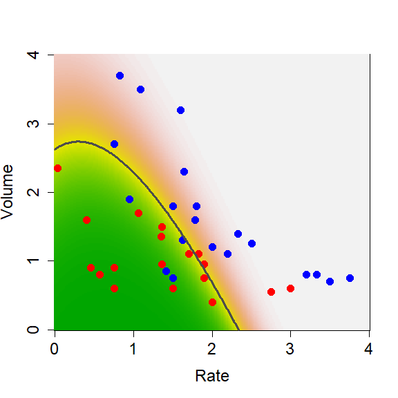
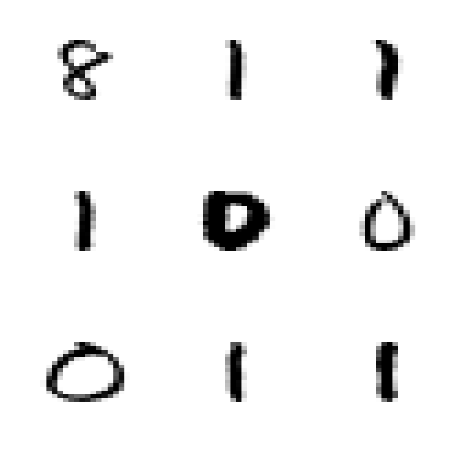
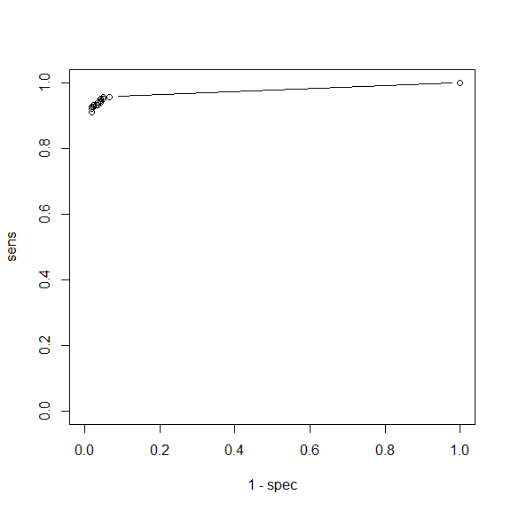

STAT406 - Lecture 15 notes
================
Matias Salibian-Barrera
2017-10-25

LICENSE
-------

These notes are released under the "Creative Commons Attribution-ShareAlike 4.0 International" license. See the **human-readable version** [here](https://creativecommons.org/licenses/by-sa/4.0/) and the **real thing** [here](https://creativecommons.org/licenses/by-sa/4.0/legalcode).

Lecture slides
--------------

The lecture slides are [here](STAT406-17-lecture-15.pdf).

LDA & QDA
---------

Similarly to the way we derived the LDA classifier in class, if one relaxes the assumption that the conditional distribution of the vector of features **X** in each class has the same covariance matrix (*shape*) (but still assumes that these distributions are Gaussian), then it is (again) easy to find a closed form for the conditional probability of each class (conditional on a vector of features **X**). As in the LDA case, these conditional class probabilities (aka *posterior probabilities*) depend on the parameters of the assumed model for the conditional distributions of **X** in each class. So, again, we estimate those parameters from the training set (usin the observations in each group) and plug them in to compute the conditional class probabilities.

Similarly to what we did for LDA, it is easy to see that in this case the class boundaries are quadratic functions of the vector of features **X**.

We now illustrate QDA on the same `vaso` data we used before. We first load the data, and train a QDA classifier using the function `qda` in package `MASS` (this can also be written as `MASS::qda()`).

``` r
data(vaso, package='robustbase')
library(MASS)
a.qda <- qda(Y ~ . , data=vaso)
```

We now build a relatively fine grid of points in the domain of our 2-dimensional vector of features and use the `predict` method associated with a `qda` object to predict the conditional probability of class `blue`:

``` r
xvol <- seq(0, 4, length=200)
xrat <- seq(0, 4, length=200)
xx <- expand.grid(xvol, xrat)
names(xx) <- c('Volume', 'Rate')
pr.qda <- predict(a.qda, newdata=xx)$posterior[,2]
image(xrat, xvol, matrix(pr.qda, 200, 200), col=terrain.colors(100),
      ylab='Volume', xlab='Rate', cex.lab=1.5, cex.axis=1.5)
points(Volume ~ Rate, data=vaso, pch=19, cex=1.5, 
       col=c('red', 'blue')[Y+1])
contour(xrat, xvol, matrix(pr.qda, 200, 200), col='gray30', levels=.5, 
        drawlabels=FALSE, lwd=3, add=TRUE)
```

 We used the function `contour` above to draw the boundary between classes (the set of points where the probability of blue is equal to the probability of red).

### Zip code digits

``` r
data(zip.train, package='ElemStatLearn') #read.table('zip.train', header=FALSE)
data(zip.test, package='ElemStatLearn') #read.table('zip.test', header=FALSE)

x.tr <- zip.train[ zip.train[, 1] %in% c(0, 1, 8), ]
x.te <- zip.test[ zip.test[, 1] %in% c(0, 1, 8), ]

table(x.tr[, 1])
```

    ## 
    ##    0    1    8 
    ## 1194 1005  542

``` r
# Display images

# ----- Define a function for plotting a matrix ----- #
# modified from: http://www.phaget4.org/R/image_matrix.html
# ----- Define a function for plotting a matrix ----- #
myImagePlot <- function(x, ...){
  min <- min(x)
  max <- max(x)
  ColorRamp <- grey(seq(1,0,length=256))
  ColorLevels <- seq(min, max, length=length(ColorRamp))
  # Reverse Y axis
  reverse <- nrow(x) : 1
  x <- x[reverse,]
  image(1:ncol(x), 1:nrow(x), t(x), col=ColorRamp, xlab="",
        ylab="", axes=FALSE, zlim=c(min,max))
}


a <- x.tr

# Plot 9 random chosen images (hand-written 3's)
set.seed(31)
sa <- sample(dim(a)[1], 9)
par(mfrow=c(3,3))
for(j in 1:9) {
  myImagePlot(t(matrix(unlist(a[sa[j],-1]), 16, 16)))
}
```



``` r
par(mfrow=c(1,1))
```

Plot the "average 8" in the training set

``` r
myImagePlot(t(matrix(colMeans(a[a[,1]==8,-1]), 16, 16)))
```


Can we classify?

``` r
# a <- lda(V1 ~ ., data=x.tr)
x.tr <- data.frame(x.tr)
x.te <- data.frame(x.te)
names( x.te ) <- names( x.tr  ) <- paste('V', 1:257, sep='')
a <- lda(V1 ~ . - V257, data=x.tr) #x.tr[,1] ~ x[, 2:256])
pr <- predict(a, newdata=x.te)$class
table(pr, x.te$V1)
```

    ##    
    ## pr    0   1   8
    ##   0 353   2   9
    ##   1   0 258   0
    ##   8   6   4 157

``` r
library(nnet)
a.log <- multinom(V1 ~ . - V257, data=x.tr, maxit=5000)
```

    ## # weights:  771 (512 variable)
    ## initial  value 3011.296283 
    ## iter  10 value 27.327939
    ## iter  20 value 8.491334
    ## iter  30 value 2.640128
    ## iter  40 value 1.228798
    ## iter  50 value 0.663474
    ## iter  60 value 0.391984
    ## iter  70 value 0.212952
    ## iter  80 value 0.114876
    ## iter  90 value 0.053465
    ## iter 100 value 0.026628
    ## iter 110 value 0.014534
    ## iter 120 value 0.009281
    ## iter 130 value 0.006623
    ## iter 140 value 0.004210
    ## iter 150 value 0.002723
    ## iter 160 value 0.001851
    ## iter 170 value 0.001318
    ## iter 180 value 0.001036
    ## iter 190 value 0.000580
    ## iter 200 value 0.000516
    ## iter 210 value 0.000304
    ## iter 220 value 0.000249
    ## iter 230 value 0.000218
    ## final  value 0.000090 
    ## converged

``` r
pr.log <- predict(a.log, newdata=x.te)
table(pr.log, x.te$V1)
```

    ##       
    ## pr.log   0   1   8
    ##      0 342   3  13
    ##      1  12 258  10
    ##      8   5   3 143

``` r
a.qda <- try(  qda(V1 ~ . - V257, data=x.tr) )

# rank deficiency?
x1 <- x.tr[ x.tr$V1 == 0, ]
dim(x1)
```

    ## [1] 1194  257

``` r
qr(x1)$rank
```

    ## [1] 254

#### Sensitivity & Specificity

``` r
a <- lda(Y ~ . , data=vaso)
a.qda <- qda(Y ~ . , data=vaso)

pr.lda <- as.numeric(predict(a)$class)
pr.qda <- as.numeric(predict(a.qda)$class)

table(pr.lda, vaso$Y)
```

    ##       
    ## pr.lda  0  1
    ##      1 17  4
    ##      2  2 16

``` r
table(pr.qda, vaso$Y)
```

    ##       
    ## pr.qda  0  1
    ##      1 16  4
    ##      2  3 16

``` r
# sensitivity 
# LDA: 16/20 = 4/5
# QDA: 16/20 

# specificity
# LDA: 17/19
# QDA: 16/19
```

For the zip code data

``` r
data(zip.train, package='ElemStatLearn') 
data(zip.test, package='ElemStatLearn')


x.tr <- zip.train[ zip.train[, 1] %in% c(3, 8), ]
x.te <- zip.test[ zip.test[, 1] %in% c(3, 8), ]

x.tr <- data.frame(x.tr)
x.te <- data.frame(x.te)
names( x.te ) <- names( x.tr  ) <- paste('V', 1:257, sep='')


a <- lda(V1 ~ . - V257, data=x.tr)
# a.qda <- qda(V1 ~ . - V257, data=x.tr)

pr.lda <- as.numeric(predict(a)$class)
te.lda <- as.numeric(predict(a, newdata=x.te)$class)

table(pr.lda, x.tr$V1)
```

    ##       
    ## pr.lda   3   8
    ##      1 654   2
    ##      2   4 540

``` r
table(te.lda, x.te$V1)
```

    ##       
    ## te.lda   3   8
    ##      1 155   6
    ##      2  11 160

``` r
# sensitivity - training
# 1191/ 1194 = 99.7%

# specificity - training
# 534 / 542 = 98.5%

# sensitivity - test
# 350/ 359 = 97.4%

# specificity - test
# 160 / 166 = 96.4%

# build ROC

te.lda <- predict(a, newdata=x.te)$posterior[,1]
sens <- spec <- rep(0, 50)
als <- seq(0, 1, length=51)
for(i in 1:50) {
  npr.1 <- (te.lda > als[i])
  npr.2 <- !npr.1
  sens[i] <- sum( (as.numeric(as.factor(x.te$V1)) == 1) & npr.1 )
  spec[i] <- sum( (as.numeric(as.factor(x.te$V1)) == 2) & npr.2 )
}
sens <- sens / sum(as.numeric(as.factor(x.te$V1)) == 1)
spec <- spec / sum(as.numeric(as.factor(x.te$V1)) == 2)
plot(1-spec, sens, type='b', ylim=c(0,1), xlim=c(0,1))
```



<!-- x.tr <- x.train[ x.train$V1 %in% c(9, 6), ] -->
<!-- x.te <- x.test[ x.test$V1 %in% c(9, 6), ] -->
<!-- x.tr$V1 <- as.factor(x.tr$V1) -->
<!-- x.te$V1 <- as.factor(x.te$V1) -->
<!-- a <- glm(Y ~ ., data=vaso, family=binomial) -->
<!-- te.glm <- predict(a, type='response') -->
<!-- plot(te.glm) -->
<!-- sens <- spec <- rep(0, 500) -->
<!-- als <- seq(0, 1, length=501) -->
<!-- for(i in 1:500) { -->
<!--   npr.1 <- (te.glm > als[i]) -->
<!--   npr.2 <- !npr.1 -->
<!--   sens[i] <- sum( (vaso$Y == 0) & npr.2 ) -->
<!--   spec[i] <- sum( (vaso$Y == 1) & npr.1 ) -->
<!-- } -->
<!-- sens <- sens / sum( vaso$Y == 0 ) # red -->
<!-- spec <- spec / sum( vaso$Y == 1 ) # blue -->
<!-- pdf(file='vaso-roc.pdf', bg='transparent') -->
<!-- plot(1-spec, sens, type='l', ylim=c(0,1), xlim=c(0,1), -->
<!--      lwd=4, col='gray30', xlab='1-Specificity',  -->
<!--      ylab='Sensitivity', cex.lab=1.5, cex.axis=1.5) -->
<!-- dev.off() -->
<!-- xvol <- seq(0, 4, length=200) -->
<!-- xrat <- seq(0, 4, length=200) -->
<!-- xx <- expand.grid(xvol, xrat) -->
<!-- names(xx) <- c('Volume', 'Rate') -->
<!-- a <- glm(Y ~ ., data=vaso, family=binomial) -->
<!-- pr.glm <- predict(a, newdata=xx, type='response') -->
<!-- beta <- coef(a) -->
<!-- als <- c(.5, 1, 5, 9.5)/10 -->
<!-- rr <- seq(0,4, length=10) -->
<!-- for(j in 1:4) { -->
<!--   pdf(file=paste('vaso-sens-spec-',als[j]*100,'.pdf',sep=''),  -->
<!--       bg='transparent') -->
<!--   image(xrat, xvol, matrix(pr.glm, 200, 200), col=terrain.colors(100), -->
<!--         ylab='Volume', xlab='Rate', cex.lab=1.5, cex.axis=1.5) -->
<!--   points(Volume ~ Rate, data=vaso, pch=19, cex=1.5,  -->
<!--          col=c('red', 'blue')[Y+1]) -->
<!--   #   plot(Volume ~ Rate, data=vaso, pch=19, cex=1.5,  -->
<!--   #        col=c('red', 'blue')[Y+1], xlim=c(0, 4), ylim=c(0,4), -->
<!--   #        cex.lab=1.5, cex.axis=1.5) -->
<!--   c0 <- log(als[j]/(1-als[j])) -->
<!--   vv <- (c0 - beta[1] - beta[2]*rr)/beta[3] -->
<!--   lines(vv~rr, lwd=6, col='gray40') -->
<!--   dev.off() -->
<!-- } -->
Nearest neighbours
------------------

Probably simplest model-free estimator for conditional class probabilities (given values for the features). *Peer-pressure*. Akin to kernel regression, also suffers from the *curse of dimensionality*. Factor or binary features need to be treated with care.

<!-- # Nearest neighbours -->
<!-- library(class) -->
<!-- data(vaso, package='robustbase') -->
<!-- plot(Volume ~ Rate, data=vaso, pch=19, cex=1.5,  -->
<!--      col=c('red', 'blue')[Y+1], xlim=c(0, 4), ylim=c(0,4)) -->
<!-- x1 <- seq(0, 4, length=200) -->
<!-- x2 <- seq(0, 4, length=200) -->
<!-- xx <- expand.grid(x1, x2) -->
<!-- u1 <- knn(train=vaso[, c(2, 1)], cl=vaso[,3], test=xx, k=1) -->
<!-- # names(vaso) = [1] "Volume" "Rate"   "Y"  -->
<!-- # but we plot "Volume" on the y-axis -->
<!-- u1 <- as.numeric(u1) -->
<!-- image(x1, x2, matrix(u1, 200, 200), col=terrain.colors(100), -->
<!--       ylab='Volume', xlab='Rate', main='1-NN') -->
<!-- points(Volume ~ Rate, data=vaso, pch=19, cex=1.5,  -->
<!--        col=c('red', 'blue')[Y+1]) -->
<!-- pdf('vaso-1nn.pdf', bg='transparent') -->
<!-- image(x1, x2, matrix(u1, 200, 200), col=terrain.colors(100), -->
<!--       ylab='Volume', xlab='Rate') -->
<!-- points(Volume ~ Rate, data=vaso, pch=19, cex=1.5,  -->
<!--        col=c('red', 'blue')[Y+1]) -->
<!-- dev.off() -->
<!-- u5 <- as.numeric(knn(train=vaso[, c(2, 1)], cl=vaso[,3], test=xx, k=5)) -->
<!-- image(x1, x2, matrix(u5, 200, 200), col=terrain.colors(100), -->
<!--       ylab='Volume', xlab='Rate', main='5-NN') -->
<!-- points(Volume ~ Rate, data=vaso, pch=19, cex=1.5,  -->
<!--        col=c('red', 'blue')[Y+1]) -->
<!-- pdf('vaso-5nn-pred.pdf', bg='transparent') -->
<!-- image(x1, x2, matrix(u5, 200, 200), col=terrain.colors(100), -->
<!--       ylab='Volume', xlab='Rate') -->
<!-- points(Volume ~ Rate, data=vaso, pch=19, cex=1.5,  -->
<!--        col=c('red', 'blue')[Y+1]) -->
<!-- dev.off() -->
<!-- u5 <- attr(knn(train=vaso[, c(2, 1)], cl=vaso[,3], test=xx, k=5, prob=TRUE),  -->
<!--            'prob') -->
<!-- image(x1, x2, matrix(u5, 200, 200), col=terrain.colors(100), -->
<!--       ylab='Volume', xlab='Rate', main='5-NN') -->
<!-- points(Volume ~ Rate, data=vaso, pch=19, cex=1.5,  -->
<!--        col=c('red', 'blue')[Y+1]) -->
<!-- pdf('vaso-5nn-votes.pdf', bg='transparent') -->
<!-- image(x1, x2, matrix(u5, 200, 200), col=terrain.colors(100), -->
<!--       ylab='Volume', xlab='Rate') -->
<!-- points(Volume ~ Rate, data=vaso, pch=19, cex=1.5,  -->
<!--        col=c('red', 'blue')[Y+1]) -->
<!-- dev.off() -->
<!-- u10 <- attr(knn(train=vaso[, c(2, 1)], cl=vaso[,3], test=xx, k=10, prob=TRUE),  -->
<!--             'prob') -->
<!-- pdf('vaso-10nn-votes.pdf', bg='transparent') -->
<!-- image(x1, x2, matrix(u10, 200, 200), col=terrain.colors(100), -->
<!--       ylab='Volume', xlab='Rate') -->
<!-- points(Volume ~ Rate, data=vaso, pch=19, cex=1.5,  -->
<!--        col=c('red', 'blue')[Y+1]) -->
<!-- dev.off() -->
<!-- u10 <- as.numeric(knn(train=vaso[, c(2, 1)], cl=vaso[,3], test=xx, k=10)) -->
<!-- pdf('vaso-10nn-pred.pdf', bg='transparent') -->
<!-- image(x1, x2, matrix(u10, 200, 200), col=terrain.colors(100), -->
<!--       ylab='Volume', xlab='Rate') -->
<!-- points(Volume ~ Rate, data=vaso, pch=19, cex=1.5,  -->
<!--        col=c('red', 'blue')[Y+1]) -->
<!-- dev.off() -->
<!-- # zip code data -->
<!-- x.tr <- x.train[ x.train$V1 %in% c(0, 1, 8), ] -->
<!-- x.te <- x.test[ x.test$V1 %in% c(0, 1, 8), ] -->
<!-- u1 <- knn(train=x.tr[,-1], cl=x.tr[,1], test=x.te[, -1], k=1) -->
<!-- table(u1, x.te$V1) -->
<!-- mean( u1 != x.te$V1 ) -->
<!-- u5 <- knn(train=x.tr[,-1], cl=x.tr[,1], test=x.te[, -1], k=5) -->
<!-- table(u5, x.te$V1) -->
<!-- mean( u5 != x.te$V1 ) -->
<!-- u10 <- knn(train=x.tr[,-1], cl=x.tr[,1], test=x.te[, -1], k=10) -->
<!-- table(u10, x.te$V1) -->
<!-- mean( u10 != x.te$V1 ) -->
<!-- u50 <- knn(train=x.tr[,-1], cl=x.tr[,1], test=x.te[, -1], k=50) -->
<!-- table(u50, x.te$V1) -->
<!-- mean( u50 != x.te$V1 ) -->
<!-- # x0 <- rbind(as.matrix(vaso[,-3]), c(0.75, 1.4)) -->
<!-- # dd <- dist(x0) -->
<!-- #  -->
<!-- # # n <- attr(do, "Size"), then for i < j <= n,  -->
<!-- # # the dissimilarity between (row) i and j is  -->
<!-- # # do[n*(i-1) - i*(i-1)/2 + j-i] -->
<!-- # n <- attr(dd, "Size") -->
<!-- # ii <- 1:(n-1) -->
<!-- # closest <- which.min(dd[n*(ii-1)-ii*(ii-1)/2+n-ii]) -->
<!-- #  -->
<!-- # points(vaso[closest, 1], vaso[closest,2], pch=19, col='gray', cex=1.5) -->
<!-- #### END ############### -->
<!-- #### END ############### -->
<!-- #### END ############### -->
<!-- #### END ############### -->
Classification Trees
--------------------

Classification trees. Instead of RSS we use a measure of (in)homogeneity of classes within leaves, partition to maximize the reduction in inhomogeneity.
