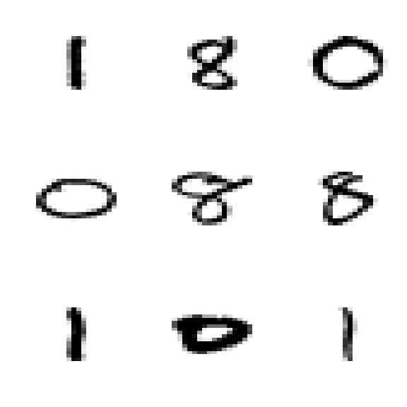
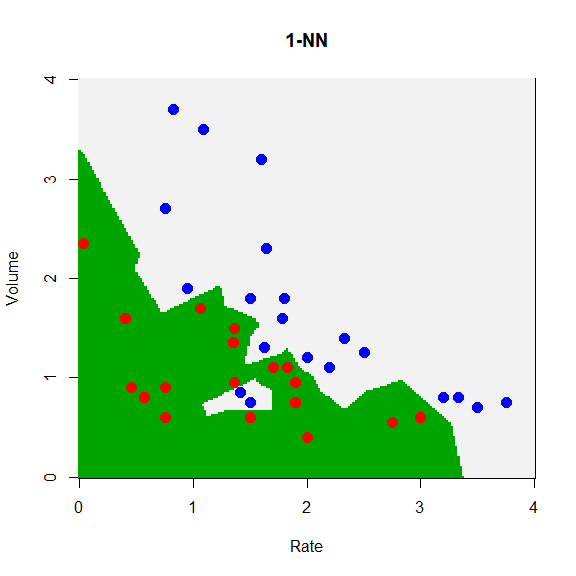
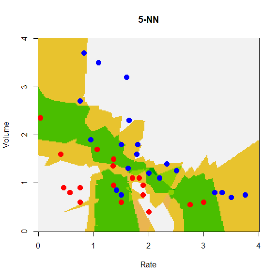
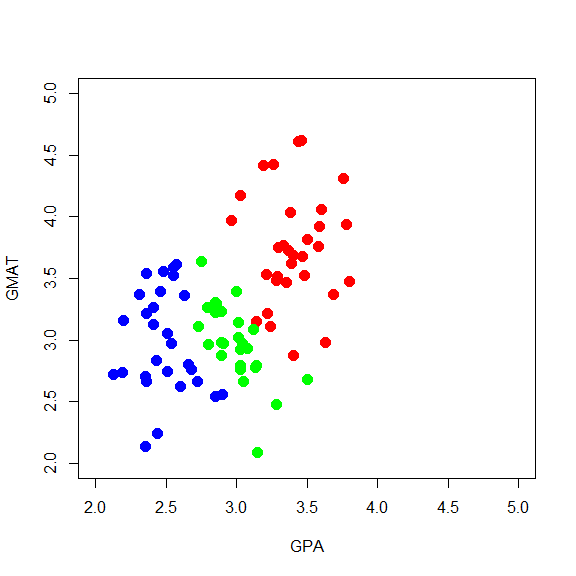
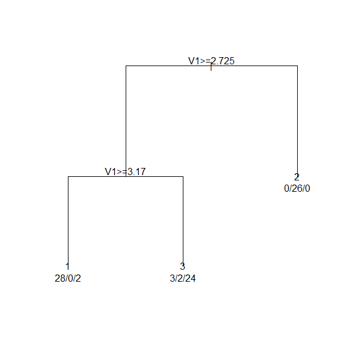
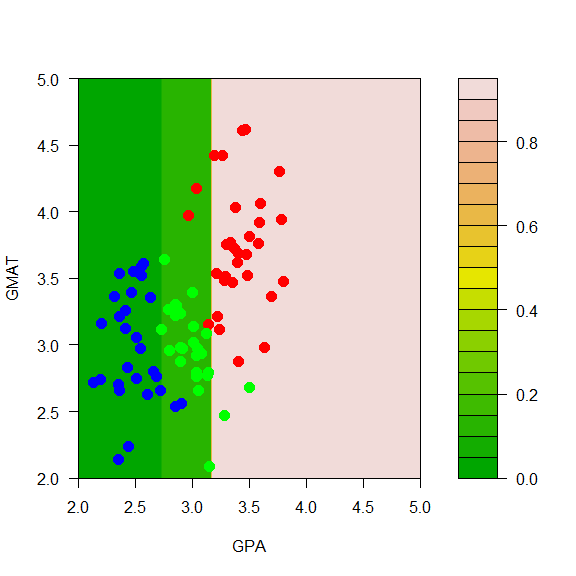
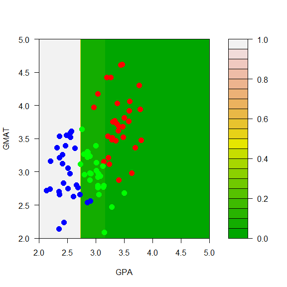
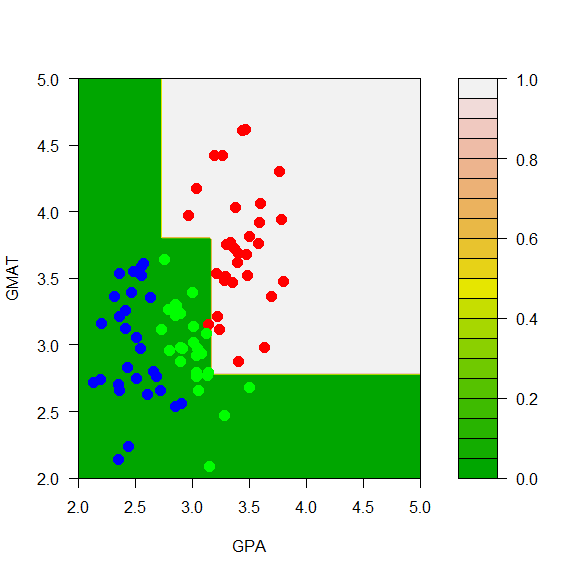
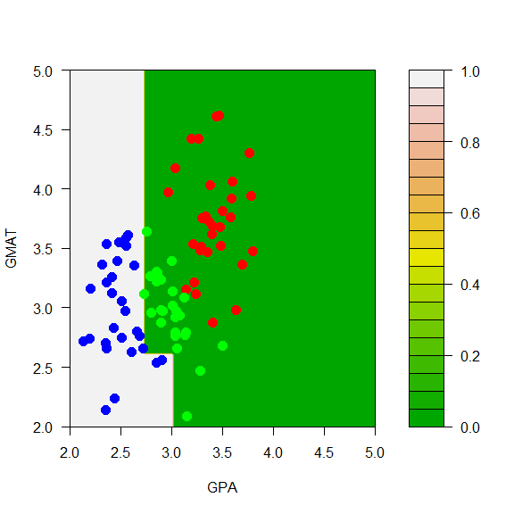
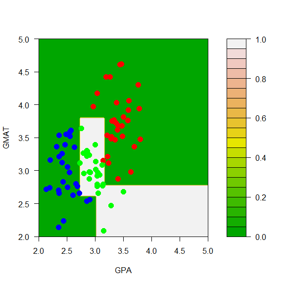

STAT406 - Lecture 15 notes
================
Matias Salibian-Barrera
2017-10-25

LICENSE
-------

These notes are released under the "Creative Commons Attribution-ShareAlike 4.0 International" license. See the **human-readable version** [here](https://creativecommons.org/licenses/by-sa/4.0/) and the **real thing** [here](https://creativecommons.org/licenses/by-sa/4.0/legalcode).

Lecture slides
--------------

The lecture slides are [here](STAT406-17-lecture-15-preliminary.pdf).

QDA
---

Similarly to the way we derived the LDA classifier in class, if one relaxes the assumption that the conditional distribution of the vector of features **X** in each class has the same covariance matrix (*shape*) (but still assumes that these distributions are Gaussian), then it is (again) easy to find a closed form for the conditional probability of each class (conditional on a vector of features **X**). As in the LDA case, these conditional class probabilities (aka *posterior probabilities*) depend on the parameters of the assumed model for the conditional distributions of **X** in each class. So, again, we estimate those parameters from the training set (usin the observations in each group) and plug them in to compute the conditional class probabilities.

Similarly to what we did for LDA, it is easy to see that in this case the class boundaries are quadratic functions of the vector of features **X**.

We now illustrate QDA on the same `vaso` data we used before. We first load the data, and train a QDA classifier using the function `qda` in package `MASS` (this can also be written as `MASS::qda()`).

``` r
data(vaso, package='robustbase')
library(MASS)
a.qda <- qda(Y ~ . , data=vaso)
```

We now build a relatively fine grid of points in the domain of our 2-dimensional vector of features and use the `predict` method associated with a `qda` object to predict the conditional probability of class `blue`:

``` r
xvol <- seq(0, 4, length=200)
xrat <- seq(0, 4, length=200)
xx <- expand.grid(xvol, xrat)
names(xx) <- c('Volume', 'Rate')
pr.qda <- predict(a.qda, newdata=xx)$posterior[,2]
image(xrat, xvol, matrix(pr.qda, 200, 200), col=terrain.colors(100),
      ylab='Volume', xlab='Rate', cex.lab=1.5, cex.axis=1.5)
points(Volume ~ Rate, data=vaso, pch=19, cex=1.5, 
       col=c('red', 'blue')[Y+1])
contour(xrat, xvol, matrix(pr.qda, 200, 200), col='gray30', levels=.5, 
        drawlabels=FALSE, lwd=3, add=TRUE)
```


We used the function `contour` above to draw the boundary between classes (the set of points where the probability of blue is equal to the probability of red).

#### Sensitivity to the Gaussian assumption

With the help of an example we discussed in class the sensitivity of QDA to the assumed specific conditional distribution of the features within each class. It is very easy to see that LDA may also be affected by similar problems. This is not at all surprising--in many cases optimal methods obtained under certain conditions are very sensitive to the vailidity of the assumptions used in ther derivation.

It is interesting to note (as discussed in class) that logistic regression was not affected by the "good outliers" we included in the data. Again, this is not surprising (furthermore, I expect you to be able to explain what is happening in this particular example). Note, furthermore, that both QDA (and LDA) and logistic regression are classifiers that require the estimation of parameters (maybe we can call them *parametric classifiers*?), and in all cases so far we used maximum likelihood estimates for them. However their sensitivity to this kind of outliers is very different. Discuss!

### More than 2 classes -- The handwritten digit recognition data

As you may have noted, all the classification methods we have seen so far can be used in applications with an arbitrary number of classes. We will now illustrate them on the well-known Handwritten Digit Recognition Data (as usual, see `help(zip.train, package='ElemStatLearn')`). We first load the data, and extract the images corresponding to digits 0, 1 and 8. These should be challenging enough to discriminate given their shape.

``` r
data(zip.train, package='ElemStatLearn')
data(zip.test, package='ElemStatLearn')
x.tr <- zip.train[ zip.train[, 1] %in% c(0, 1, 8), ]
x.te <- zip.test[ zip.test[, 1] %in% c(0, 1, 8), ]
table(x.tr[, 1])
```

    ## 
    ##    0    1    8 
    ## 1194 1005  542

To display these 16x16 images we adapt a simple function to plot matrices:

``` r
# ----- Define a function for plotting a matrix ----- #
# modified from: http://www.phaget4.org/R/image_matrix.html
# ----- Define a function for plotting a matrix ----- #
myImagePlot <- function(x, ...){
  min <- min(x)
  max <- max(x)
  ColorRamp <- grey(seq(1,0,length=256))
  ColorLevels <- seq(min, max, length=length(ColorRamp))
  # Reverse Y axis
  reverse <- nrow(x) : 1
  x <- x[reverse,]
  image(1:ncol(x), 1:nrow(x), t(x), col=ColorRamp, xlab="",
        ylab="", axes=FALSE, zlim=c(min,max))
}
```

We choose 9 images at random and display them in a 3x3 array of images:

``` r
a <- x.tr
set.seed(987)
sa <- sample(dim(a)[1], 9)
par(mfrow=c(3,3))
for(j in 1:9) {
  myImagePlot(t(matrix(unlist(a[sa[j],-1]), 16, 16)))
}
```



``` r
par(mfrow=c(1,1))
```

We can also show the "average 8" in the training set:

``` r
myImagePlot(t(matrix(colMeans(a[a[,1]==8,-1]), 16, 16)))
```


We will now use LDA, QDA and a multinomial logistic model. The latter is the natural extension of logistic regression to more than 2 classes. You can easily derive it yourself by assuming the response variable has a multinomial distribution and modeling each conditional probability as a (different) logistic function of the vector **X** of features. Note that if there are *K* classes you only need to model *K-1* of these conditional class probabilities. The derivation is left as an easy exercise for you.

Note that the data is stored in a matrix, but the use of `lda()`, `qda()`, etc. is clearer when you have your data in a `data frame` (as you can then refer to features by their names and use the `data` argument). So, we first transform our matrix into a data frame, and name the resulting variables *V1*, *V2*, ..., *V257*:

``` r
x.tr <- data.frame(x.tr)
x.te <- data.frame(x.te)
names( x.te ) <- names( x.tr  ) <- paste('V', 1:257, sep='')
```

Now we use `lda` and `multinom` (from package `nnet`) to train an LDA and a multinomial classifier to these 3-class data:

``` r
a <- lda(V1 ~ . - V257, data=x.tr) #x.tr[,1] ~ x[, 2:256])
library(nnet)
a.log <- multinom(V1 ~ . - V257, data=x.tr, maxit=5000)
```

    ## # weights:  771 (512 variable)
    ## initial  value 3011.296283 
    ## iter  10 value 27.327939
    ## iter  20 value 8.491334
    ## iter  30 value 2.640128
    ## iter  40 value 1.228798
    ## iter  50 value 0.663474
    ## iter  60 value 0.391984
    ## iter  70 value 0.212952
    ## iter  80 value 0.114876
    ## iter  90 value 0.053465
    ## iter 100 value 0.026628
    ## iter 110 value 0.014534
    ## iter 120 value 0.009281
    ## iter 130 value 0.006623
    ## iter 140 value 0.004210
    ## iter 150 value 0.002723
    ## iter 160 value 0.001851
    ## iter 170 value 0.001318
    ## iter 180 value 0.001036
    ## iter 190 value 0.000580
    ## iter 200 value 0.000516
    ## iter 210 value 0.000304
    ## iter 220 value 0.000249
    ## iter 230 value 0.000218
    ## final  value 0.000090 
    ## converged

Note how slow is the convergence of `multinom`. This is not unusual, and it has to do with how neural networks are trained (!). Refer to the corresponding help page for more information. We will probably discuss this further later in the course.

For now we obtain the predictions on the test set and build a matrix of classification errors for each classifier:

``` r
pr.lda <- predict(a, newdata=x.te)$class
table(pr.lda, x.te$V1)
```

    ##       
    ## pr.lda   0   1   8
    ##      0 353   2   9
    ##      1   0 258   0
    ##      8   6   4 157

``` r
pr.log <- predict(a.log, newdata=x.te)
table(pr.log, x.te$V1)
```

    ##       
    ## pr.log   0   1   8
    ##      0 342   3  13
    ##      1  12 258  10
    ##      8   5   3 143

We now attempt to train a QDA classifier:

``` r
a.qda <- try(  qda(V1 ~ . - V257, data=x.tr) )
class(a.qda)
```

    ## [1] "try-error"

This classifier cannot be trained on these data. The problem is that the training set for at least one class is rank deficient (which can be found by looking at the error message stored in the returned object `a.qda`

``` r
a.qda
```

    ## [1] "Error in qda.default(x, grouping, ...) : rank deficiency in group 0\n"
    ## attr(,"class")
    ## [1] "try-error"
    ## attr(,"condition")
    ## <simpleError in qda.default(x, grouping, ...): rank deficiency in group 0>

Indeed, we have:

``` r
x1 <- x.tr[ x.tr$V1 == 0, ]
dim(x1)
```

    ## [1] 1194  257

``` r
qr(x1)$rank
```

    ## [1] 254

The questions for you are:

-   why is this rank deficiency a problem for QDA, but not for LDA, or a multinomial model?
-   can we do anything to train a (possibly different) QDA classifier to these data?

#### (Optional section) Sensitivity & Specificity

**This section is still under revision, read at your own risk.**

Any binary decision-making process has two important features, generally called senstivity and specificity. Intuitively these measure:

-   how often it makes correct decisions (how many *cats* are correctly classified as *cats*?) (sensitivity); and
-   how often it makes correct positive calls (how many objects classified as *cats* are indeed *cats*?) (equivalentely, how many *not cats* are **not called cats**?) (specificity).

We refer back to the `vaso` data. We train both an LDA and a QDA classifier. We can derive the associated sensitivity and specificity from the misclassification table. Note that since there is no independent test set these figures may be misleading.

``` r
a <- lda(Y ~ . , data=vaso)
a.qda <- qda(Y ~ . , data=vaso)
pr.lda <- as.numeric(predict(a)$class)
pr.qda <- as.numeric(predict(a.qda)$class)
table(pr.lda, vaso$Y)
```

    ##       
    ## pr.lda  0  1
    ##      1 17  4
    ##      2  2 16

``` r
table(pr.qda, vaso$Y)
```

    ##       
    ## pr.qda  0  1
    ##      1 16  4
    ##      2  3 16

Hence we can estimate the sensitivities of LDA and QDA as 17/19 and 16/19 respectively. Their specificities are both 16/20.

<!-- # sensitivity  -->
<!-- # LDA: 16/20 = 4/5 -->
<!-- # QDA: 16/20  -->
<!-- # specificity -->
<!-- # LDA: 17/19 -->
<!-- # QDA: 16/19 -->
For the zip code data:

``` r
data(zip.train, package='ElemStatLearn') 
data(zip.test, package='ElemStatLearn')
x.tr <- data.frame( zip.train[ zip.train[, 1] %in% c(3, 8), ] )
x.te <- data.frame( zip.test[ zip.test[, 1] %in% c(3, 8), ] )
names( x.te ) <- names( x.tr  ) <- paste('V', 1:257, sep='')
a <- lda(V1 ~ . - V257, data=x.tr)
te.lda <- as.numeric(predict(a, newdata=x.te)$class)
table(te.lda, x.te$V1)
```

    ##       
    ## te.lda   3   8
    ##      1 155   6
    ##      2  11 160

<!-- # sensitivity - test -->
<!-- # 350/ 359 = 97.4% -->
<!-- # specificity - test -->
<!-- # 160 / 166 = 96.4% -->
<!-- # build the ROC curve -->
<!-- te.lda <- predict(a, newdata=x.te)$posterior[,1] -->
<!-- sens <- spec <- rep(0, 50) -->
<!-- als <- seq(0, 1, length=51) -->
<!-- for(i in 1:50) { -->
<!--   npr.1 <- (te.lda > als[i]) -->
<!--   npr.2 <- !npr.1 -->
<!--   sens[i] <- sum( (as.numeric(as.factor(x.te$V1)) == 1) & npr.1 ) -->
<!--   spec[i] <- sum( (as.numeric(as.factor(x.te$V1)) == 2) & npr.2 ) -->
<!-- } -->
<!-- sens <- sens / sum(as.numeric(as.factor(x.te$V1)) == 1) -->
<!-- spec <- spec / sum(as.numeric(as.factor(x.te$V1)) == 2) -->
<!-- plot(1-spec, sens, type='b', ylim=c(0,1), xlim=c(0,1)) -->
K-Nearest Neighbours (K-NN)
---------------------------

Perhaps the intuitively simplest model-free estimator for conditional class probabilities for a given set of feature values **X** is the one based on nearest neighbours (as discussed in class). It is similar (in *spirit*) to the kernel regression estimator in the continuous-response regression setting. More specifically, it can be thought of as a variable-bandwidth kernel estimator. For a point **X** in the feature space we look at the proportion of observations in each class among **X**'s K-th closest neighbours. That is, of course, equivalent to looking at all points (*Y*<sub>*i*</sub>, **X**<sub>*i*</sub>) in the training set such that ∥**X**<sub>*i*</sub>−**X**∥ ≤ *h*<sub>*k*</sub>, where *h*<sub>*k*</sub> is the distance from **X** to the K-th closest neighbour in the training set. Refer to the discussion in class for more details.

Here we will illustrate K-NN classifiers on the toy `vaso` example (to be able to visualize the results more easily), and also on the hand written digits data. We will use the function `knn` in package `class`. This function takes a training set, and also a *test* set (i.e. a different data set containing the observations to be predicted). In the example below we first create (as we have done before) a 200 x 200 grid of points and display the resulting predicted probabilities (or the corresponding class with highest conditional probability).

We first we use a trivial 1-NN classifier: the estimated conditional probabilities for each class at a point **X**, will simply be 0 or 1 depending on the class of the closest neighbour to **X** in the training set.

``` r
library(class)
data(vaso, package='robustbase')
x1 <- seq(0, 4, length=200)
x2 <- seq(0, 4, length=200)
xx <- expand.grid(x1, x2)
u1 <- knn(train=vaso[, c(2, 1)], cl=vaso[,3], test=xx, k=1)
u1 <- as.numeric(u1)
image(x1, x2, matrix(u1, 200, 200), col=terrain.colors(100),
      ylab='Volume', xlab='Rate', main='1-NN')
points(Volume ~ Rate, data=vaso, pch=19, cex=1.5,
       col=c('red', 'blue')[Y+1])
```



We repeat the analysis with a 5-NN classifier. Now the estimated conditional probabilities for each **X** in the grid can be 0, 0.20, 0.40, 0.60, 0.80 or 1 (why?) The function `knn` returns the estimated probabilities in the `'prob'` attribute of the returned object, so we need to use the function `attr` to extract it (as usual, the R help pages are a good source of information if you have any questions about the code below):

``` r
u5 <- attr(knn(train=vaso[, c(2, 1)], cl=vaso[,3], test=xx, k=5, prob=TRUE),
           'prob')
image(x1, x2, matrix(u5, 200, 200), col=terrain.colors(100),
      ylab='Volume', xlab='Rate', main='5-NN')
points(Volume ~ Rate, data=vaso, pch=19, cex=1.5,
       col=c('red', 'blue')[Y+1])
```



We now turn to the digits data. Just to be safe we re-create the training and test set for the digits 1, 3 and 8 and look at the misclassification tables on the test set.

``` r
data(zip.train, package='ElemStatLearn') 
data(zip.test, package='ElemStatLearn')
x.tr <- data.frame( zip.train[ zip.train[, 1] %in% c(3, 8), ] )
x.te <- data.frame( zip.test[ zip.test[, 1] %in% c(3, 8), ] )
names( x.te ) <- names( x.tr  ) <- paste('V', 1:257, sep='')
```

We now train 1-, 5-, 10- and 50-NN classifiers and evaluate them on the test set. We report the misclassification rate on the test set, along with the corresponding tables:

``` r
u1 <- knn(train=x.tr[,-1], cl=x.tr[,1], test=x.te[, -1], k=1)
table(u1, x.te$V1)
```

    ##    
    ## u1    3   8
    ##   3 162   9
    ##   8   4 157

``` r
mean( u1 != x.te$V1 )
```

    ## [1] 0.03915663

``` r
u5 <- knn(train=x.tr[,-1], cl=x.tr[,1], test=x.te[, -1], k=5)
table(u5, x.te$V1)
```

    ##    
    ## u5    3   8
    ##   3 162   7
    ##   8   4 159

``` r
mean( u5 != x.te$V1 )
```

    ## [1] 0.03313253

``` r
u10 <- knn(train=x.tr[,-1], cl=x.tr[,1], test=x.te[, -1], k=10)
table(u10, x.te$V1)
```

    ##    
    ## u10   3   8
    ##   3 164  10
    ##   8   2 156

``` r
mean( u10 != x.te$V1 )
```

    ## [1] 0.03614458

``` r
u50 <- knn(train=x.tr[,-1], cl=x.tr[,1], test=x.te[, -1], k=50)
table(u50, x.te$V1)
```

    ##    
    ## u50   3   8
    ##   3 160  18
    ##   8   6 148

``` r
mean( u50 != x.te$V1 )
```

    ## [1] 0.07228916

Note how the performance of the K-NN classifier in this case stops improving when K is 10 or more. Since the number *K* of nearest neighbours is in fact a tuning constant that needs to be chosen by the user, how would do it in an objective manner? What would you do if you didn't have a test set available?

#### Challenges for K-NN classifiers

-   It is easy to see that they suffer from the *curse of dimensionality*.
-   Factor or binary features need to be treated with care.
-   Euclidean distances do not reflect *shape* of features in each class (i.e. the conditional distribution of **X** in each class). Class-wise pre-standardization (whitening) might be useful.

Classification Trees
--------------------

Just as in the continuous regression case, when the number of available explanatory variables is moderate or large, methods like nearest neighbours quickly become unfeasible, or their performance is not satisfactory. Classification trees provide a good alternative: they are still model-free (we do not need to assume anything about the true conditional probabilities of each class for a given vector of features **X**), but they are constrained to have a fairly specifc form. Intuitively (and informally) we could say (if nobody was listening) that this restriction provides some form of regularization or penalization.

Classification trees are constructed in much the same was as regression trees. We will construct a partition of the feature space (in "rectangular" areas), and within each region we will predict the class to be the most common class among the training points that are in that region. It is reasonable then to try to find a partition of the feature space so that in each area there is only one class (or at least, such that one class clearly dominates the others in that region). Hence, to build a classification tree we need a quantitative measure of the homogeneity of the classes present in a node. Given such a numerical measure, we can build the tree by selecting, at each step, the optimal split in the sense of yielding the most homogeneous child leaves possible (i.e. by maximizing at each step the chosen homogeneity measure). The two most common homogeneity measures are the Gini Index and the deviance (refer to the discussion in class). Although the resulting trees are generally different depending on which loss function is used, we will later see that this difference is not critical in practice.

As usual, in order to be able to visualize what is going on, we will illustrate the training and use of classification trees on a simple toy example. This example contains data on admissions to graduate school. There are 2 explanatory variables (GPA and GMAT scores), and the response has 3 levels: Admitted, No decision, Not admitted. The purpose here is to build a classifier to decide if a student will be admitted to graduate school based on her/his GMAT and GPA scores.

We first read the data, convert the response into a proper `factor` variable, and visualize the training set:

``` r
mm <- read.table('T11-6.DAT', header=FALSE)
mm$V3 <- as.factor(mm$V3)
# re-scale one feature, for better plots
mm[,2] <- mm[,2] / 150
plot(mm[,1:2], pch=19, cex=1.5, col=c("red", "blue", "green")[mm[,3]], 
xlab='GPA', 'GMAT', xlim=c(2,5), ylim=c(2,5))
```



Next we build a classification tree using the Gini index as splitting criterion.

``` r
library(rpart)
a.t <- rpart(V3~V1+V2, data=mm, method='class', parms=list(split='gini'))
plot(a.t, margin=0.05)
text(a.t, use.n=TRUE)
```


If we use the deviance as splitting criterion instead, we obtain the following classification tree (also using the default stopping criteria):

``` r
a.t <- rpart(V3~V1+V2, data=mm, method='class', parms=list(split='information'))
plot(a.t, margin=0.05)
text(a.t, use.n=TRUE)
```



The predicted conditional probabilities for each class on the range of values of the explanatory variables present on the training set can be visualized exactly as before:

``` r
aa <- seq(2, 5, length=200)
bb <- seq(2, 5, length=200)
dd <- expand.grid(aa, bb)
names(dd) <- names(mm)[1:2]
p.t <- predict(a.t, newdata=dd, type='prob')
```

We display the estimated conditional probabilities for each class:

``` r
filled.contour(aa, bb, matrix(p.t[,1], 200, 200), col=terrain.colors(20), xlab='GPA', ylab='GMAT',
               panel.last={points(mm[,-3], pch=19, cex=1.5, col=c("red", "blue", "green")[mm[,3]])
               })
```



``` r
filled.contour(aa, bb, matrix(p.t[,2], 200, 200), col=terrain.colors(20), xlab='GPA', ylab='GMAT',
               panel.last={points(mm[,-3], pch=19, cex=1.5, col=c("red", "blue", "green")[mm[,3]])
               })
```



``` r
filled.contour(aa, bb, matrix(p.t[,3], 200, 200), col=terrain.colors(20), xlab='GPA', ylab='GMAT',
               panel.last={points(mm[,-3], pch=19, cex=1.5, col=c("red", "blue", "green")[mm[,3]])
               })
```


#### Pruning

Just like regression trees, classification trees generally perform better if they are built by pruning an overfitting one. This is done in the same way as it is done for classification trees. When we do it on the graduate school admissions data we indeed obtain estimated conditional probabilities that appear to be more sensible (less "simple"):

``` r
set.seed(123)
a.t <- rpart(V3~V1+V2, data=mm, method='class', control=rpart.control(minsplit=3, cp=1e-8, xval=10),
             parms=list(split='information'))
b <- a.t$cptable[which.min(a.t$cptable[,"xerror"]),"CP"]
a.t <- prune(a.t, cp=b)
p.t <- predict(a.t, newdata=dd, type='prob')
filled.contour(aa, bb, matrix(p.t[,1], 200, 200), col=terrain.colors(20), xlab='GPA', ylab='GMAT',
               panel.last={points(mm[,-3], pch=19, cex=1.5, col=c("red", "blue", "green")[mm[,3]])
               })
```



``` r
filled.contour(aa, bb, matrix(p.t[,2], 200, 200), col=terrain.colors(20), xlab='GPA', ylab='GMAT',
               panel.last={points(mm[,-3], pch=19, cex=1.5, col=c("red", "blue", "green")[mm[,3]])
               })
```



``` r
filled.contour(aa, bb, matrix(p.t[,3], 200, 200), col=terrain.colors(20), xlab='GPA', ylab='GMAT',
               panel.last={points(mm[,-3], pch=19, cex=1.5, col=c("red", "blue", "green")[mm[,3]])
               })
```



#### Challenges

-   stability (lack of thereof)

<!-- # Unstability of trees -->
<!-- # modify data... -->
<!-- mm2 <- mm -->
<!-- mm2[1,3] <- 2 -->
<!-- mm2[7,3] <- 2 -->
<!-- # Show them, highlight changes -->
<!-- plot(mm2[,1:2], pch=19, cex=1.5, col=c("red", "blue", "green")[mm2[,3]],  -->
<!--      xlab='GPA', 'GMAT', xlim=c(2,5), ylim=c(2,5)) -->
<!-- points(mm[c(1,7),-3], pch='O', cex=1.1, col=c("red", "blue", "green")[mm[c(1,7),3]]) -->
<!-- # default trees on original and modified data -->
<!-- a.t <- rpart(V3~V1+V2, data=mm, method='class', parms=list(split='information')) -->
<!-- a2.t <- rpart(V3~V1+V2, data=mm2, method='class', parms=list(split='information')) -->
<!-- # corresponding predictions on the grid -->
<!-- p.t <- predict(a.t, newdata=dd, type='prob') -->
<!-- p2.t <- predict(a2.t, newdata=dd, type='prob') -->
<!-- # reds -->
<!-- filled.contour(aa, bb, matrix(p.t[,1], 200, 200), col=terrain.colors(20), xlab='GPA', ylab='GMAT', -->
<!-- plot.axes={axis(1); axis(2); -->
<!-- points(mm[,-3], pch=19, cex=1.5, col=c("red", "blue", "green")[mm[,3]])}) -->
<!-- filled.contour(aa, bb, matrix(p2.t[,1], 200, 200), col=terrain.colors(20), xlab='GPA', ylab='GMAT',  -->
<!-- plot.axes={axis(1); axis(2); points(mm2[,-3], pch=19, cex=1.5, col=c("red", "blue", "green")[mm2[,3]]); -->
<!-- points(mm[c(1,7),-3], pch='O', cex=1.1, col=c("red", "blue", "green")[mm[c(1,7),3]]) -->
<!-- }) -->
<!-- # greens -->
<!-- filled.contour(aa, bb, matrix(p.t[,3], 200, 200), col=terrain.colors(20), xlab='GPA', ylab='GMAT', -->
<!-- plot.axes={axis(1); axis(2); -->
<!-- points(mm[,-3], pch=19, cex=1.5, col=c("red", "blue", "green")[mm[,3]])}) -->
<!-- filled.contour(aa, bb, matrix(p2.t[,3], 200, 200), col=terrain.colors(20), xlab='GPA', ylab='GMAT',  -->
<!-- plot.axes={axis(1); axis(2); points(mm2[,-3], pch=19, cex=1.5, col=c("red", "blue", "green")[mm2[,3]]); -->
<!-- points(mm[c(1,7),-3], pch='O', cex=1.1, col=c("red", "blue", "green")[mm[c(1,7),3]]) -->
<!-- }) -->
<!-- # predictions by color -->
<!-- mpt <- apply(p.t, 1, which.max) -->
<!-- mp2t <- apply(p2.t, 1, which.max) -->
<!-- image(aa, bb, matrix(as.numeric(mpt), 200, 200), col=c('pink', 'lightblue','lightgreen'), xlab='GPA', ylab='GMAT') -->
<!-- points(mm[,-3], pch=19, cex=1.5, col=c("red", "blue", "green")[mm[,3]]) -->
<!-- image(aa, bb, matrix(as.numeric(mp2t), 200, 200), col=c('pink', 'lightblue','lightgreen'), xlab='GPA', ylab='GMAT') -->
<!-- points(mm2[,-3], pch=19, cex=1.5, col=c("red", "blue", "green")[mm2[,3]]) -->
<!-- points(mm[c(1,7),-3], pch='O', cex=1.2, col=c("red", "blue", "green")[mm[c(1,7),3]]) -->
<!-- # Bagging!! -->
