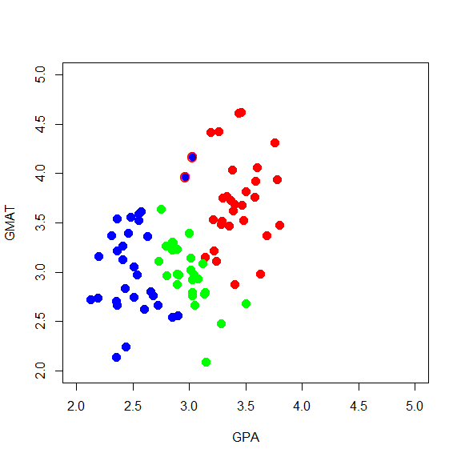
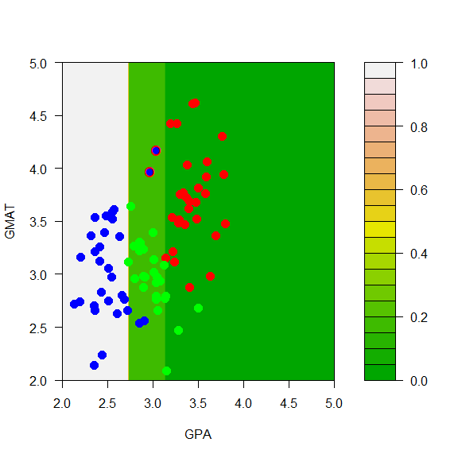
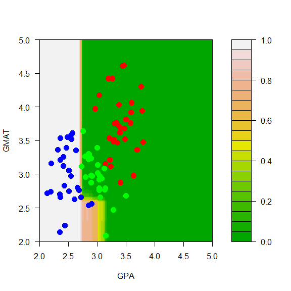
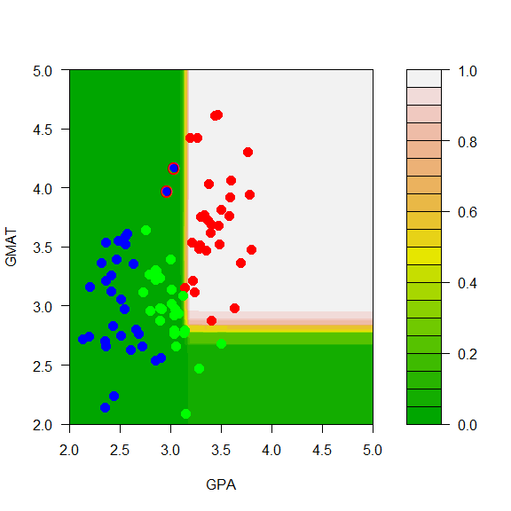
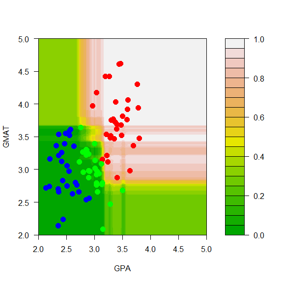
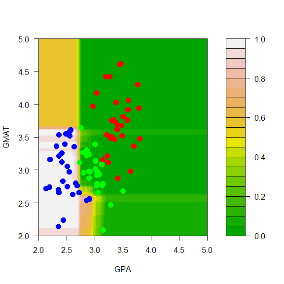
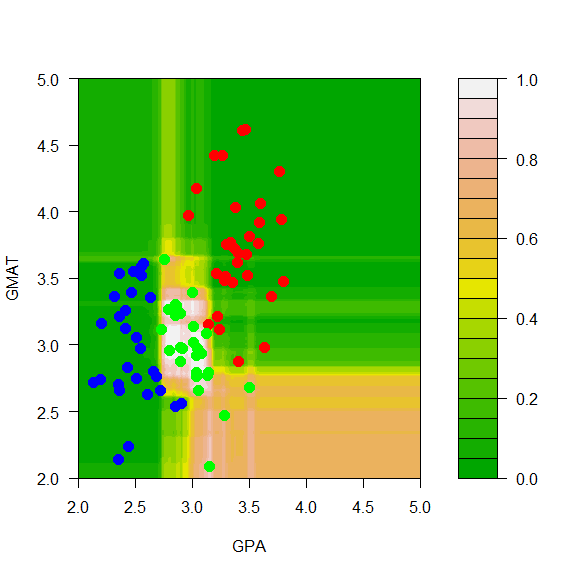
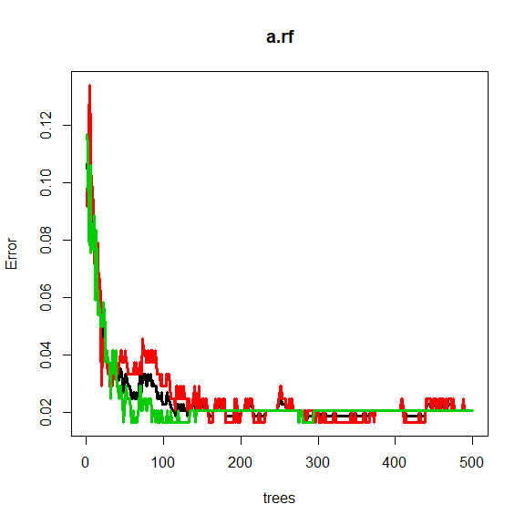
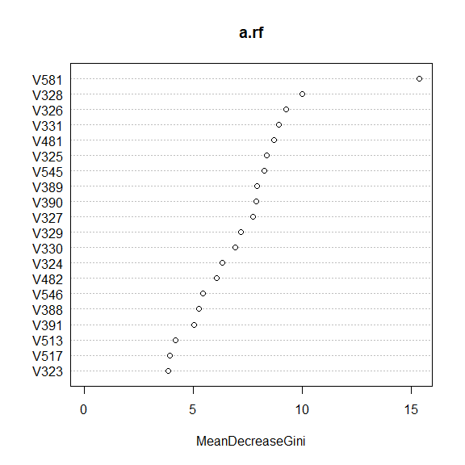

STAT406 - Lecture 16 notes
================
Matias Salibian-Barrera
2017-10-29

LICENSE
-------

These notes are released under the "Creative Commons Attribution-ShareAlike 4.0 International" license. See the **human-readable version** [here](https://creativecommons.org/licenses/by-sa/4.0/) and the **real thing** [here](https://creativecommons.org/licenses/by-sa/4.0/legalcode).

Lecture slides
--------------

The lecture slides are [here](STAT406-17-lecture-16-preliminary.pdf).

#### Instability of trees

Just like we discussed in the regression case, classification trees can be highly unstable (meaning: small changes in the training set may result in large changes in the corresponding tree).

We illustrate the problem on the toy example we used in class:

``` r
mm <- read.table('../Lecture15/T11-6.DAT', header=FALSE)
mm$V3 <- as.factor(mm$V3)
# re-scale one feature, for better plots
mm[,2] <- mm[,2] / 150
```

We now slightly modify the data and compare the resulting trees and their predictions:

``` r
mm2 <- mm
mm2[1,3] <- 2
mm2[7,3] <- 2
plot(mm2[,1:2], pch=19, cex=1.5, col=c("red", "blue", "green")[mm2[,3]],
     xlab='GPA', 'GMAT', xlim=c(2,5), ylim=c(2,5))
points(mm[c(1,7),-3], pch='O', cex=1.1, col=c("red", "blue", "green")[mm[c(1,7),3]])
```



``` r
library(rpart)
# default trees on original and modified data
a.t <- rpart(V3~V1+V2, data=mm, method='class', parms=list(split='information'))
a2.t <- rpart(V3~V1+V2, data=mm2, method='class', parms=list(split='information'))

aa <- seq(2, 5, length=200)
bb <- seq(2, 5, length=200)
dd <- expand.grid(aa, bb)
names(dd) <- names(mm)[1:2]

# corresponding predictions on the grid
p.t <- predict(a.t, newdata=dd, type='prob')
p2.t <- predict(a2.t, newdata=dd, type='prob')

# reds
filled.contour(aa, bb, matrix(p.t[,1], 200, 200), col=terrain.colors(20), xlab='GPA', ylab='GMAT',
plot.axes={axis(1); axis(2)}, 
panel.last={points(mm[,-3], pch=19, cex=1.5, col=c("red", "blue", "green")[mm[,3]])})
```


``` r
filled.contour(aa, bb, matrix(p2.t[,1], 200, 200), col=terrain.colors(20), xlab='GPA', ylab='GMAT',
plot.axes={axis(1); axis(2)},
panel.last={points(mm2[,-3], pch=19, cex=1.5, col=c("red", "blue", "green")[mm2[,3]]);
points(mm[c(1,7),-3], pch='O', cex=1.1, col=c("red", "blue", "green")[mm[c(1,7),3]])
})
```


``` r
# greens
filled.contour(aa, bb, matrix(p.t[,3], 200, 200), col=terrain.colors(20), xlab='GPA', ylab='GMAT',
plot.axes={axis(1); axis(2)}, panel.last={ points(mm[,-3], pch=19, cex=1.5, col=c("red", "blue", "green")[mm[,3]])})
```


``` r
filled.contour(aa, bb, matrix(p2.t[,3], 200, 200), col=terrain.colors(20), xlab='GPA', ylab='GMAT',
plot.axes={axis(1); axis(2)},
pane.last={points(mm2[,-3], pch=19, cex=1.5, col=c("red", "blue", "green")[mm2[,3]]);
points(mm[c(1,7),-3], pch='O', cex=1.1, col=c("red", "blue", "green")[mm[c(1,7),3]])
})
```



<!-- # predictions by color -->
<!-- mpt <- apply(p.t, 1, which.max) -->
<!-- mp2t <- apply(p2.t, 1, which.max) -->
<!-- image(aa, bb, matrix(as.numeric(mpt), 200, 200), col=c('pink', 'lightblue','lightgreen'), xlab='GPA', ylab='GMAT') -->
<!-- points(mm[,-3], pch=19, cex=1.5, col=c("red", "blue", "green")[mm[,3]]) -->
<!-- image(aa, bb, matrix(as.numeric(mp2t), 200, 200), col=c('pink', 'lightblue','lightgreen'), xlab='GPA', ylab='GMAT') -->
<!-- points(mm2[,-3], pch=19, cex=1.5, col=c("red", "blue", "green")[mm2[,3]]) -->
<!-- points(mm[c(1,7),-3], pch='O', cex=1.2, col=c("red", "blue", "green")[mm[c(1,7),3]]) -->
<!-- # Bagging!! -->
Bagging
-------

We now show the possitive effect of bagging. We average the predicted conditional probabilities, and we *bagg* prunned trees. Note that the predicted probabilities obtained with bagged trees do not differ much from each other when the *bags* were built with the original and perturbed data sets.

``` r
my.c <- rpart.control(minsplit=5, cp=1e-8, xval=10)
NB <- 1000
ts <- vector('list', NB)
set.seed(123)
n <- nrow(mm)
for(j in 1:NB) {
  ii <- sample(1:n, replace=TRUE)
  ts[[j]] <- rpart(V3~V1+V2, data=mm[ii,], method='class', parms=list(split='information'), control=my.c)
  b <- ts[[j]]$cptable[which.min(ts[[j]]$cptable[,"xerror"]),"CP"]
  ts[[j]] <- prune(ts[[j]], cp=b)
}

aa <- seq(2, 5, length=200)
bb <- seq(2, 5, length=200)
dd <- expand.grid(aa, bb)
names(dd) <- names(mm)[1:2]
pp0 <- vapply(ts, FUN=predict, FUN.VALUE=matrix(0, 200*200, 3), newdata=dd, type='prob')
pp <- apply(pp0, c(1, 2), mean)

# reds
filled.contour(aa, bb, matrix(pp[,1], 200, 200), col=terrain.colors(20), xlab='GPA', ylab='GMAT',
               plot.axes={axis(1); axis(2)},
                 panel.last={points(mm[,-3], pch=19, cex=1.5, col=c("red", "blue", "green")[mm[,3]])})
```


``` r
# blues
filled.contour(aa, bb, matrix(pp[,2], 200, 200), col=terrain.colors(20), xlab='GPA', ylab='GMAT',
               plot.axes={axis(1); axis(2)}, 
                 panel.last={points(mm[,-3], pch=19, cex=1.5, col=c("red", "blue", "green")[mm[,3]])})
```



``` r
# greens
filled.contour(aa, bb, matrix(pp[,3], 200, 200), col=terrain.colors(20), xlab='GPA', ylab='GMAT',
               plot.axes={axis(1); axis(2)}, 
                 panel.last={points(mm[,-3], pch=19, cex=1.5, col=c("red", "blue", "green")[mm[,3]])})
```


<!-- pp2 <- apply(pp, 1, which.max) -->
<!-- pdf('gpa-bagg-pred-rpart.pdf') -->
<!-- image(aa, bb, matrix(as.numeric(pp2), 200, 200), col=c('pink', 'lightblue','lightgreen'), xlab='GPA', ylab='GMAT') -->
<!-- points(mm[,-3], pch=19, cex=1.5, col=c("red", "blue", "green")[mm[,3]]) -->
<!-- dev.off() -->
And with the modified data



<!-- pp4 <- apply(pp3, 1, which.max) -->
<!-- pdf('gpa-bagg-pred2-rpart.pdf') -->
<!-- image(aa, bb, matrix(as.numeric(pp4), 200, 200), col=c('pink', 'lightblue','lightgreen'), xlab='GPA', ylab='GMAT') -->
<!-- points(mm2[,-3], pch=19, cex=1.5, col=c("red", "blue", "green")[mm2[,3]]) -->
<!-- points(mm[c(1,7),-3], pch='O', cex=1.2, col=c("red", "blue", "green")[mm[c(1,7),3]]) -->
<!-- dev.off() -->
Random Forests
==============

Even though using a *bagged* ensemble of trees helps to improve the stability of resulting predictor, it can be improved further. The main idea is to reduce the (conditional) potential correlation among bagged trees, as discussed in class.

``` r
library(randomForest)
a.rf <- randomForest(V3~V1+V2, data=mm, ntree=500) #, method='class', parms=list(split='information'))
pp.rf <- predict(a.rf, newdata=dd, type='prob')
filled.contour(aa, bb, matrix(pp.rf[,1], 200, 200), col=terrain.colors(20), xlab='GPA', ylab='GMAT',
               plot.axes={axis(1); axis(2)},
                 panel.last={points(mm[,-3], pch=19, cex=1.5, col=c("red", "blue", "green")[mm[,3]])
               })
```



And the predicted conditional probabilities for the rest of the classes:



A simple exercise would be for the reader to train a Random Forest on the perturbed data and verify that the predicted conditional probabilities do not change much, as was the case for the bagged classifier.

### Another example

We will now use a more interesting example. The ISOLET data, available here: <http://archive.ics.uci.edu/ml/datasets/ISOLET>, contains data on sound recordings of 150 speakers saying each letter of the alphabet (twice). See the original source for more details. Since the full data set is rather large, here we only use a subset corresponding to the observations for the letters **C** and **Z**.

We first load the training and test data sets, and force the response variable to be categorical, so that the `R` implementations of the different predictors we will use below will build classifiers and not their regression counterparts:

``` r
xtr <- read.table('isolet-train-c-z.data', sep=',')
xte <- read.table('isolet-test-c-z.data', sep=',') 
xtr$V618 <- as.factor(xtr$V618)
xte$V618 <- as.factor(xte$V618)
```

We first train a Random Forest, using all the default parameters, and check its performance on the test set:

``` r
library(randomForest)
set.seed(123)
a.rf <- randomForest(V618 ~ ., data=xtr, ntree=500) #, method='class', parms=list(split='information'))
p.rf <- predict(a.rf, newdata=xte, type='response')
table(p.rf, xte$V618)
```

    ##     
    ## p.rf  3 26
    ##   3  60  1
    ##   26  0 59

Note that the Random Forest only makes one mistake out of 120 observations in the test set. The OOB error rate estimate is slightly over 2%, and we see that 500 trees is a reasonable forest size:

``` r
plot(a.rf, lwd=3, lty=1)
```



``` r
a.rf
```

    ## 
    ## Call:
    ##  randomForest(formula = V618 ~ ., data = xtr, ntree = 500) 
    ##                Type of random forest: classification
    ##                      Number of trees: 500
    ## No. of variables tried at each split: 24
    ## 
    ##         OOB estimate of  error rate: 2.08%
    ## Confusion matrix:
    ##      3  26 class.error
    ## 3  235   5  0.02083333
    ## 26   5 235  0.02083333

To explore which variables were used in the forest, and also, their importance rank we use the function `varImpPlot`:

``` r
varImpPlot(a.rf, n.var=20)
```



We now compare the Random Forest with some of the other classifiers we saw in class, using their classification error rate on the test set as our comparison measure. We first start with K-NN:

``` r
library(class)
u1 <- knn(train=xtr[, -618], test=xte[, -618], cl=xtr[, 618], k = 1)
table(u1, xte$V618)
```

    ##     
    ## u1    3 26
    ##   3  57  9
    ##   26  3 51

``` r
u5 <- knn(train=xtr[, -618], test=xte[, -618], cl=xtr[, 618], k = 5)
table(u5, xte$V618)
```

    ##     
    ## u5    3 26
    ##   3  58  5
    ##   26  2 55

``` r
u10 <- knn(train=xtr[, -618], test=xte[, -618], cl=xtr[, 618], k = 10)
table(u10, xte$V618)
```

    ##     
    ## u10   3 26
    ##   3  58  6
    ##   26  2 54

``` r
u20 <- knn(train=xtr[, -618], test=xte[, -618], cl=xtr[, 618], k = 20)
table(u20, xte$V618)
```

    ##     
    ## u20   3 26
    ##   3  58  5
    ##   26  2 55

``` r
u50 <- knn(train=xtr[, -618], test=xte[, -618], cl=xtr[, 618], k = 50)
table(u50, xte$V618)
```

    ##     
    ## u50   3 26
    ##   3  59  6
    ##   26  1 54

To use logistic regression we first create a new variable that is 1 for the letter **C** and 0 for the letter **Z**, and use it as our response variable.

``` r
xtr$V619 <- as.numeric(xtr$V618==3)
d.glm <- glm(V619 ~ . - V618, data=xtr, family=binomial)
pr.glm <- as.numeric( predict(d.glm, newdata=xte, type='response') >  0.5 )
table(pr.glm, xte$V618)
```

    ##       
    ## pr.glm  3 26
    ##      0 25 33
    ##      1 35 27

Question for the reader: why do you think this classifier's performance is so disappointing?

It is interesting to see how a simple LDA classifier does:

``` r
library(MASS)
xtr$V619 <- NULL
d.lda <- lda(V618 ~ . , data=xtr)
pr.lda <- predict(d.lda, newdata=xte)$class
table(pr.lda, xte$V618)
```

    ##       
    ## pr.lda  3 26
    ##     3  58  3
    ##     26  2 57

Finally, note that a carefully built classification tree performs remarkably well, only using 3 features:

``` r
library(rpart)
my.c <- rpart.control(minsplit=5, cp=1e-8, xval=10)
set.seed(987)
a.tree <- rpart(V618 ~ ., data=xtr, method='class', parms=list(split='information'), control=my.c)
cp <- a.tree$cptable[which.min(a.tree$cptable[,"xerror"]),"CP"]
a.tp <- prune(a.tree, cp=cp)
p.t <- predict(a.tp, newdata=xte, type='vector')
table(p.t, xte$V618)
```

    ##    
    ## p.t  3 26
    ##   1 57  0
    ##   2  3 60

Finally, note that if you train a single classification tree with the default values for the stopping criterion tuning parameters, the tree also uses only 3 features, but its classification error rate on the test set is almost double of the pruned one:

``` r
set.seed(987)
a2.tree <- rpart(V618 ~ ., data=xtr, method='class', parms=list(split='information'))
p2.t <- predict(a2.tree, newdata=xte, type='vector')
table(p2.t, xte$V618)
```

    ##     
    ## p2.t  3 26
    ##    1 57  2
    ##    2  3 58
