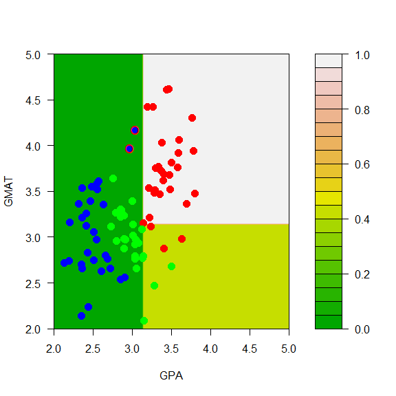
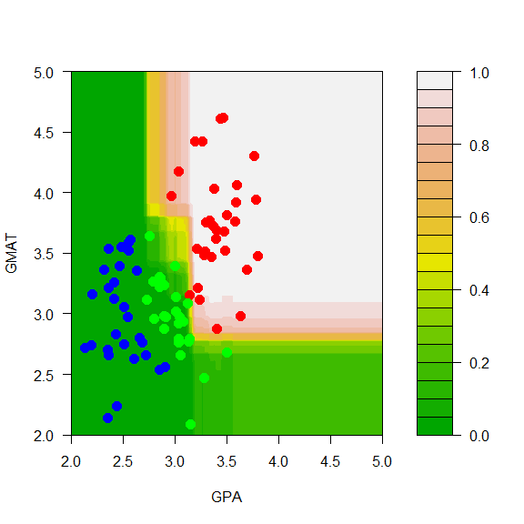

STAT406 - Lecture 16 notes
================
Matias Salibian-Barrera
2017-10-29

LICENSE
-------

These notes are released under the "Creative Commons Attribution-ShareAlike 4.0 International" license. See the **human-readable version** [here](https://creativecommons.org/licenses/by-sa/4.0/) and the **real thing** [here](https://creativecommons.org/licenses/by-sa/4.0/legalcode).

Lecture slides
--------------

The lecture slides are [here](STAT406-17-lecture-16-preliminary.pdf).

#### Instability of trees

Just like we discussed in the regression case, classification trees can be highly unstable (meaning: small changes in the training set may result in large changes in the corresponding tree).

We illustrate the problem on the toy example we used in class:

``` r
mm <- read.table('../Lecture15/T11-6.DAT', header=FALSE)
mm$V3 <- as.factor(mm$V3)
# re-scale one feature, for better plots
mm[,2] <- mm[,2] / 150
```

We now slightly modify the data and compare the resulting trees and their predictions:

``` r
mm2 <- mm
mm2[1,3] <- 2
mm2[7,3] <- 2
plot(mm2[,1:2], pch=19, cex=1.5, col=c("red", "blue", "green")[mm2[,3]],
     xlab='GPA', 'GMAT', xlim=c(2,5), ylim=c(2,5))
points(mm[c(1,7),-3], pch='O', cex=1.1, col=c("red", "blue", "green")[mm[c(1,7),3]])
```


``` r
library(rpart)
# default trees on original and modified data
a.t <- rpart(V3~V1+V2, data=mm, method='class', parms=list(split='information'))
a2.t <- rpart(V3~V1+V2, data=mm2, method='class', parms=list(split='information'))

aa <- seq(2, 5, length=200)
bb <- seq(2, 5, length=200)
dd <- expand.grid(aa, bb)
names(dd) <- names(mm)[1:2]

# corresponding predictions on the grid
p.t <- predict(a.t, newdata=dd, type='prob')
p2.t <- predict(a2.t, newdata=dd, type='prob')

# reds
filled.contour(aa, bb, matrix(p.t[,1], 200, 200), col=terrain.colors(20), xlab='GPA', ylab='GMAT',
plot.axes={axis(1); axis(2)}, 
panel.last={points(mm[,-3], pch=19, cex=1.5, col=c("red", "blue", "green")[mm[,3]])})
```


``` r
filled.contour(aa, bb, matrix(p2.t[,1], 200, 200), col=terrain.colors(20), xlab='GPA', ylab='GMAT',
plot.axes={axis(1); axis(2)},
panel.last={points(mm2[,-3], pch=19, cex=1.5, col=c("red", "blue", "green")[mm2[,3]]);
points(mm[c(1,7),-3], pch='O', cex=1.1, col=c("red", "blue", "green")[mm[c(1,7),3]])
})
```



``` r
# greens
filled.contour(aa, bb, matrix(p.t[,3], 200, 200), col=terrain.colors(20), xlab='GPA', ylab='GMAT',
plot.axes={axis(1); axis(2)}, panel.last={ points(mm[,-3], pch=19, cex=1.5, col=c("red", "blue", "green")[mm[,3]])})
```


``` r
filled.contour(aa, bb, matrix(p2.t[,3], 200, 200), col=terrain.colors(20), xlab='GPA', ylab='GMAT',
plot.axes={axis(1); axis(2)},
pane.last={points(mm2[,-3], pch=19, cex=1.5, col=c("red", "blue", "green")[mm2[,3]]);
points(mm[c(1,7),-3], pch='O', cex=1.1, col=c("red", "blue", "green")[mm[c(1,7),3]])
})
```


<!-- # predictions by color -->
<!-- mpt <- apply(p.t, 1, which.max) -->
<!-- mp2t <- apply(p2.t, 1, which.max) -->
<!-- image(aa, bb, matrix(as.numeric(mpt), 200, 200), col=c('pink', 'lightblue','lightgreen'), xlab='GPA', ylab='GMAT') -->
<!-- points(mm[,-3], pch=19, cex=1.5, col=c("red", "blue", "green")[mm[,3]]) -->
<!-- image(aa, bb, matrix(as.numeric(mp2t), 200, 200), col=c('pink', 'lightblue','lightgreen'), xlab='GPA', ylab='GMAT') -->
<!-- points(mm2[,-3], pch=19, cex=1.5, col=c("red", "blue", "green")[mm2[,3]]) -->
<!-- points(mm[c(1,7),-3], pch='O', cex=1.2, col=c("red", "blue", "green")[mm[c(1,7),3]]) -->
<!-- # Bagging!! -->
Bagging
-------

We now show the possitive effect of bagging. We average the predicted conditional probabilities, and we *bagg* prunned trees. Note that the predicted probabilities obtained with bagged trees do not differ much from each other when the *bags* were built with the original and perturbed data sets.

``` r
my.c <- rpart.control(minsplit=5, cp=1e-8, xval=10)
NB <- 1000
ts <- vector('list', NB)
set.seed(123)
n <- nrow(mm)
for(j in 1:NB) {
  ii <- sample(1:n, replace=TRUE)
  ts[[j]] <- rpart(V3~V1+V2, data=mm[ii,], method='class', parms=list(split='information'), control=my.c)
  b <- ts[[j]]$cptable[which.min(ts[[j]]$cptable[,"xerror"]),"CP"]
  ts[[j]] <- prune(ts[[j]], cp=b)
}

aa <- seq(2, 5, length=200)
bb <- seq(2, 5, length=200)
dd <- expand.grid(aa, bb)
names(dd) <- names(mm)[1:2]
pp0 <- vapply(ts, FUN=predict, FUN.VALUE=matrix(0, 200*200, 3), newdata=dd, type='prob')
pp <- apply(pp0, c(1, 2), mean)

# reds
filled.contour(aa, bb, matrix(pp[,1], 200, 200), col=terrain.colors(20), xlab='GPA', ylab='GMAT',
               plot.axes={axis(1); axis(2)},
                 panel.last={points(mm[,-3], pch=19, cex=1.5, col=c("red", "blue", "green")[mm[,3]])})
```



``` r
# blues
filled.contour(aa, bb, matrix(pp[,2], 200, 200), col=terrain.colors(20), xlab='GPA', ylab='GMAT',
               plot.axes={axis(1); axis(2)}, 
                 panel.last={points(mm[,-3], pch=19, cex=1.5, col=c("red", "blue", "green")[mm[,3]])})
```


``` r
# greens
filled.contour(aa, bb, matrix(pp[,3], 200, 200), col=terrain.colors(20), xlab='GPA', ylab='GMAT',
               plot.axes={axis(1); axis(2)}, 
                 panel.last={points(mm[,-3], pch=19, cex=1.5, col=c("red", "blue", "green")[mm[,3]])})
```


<!-- pp2 <- apply(pp, 1, which.max) -->
<!-- pdf('gpa-bagg-pred-rpart.pdf') -->
<!-- image(aa, bb, matrix(as.numeric(pp2), 200, 200), col=c('pink', 'lightblue','lightgreen'), xlab='GPA', ylab='GMAT') -->
<!-- points(mm[,-3], pch=19, cex=1.5, col=c("red", "blue", "green")[mm[,3]]) -->
<!-- dev.off() -->
And with the modified data


<!-- pp4 <- apply(pp3, 1, which.max) -->
<!-- pdf('gpa-bagg-pred2-rpart.pdf') -->
<!-- image(aa, bb, matrix(as.numeric(pp4), 200, 200), col=c('pink', 'lightblue','lightgreen'), xlab='GPA', ylab='GMAT') -->
<!-- points(mm2[,-3], pch=19, cex=1.5, col=c("red", "blue", "green")[mm2[,3]]) -->
<!-- points(mm[c(1,7),-3], pch='O', cex=1.2, col=c("red", "blue", "green")[mm[c(1,7),3]]) -->
<!-- dev.off() -->
Random Forests
==============

Even though using a *bagged* ensemble of trees helps to improve the stability of resulting predictor, it can be improved further. The main idea is to reduce the (conditional) potential correlation among bagged trees, as discussed in class.

``` r
library(randomForest)
a.rf <- randomForest(V3~V1+V2, data=mm, ntree=500) #, method='class', parms=list(split='information'))
pp.rf <- predict(a.rf, newdata=dd, type='prob')
filled.contour(aa, bb, matrix(pp.rf[,1], 200, 200), col=terrain.colors(20), xlab='GPA', ylab='GMAT',
               plot.axes={axis(1); axis(2)},
                 panel.last={points(mm[,-3], pch=19, cex=1.5, col=c("red", "blue", "green")[mm[,3]])
               })
```


And the predicted conditional probabilities for the rest of the classes:


<!-- ### Another example -->
<!-- # http://archive.ics.uci.edu/ml/datasets/ISOLET -->
<!-- #Data Set Information: -->
<!-- # -->
<!-- #This data set was generated as follows. 150 subjects spoke the name  -->
<!-- #of each letter of the alphabet twice. Hence, we have 52 training examples  -->
<!-- #from each speaker. The speakers are grouped into sets of 30 speakers  -->
<!-- #each, and are referred to as isolet1, isolet2, isolet3, isolet4, and  -->
<!-- #isolet5. The data appears in isolet1+2+3+4.data in sequential order,  -->
<!-- #first the speakers from isolet1, then isolet2, and so on. The test set,  -->
<!-- #isolet5, is a separate file. -->
<!-- # -->
<!-- #You will note that 3 examples are missing. I believe they were dropped  -->
<!-- #due to difficulties in recording. -->
<!-- #     The features are described in the paper by Cole and Fanty cited -->
<!-- #     above.  The features include spectral coefficients; contour -->
<!-- #     features, sonorant features, pre-sonorant features, and -->
<!-- #     post-sonorant features.  Exact order of appearance of the -->
<!-- #     features is not known. -->
<!-- #   (a) Fanty, M., Cole, R. (1991).  Spoken letter recognition.  In -->
<!-- #       Lippman, R. P., Moody, J., and Touretzky, D. S. (Eds). -->
<!-- #       Advances in Neural Information Processing Systems 3.  San -->
<!-- #       Mateo, CA: Morgan Kaufmann. -->
<!-- x <- read.table('isolet-train.data', sep=',') -->
<!-- xt <- read.table('isolet-test.data', sep=',') -->
<!-- # 7, 10 -->
<!-- # 13, 14 -->
<!-- # 3 and 26 "C" and "Z" -->
<!-- xa <- x[ x$V618 == 3, ] -->
<!-- xb <- x[ x$V618 == 26, ] -->
<!-- xx <- rbind(xa, xb) -->
<!-- xx$V618 <- as.factor(xx$V618) -->
<!-- xta <- xt[ xt$V618 == 3, ] -->
<!-- xtb <- xt[ xt$V618 == 26, ] -->
<!-- dd <- rbind(xta, xtb) -->
<!-- truth <- as.factor(c(xt1[,618], xt8[,618])) -->
<!-- library(tree) -->
<!-- d.r <- tree(V618 ~., data=xx, split='deviance') -->
<!-- pdf('letters-tree-deviance.pdf') -->
<!-- plot(d.r) -->
<!-- text(d.r, pretty=10, label='yprob', cex=1.1) -->
<!-- dev.off() -->
<!-- d.pr <- predict(d.r, newdata=dd, type='class') -->
<!-- table(truth, d.pr) -->
<!-- u1 <- knn(train=xx[,-618], test=dd[,-618], cl=xx[,618], k = 1) -->
<!-- table(truth, u1) -->
<!-- u5 <- knn(train=xx[,-618], test=dd[,-618], cl=xx[,618], k = 5) -->
<!-- table(truth, u5) -->
<!-- xx$V619 <- as.numeric(xx$V618==3) -->
<!-- d.glm <- glm(V619 ~ . - V618, data=xx, family=binomial) -->
<!-- dd$V618 <- as.factor(dd$V618) -->
<!-- pr.glm <- predict(d.glm, newdata=dd, type='response') -->
<!-- pr.glm <- as.numeric(pr.glm > 0.5) -->
<!-- table(truth, pr.glm) -->
<!-- library(MASS) -->
<!-- xx <- rbind(xa, xb) -->
<!-- xx$V618 <- as.factor(xx$V618) -->
<!-- d.lda <- lda(V618 ~ ., data=xx) -->
<!-- pr.lda <- predict(d.lda, newdata=dd)$class -->
<!-- table(truth, pr.lda) -->
