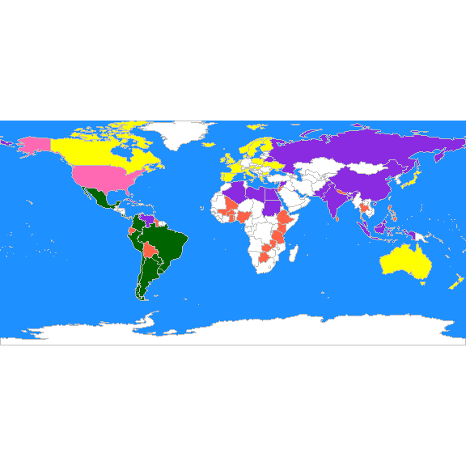
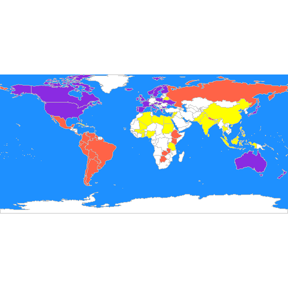
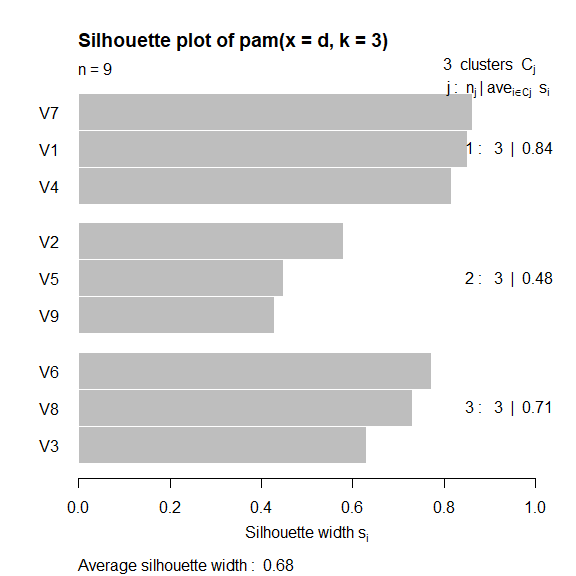
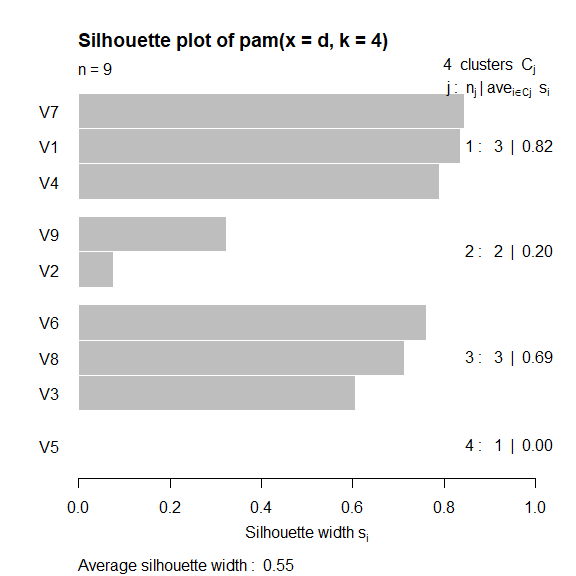
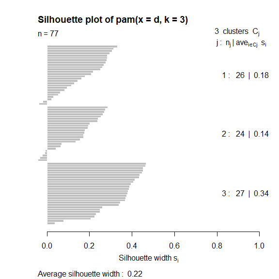
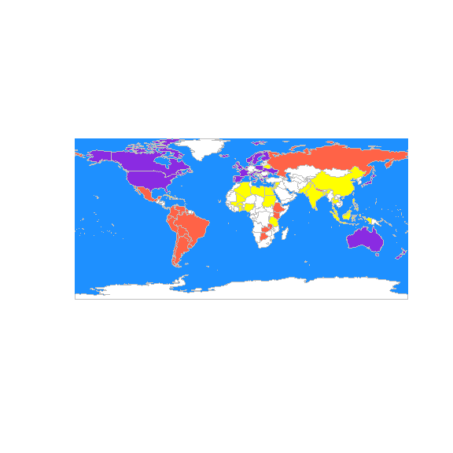

STAT406 - Lecture 20 notes
================
Matias Salibian-Barrera
2017-11-09

LICENSE
-------

These notes are released under the "Creative Commons Attribution-ShareAlike 4.0 International" license. See the **human-readable version** [here](https://creativecommons.org/licenses/by-sa/4.0/) and the **real thing** [here](https://creativecommons.org/licenses/by-sa/4.0/legalcode).

Lecture slides
--------------

The lecture slides are [here](STAT406-17-lecture-20-preliminary.pdf).

Unsupervised learning
=====================

Unsupervised learning methods differ from the supervised ones we have studied so far, in that there is no response variable. The objective is not to predict a specific variable, but rather to identify different possible structures that may be present in the data. For example, one may be interested in determining whether the observations are "grouped" in some way (clustering), or if the data can be efficiently represented using fewer variables or features (dimension reduction).

Many of these methods do not rely on any probabilistic model, and thus there may not be a clear *target* to be estimated or approximated. As a consequence, the conclusions that can be reached from this type of analyses is essentially exploratory in nature.

Clustering
----------

A large class of unsupervised learning methods is collectively called *clustering*. The data consist of *n* observations **X**\_1, **X**\_2, ..., **X**\_n, each with *p* features, and the goal is to identify possible *groups* in the data. In general, the number of groups is also unknown.

In this course we will discuss both model-free and model-based clustering methods. In the first group we will present K-means (and several related methods), and hierarchical clustering methods (agglomerative). Model-based clustering is based on the assumption that the data is a random sample, and that the distribution of the vector of features **X** is a combination of different distribution, depending on which group the observation belongs to.

### K-means, K-means++, K-medoids

Probably the most intuitive and easier to explain unsupervised clustering algorithm is K-means (and its variants). The specifics of the algorithm were discussed in class. Here we will illustrate its use on a few examples.

#### UN votes example.

These data contain the historical voting patterns of United Nations members. More details can be found here:

> Voeten, Erik; Strezhnev, Anton; Bailey, Michael, 2009, "United Nations General Assembly Voting Data", <http://hdl.handle.net/1902.1/12379>, Harvard Dataverse, V11

The UN was founded in 1946 and it contains 193 member states. These data records "important" votes, as classified by the U.S. State Department. The votes for each country were coded as follows: Yes (1), Abstain (2), No (3), Absent (8), Not a Member (9). There were 368 important votes, and 77 countries voted in at least 95% of these. We focus on these UN members. Our goal is to explore whether voting patterns reflect political alignments, and also whether vote along known political blocks. Our data consists of 77 observations with 368 variables each. More information on these data can be found [here](https://dataverse.harvard.edu/dataset.xhtml?persistentId=hdl:1902.1/12379).

``` r
# Read pre-wrangled data

X <- read.table(file='unvotes.csv', sep=',', row.names=1, header=TRUE)

# Compute pairwise distances
# note that each country's votes are stored column-wise

# Filter resolutions for which all countries voted
X2 <- X[complete.cases(X),]

# K-means, a random start, K = 5
set.seed(123)
b <- kmeans(t(X2), centers=5, iter.max=20, nstart=1)
table(b$cluster)
```

    ## 
    ##  1  2  3  4  5 
    ## 18  2  7 19 31

``` r
# Another random start
b <- kmeans(t(X2), centers=5, iter.max=20, nstart=1)
table(b$cluster)
```

    ## 
    ##  1  2  3  4  5 
    ## 27 12 13  7 18

``` r
# Take the best solution out of 1000 random starts
b <- kmeans(t(X2), centers=5, iter.max=20, nstart=1000)
table(b$cluster)
```

    ## 
    ##  1  2  3  4  5 
    ## 11  2 21 17 26

``` r
# Look at the clusters
split(colnames(X2), b$cluster)
```

    ## $`1`
    ##  [1] "Argentina"  "Bahamas"    "Brazil"     "Chile"      "Colombia"  
    ##  [6] "Costa.Rica" "Mexico"     "Panama"     "Paraguay"   "Peru"      
    ## [11] "Uruguay"   
    ## 
    ## $`2`
    ## [1] "Israel" "USA"   
    ## 
    ## $`3`
    ##  [1] "Bolivia"             "Botswana"            "Burkina.Faso"       
    ##  [4] "Ecuador"             "Ethiopia"            "Ghana"              
    ##  [7] "Guyana"              "Jamaica"             "Jordan"             
    ## [10] "Kenya"               "Mali"                "Nepal"              
    ## [13] "Nigeria"             "Philippines"         "Singapore"          
    ## [16] "Sri.Lanka"           "Tanzania"            "Thailand"           
    ## [19] "Togo"                "Trinidad.and.Tobago" "Zambia"             
    ## 
    ## $`4`
    ##  [1] "Algeria"              "Bangladesh"           "Belarus"             
    ##  [4] "Brunei.Darussalam"    "China"                "Cuba"                
    ##  [7] "Egypt"                "India"                "Indonesia"           
    ## [10] "Kuwait"               "Libya"                "Malaysia"            
    ## [13] "Pakistan"             "Russian.Federation"   "Sudan"               
    ## [16] "Syrian.Arab.Republic" "Venezuela"           
    ## 
    ## $`5`
    ##  [1] "Australia"   "Austria"     "Belgium"     "Bulgaria"    "Canada"     
    ##  [6] "Cyprus"      "Denmark"     "Finland"     "France"      "Greece"     
    ## [11] "Hungary"     "Iceland"     "Ireland"     "Italy"       "Japan"      
    ## [16] "Luxembourg"  "Malta"       "Netherlands" "New.Zealand" "Norway"     
    ## [21] "Poland"      "Portugal"    "Spain"       "Sweden"      "UK"         
    ## [26] "Ukraine"

``` r
# Easier to see on a map

library(rworldmap)
library(countrycode)
these <- countrycode(colnames(X2), 'country.name', 'iso3c')
malDF <- data.frame(country = these,
                    cluster = b$cluster)

# malDF is a data.frame with the ISO3 country names plus a variable to
# merge to the map data

# This will join your malDF data.frame to the country map data
malMap <- joinCountryData2Map(malDF, joinCode = "ISO3",
                              nameJoinColumn = "country")
```

    ## 77 codes from your data successfully matched countries in the map
    ## 0 codes from your data failed to match with a country code in the map
    ## 166 codes from the map weren't represented in your data

``` r
# colors()[grep('blue', colors())]

# fill the space on the graphical device
par(mai=c(0,0,0,0),xaxs="i",yaxs="i")

mapCountryData(malMap, nameColumnToPlot="cluster", catMethod = "categorical",
               missingCountryCol = 'white', addLegend=FALSE, mapTitle="",
               colourPalette=c('darkgreen', 'hotpink', 'tomato', 'blueviolet', 'yellow'),
               oceanCol='dodgerblue')
```



``` r
# K-medoids
# using cluster::pam() implementation


library(cluster)
# Use Euclidean distances
d <- dist(t(X))
# what happens with missing values?

set.seed(123)
a <- pam(d, k=3)

# compare with K-means
#
b <- kmeans(t(X2), centers=3, iter.max=20, nstart=1000)

table(a$clustering)
```

    ## 
    ##  1  2  3 
    ## 26 24 27

``` r
table(b$cluster)
```

    ## 
    ##  1  2  3 
    ## 16 33 28

``` r
malDF <- data.frame(country = these,
                    cluster = a$clustering)
malMap <- joinCountryData2Map(malDF, joinCode = "ISO3",
                              nameJoinColumn = "country")
```

    ## 77 codes from your data successfully matched countries in the map
    ## 0 codes from your data failed to match with a country code in the map
    ## 166 codes from the map weren't represented in your data

``` r
par(mai=c(0,0,0,0),xaxs="i",yaxs="i")
mapCountryData(malMap, nameColumnToPlot="cluster", catMethod = "categorical",
               missingCountryCol = 'white', addLegend=FALSE, mapTitle="",
               #               colourPalette='diverging',
               colourPalette=c('yellow', 'tomato', 'blueviolet'),
               oceanCol='dodgerblue') #, aspect='variable')
```



#### Breweries

9 breweries ranked on 26 attributes each Description: Beer drinkers were asked to rate 9 breweries on 26 attributes. The attributes were, e.g., Brewery has rich tradition; or Brewery makes very good Pils beer. Relative to each attribute, the informant had to assign each brewery a score on a 6-point scale ranging from 1=not true at all to 6=very true.

``` r
x <- read.table('breweries.dat', header=FALSE)
x <- t(x)
d <- dist(x, method='manhattan')
set.seed(123)
a <- pam(d, k=3)
plot(a)
```



``` r
#plot.partition
```

#### Cancer example

-   nci.data
-   <http://statweb.stanford.edu/~tibs/ElemStatLearn/datasets/nci.info.txt>
-   <http://statweb.stanford.edu/~tibs/ElemStatLearn/datasets/nci.data>

``` r
# nci.data <-
# read.table('http://statweb.stanford.edu/~tibs/ElemStatLearn/datasets/nci.data',
# header=FALSE)
data(nci, package = "ElemStatLearn")
nci.names <- c("CNS", "CNS", "CNS", "RENAL", "BREAST", "CNS", "CNS", "BREAST", 
    "NSCLC", "NSCLC", "RENAL", "RENAL", "RENAL", "RENAL", "RENAL", "RENAL", 
    "RENAL", "BREAST", "NSCLC", "RENAL", "UNKNOWN", "OVARIAN", "MELANOMA", "PROSTATE", 
    "OVARIAN", "OVARIAN", "OVARIAN", "OVARIAN", "OVARIAN", "PROSTATE", "NSCLC", 
    "NSCLC", "NSCLC", "LEUKEMIA", "K562B-repro", "K562A-repro", "LEUKEMIA", 
    "LEUKEMIA", "LEUKEMIA", "LEUKEMIA", "LEUKEMIA", "COLON", "COLON", "COLON", 
    "COLON", "COLON", "COLON", "COLON", "MCF7A-repro", "BREAST", "MCF7D-repro", 
    "BREAST", "NSCLC", "NSCLC", "NSCLC", "MELANOMA", "BREAST", "BREAST", "MELANOMA", 
    "MELANOM", "MELANOMA", "MELANOMA", "MELANOMA", "MELANOMA")
ncit <- t(nci)
set.seed(31)
a <- kmeans(ncit, centers = 8)
table(a$cluster)
```

    ## 
    ##  1  2  3  4  5  6  7  8 
    ##  8  6  6 14  3  8  4 15

``` r
set.seed(31)
a <- kmeans(ncit, centers=8, iter.max=5000, nstart=100)
table(a$cluster)
```

    ## 
    ##  1  2  3  4  5  6  7  8 
    ##  3  8  5 14  6 15  9  4

``` r
split(nci.names, a$cluster)
```

    ## $`1`
    ## [1] "K562B-repro" "K562A-repro" "LEUKEMIA"   
    ## 
    ## $`2`
    ## [1] "CNS"    "CNS"    "CNS"    "RENAL"  "BREAST" "CNS"    "CNS"    "BREAST"
    ## 
    ## $`3`
    ## [1] "LEUKEMIA" "LEUKEMIA" "LEUKEMIA" "LEUKEMIA" "LEUKEMIA"
    ## 
    ## $`4`
    ##  [1] "PROSTATE" "OVARIAN"  "OVARIAN"  "OVARIAN"  "OVARIAN"  "OVARIAN" 
    ##  [7] "PROSTATE" "NSCLC"    "NSCLC"    "NSCLC"    "COLON"    "NSCLC"   
    ## [13] "NSCLC"    "NSCLC"   
    ## 
    ## $`5`
    ## [1] "COLON" "COLON" "COLON" "COLON" "COLON" "COLON"
    ## 
    ## $`6`
    ##  [1] "NSCLC"    "NSCLC"    "RENAL"    "RENAL"    "RENAL"    "RENAL"   
    ##  [7] "RENAL"    "RENAL"    "RENAL"    "BREAST"   "NSCLC"    "RENAL"   
    ## [13] "UNKNOWN"  "OVARIAN"  "MELANOMA"
    ## 
    ## $`7`
    ## [1] "MELANOMA" "BREAST"   "BREAST"   "MELANOMA" "MELANOM"  "MELANOMA"
    ## [7] "MELANOMA" "MELANOMA" "MELANOMA"
    ## 
    ## $`8`
    ## [1] "MCF7A-repro" "BREAST"      "MCF7D-repro" "BREAST"

``` r
library(cluster)
x <- read.table('breweries.dat', header=FALSE)
x <- t(x)
d <- dist(x, method='manhattan')

a <- pam(d, k=3)
plot(a)
```


``` r
a <- pam(d, k=4)
plot(a)
```



``` r
X <- read.table(file='unvotes.csv', sep=',', row.names=1, header=TRUE)
# k-medoids
d <- dist(t(X))
set.seed(123)
a <- pam(d, k=3) 
plot(a)
```



``` r
library(countrycode)
these <- countrycode(colnames(X), 'country.name', 'iso3c')

library(rworldmap)
malDF <- data.frame(country = these,
                    cluster = a$clustering)
malMap <- joinCountryData2Map(malDF, joinCode = "ISO3",
                              nameJoinColumn = "country")
```

    ## 77 codes from your data successfully matched countries in the map
    ## 0 codes from your data failed to match with a country code in the map
    ## 166 codes from the map weren't represented in your data

``` r
mapCountryData(malMap, nameColumnToPlot="cluster", catMethod = "categorical",
               missingCountryCol = 'white', addLegend=FALSE, mapTitle="",
               #               colourPalette='diverging',
               colourPalette=c('yellow', 'tomato', 'blueviolet'),
               oceanCol='dodgerblue') #, aspect='variable')
```


