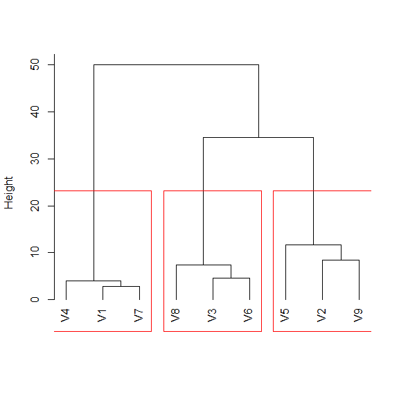
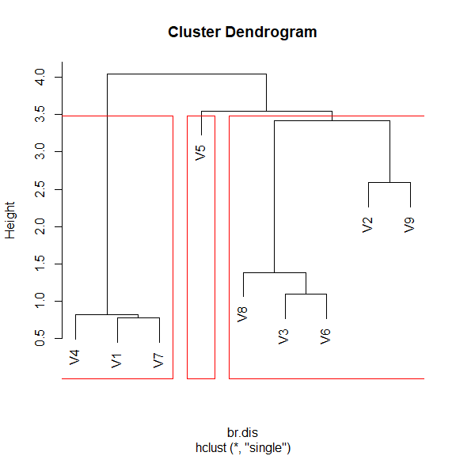
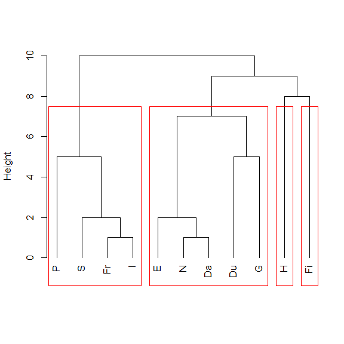
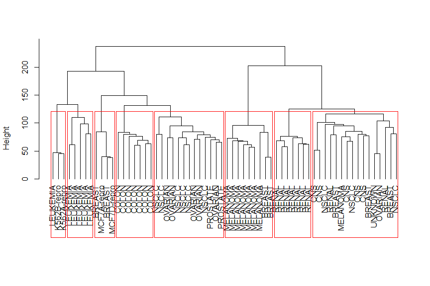
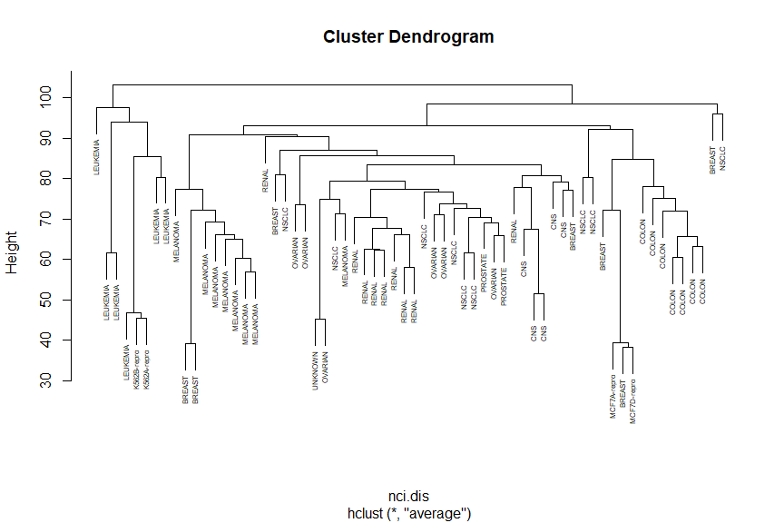

STAT406 - Lecture 23 notes
================
Matias Salibian-Barrera
2017-11-20

LICENSE
-------

These notes are released under the "Creative Commons Attribution-ShareAlike 4.0 International" license. See the **human-readable version** [here](https://creativecommons.org/licenses/by-sa/4.0/) and the **real thing** [here](https://creativecommons.org/licenses/by-sa/4.0/legalcode).

Lecture slides
--------------

The lecture slides are [here](STAT406-17-lecture-23-preliminary.pdf).

Hierarchical clustering.
------------------------

Hierarchical clustering refers to a class of algorithms that work in a different way from the ones we have seen so far. Both k-means and model-based clustering try to find a pre-specified number of clusters *simultaneously*. Hierarchical methods are *agglomerative*--they start with *n* clusters (one singleton cluster for each observation in the data set), and form a hierarchical sequence of clusters of sizes *n-1*, *n-2*, ..., *3*, *2*, and a final "cluster" composed of all the observations. The user then needs to decide where to *cut* the sequence, in other words, how many clusters to identify. Algorithms in this class are also called agglomerative, for obvious reasons.

The general algorithm can be described as follows:

1.  Set *K = n* (the number of observations in the data), and Start with *n* clusters;
2.  Merge 2 clusters to form *K-1* clusters;
3.  Set `K = K - 1` (i.e. `K--`, i.e. decrease *K* by one)
4.  If `K > 1` repeat from step 2 above.

The different versions (*flavours*) of this method are obtained by varying the criteria to decide which 2 clusters to merge at each run of step 2 above, and also which distance (or dissimilarity) measure is used.

There are a few different tools to decide how many clusters may be present in the data following a hierarchical clustering algorithm. The most commonly used is a graphical representation of the sequence of clusters, called a dendogram.

Please refer to your class notes for details on the different merging criteria and the interpretation of a dendogram. Below we will illustrate the use of these algorithms on a few examples.

#### Breweries example

Beer drinkers were asked to rate 9 breweries on 26 attributes. The attributes were, e.g., Brewery has rich tradition; or Brewery makes very good Pils beer. Relative to each attribute, the informant had to assign each brewery a score on a 6-point scale ranging from 1=not true at all to 6=very true. We read the data, and compute the pairwise *L\_1* distances between the 9 breweries:

``` r
x <- read.table("../Lecture20/breweries.dat", header = FALSE)
x <- t(x)
d <- dist(x, method = "manhattan")
```

One implementation of hierarchical clustering methods in `R` is in the function `hclust` in package `cluster`. We first use Ward's information criterion (corrected to use squared distances). The `plot` method for objects of class `hclust` produces the associated dendogram. The function `rect.hclust` computes the height at which one shuld *cut* the dendogram to obtain a desired number *k* of clusters. Below we show the result for *K = 3* clusters:

``` r
# hierarchical
library(cluster)
plot(cl <- hclust(d, method = "ward.D2"), main = "", xlab = "", sub = "", hang = -1)
rect.hclust(cl, k = 3, border = "red")
```



Now we repeat the analysis but using Euclidean distances and *single linkage*, and show *K = 3* clusters:

``` r
br.dis <- dist(x)  # L2
# compute hierarchical clustering using single linkage
br.hc <- hclust(br.dis, method = "single")
# show the dendogram
plot(br.hc)
# identify 3 clusters
br.hc.3 <- rect.hclust(br.hc, k = 3)
```



Note how these 3 clusters are somewhat different from the ones found before. However, the *(V1, V4, V7)* cluster is present in both partitions, and also the triplet *(V3, V6, V8)* stays together as well. You are welcome to explore other variants of this algorithm on this example.

#### Languages example

The details of this example were discussed in class. Here we present the results of single linkage, complete linkage and Ward's criterion. Which distance / dissimilarity measure is used?

``` r
dd <- read.table("languages.dat", header = FALSE)
names(dd) <- c("E", "N", "Da", "Du", "G", "Fr", "S", "I", "P", "H", "Fi")
dd <- (dd + t(dd)/2)
d <- as.dist(dd)

# hierarchical

plot(cl <- hclust(d, method = "single"), main = "", xlab = "", sub = "", hang = -1)
rect.hclust(cl, k = 4, border = "red")
```


``` r
plot(cl <- hclust(d, method = "complete"), main = "", xlab = "", sub = "", hang = -1)
rect.hclust(cl, k = 4, border = "red")
```



``` r
plot(cl <- hclust(d, method = "ward.D2"), main = "", xlab = "", sub = "", hang = -1)
rect.hclust(cl, k = 4, border = "red")
```


<!-- # ```{r languages2} -->
<!-- # # read the pairwise dissimilarities -->
<!-- # # (there's no data!) -->
<!-- # a.la <- read.table('languages.dat', header=FALSE) -->
<!-- #  -->
<!-- # # since only the lower triangular matrix is available -->
<!-- # # we need to copy it on the upper half -->
<!-- # a.la <- a.la + t(a.la) -->
<!-- #  -->
<!-- # # create a vector of language names, to be used later -->
<!-- # la.nms <- c('E', 'N', 'Da', 'Du', 'G', 'Fr', 'S', 'I', -->
<!-- # 'P', 'H', 'Fi') -->
<!-- #  -->
<!-- # # compute hierarchical clustering using single linkage -->
<!-- # la.hc <- hclust(as.dist(a.la), method='single') -->
<!-- #  -->
<!-- # # show the dendogram, use labels in object la.nms -->
<!-- # plot(la.hc, labels=la.nms) -->
<!-- #  -->
<!-- # # compute hierarchical clustering using complete linkage -->
<!-- # la.hc <- hclust(as.dist(a.la), method='complete') -->
<!-- #  -->
<!-- # # show the dendogram, use labels in object la.nms -->
<!-- # plot(la.hc, labels=la.nms) -->
<!-- # ``` -->
<!-- #  -->
#### Cancer example

Here we revisit the Cancer example discussed before. We use Euclidean distances and Ward's information criterion. Below we show the clusters identified when we stop the algorithm at *K = 8*.

``` r
data(nci, package = "ElemStatLearn")
ncit <- t(nci)
d <- dist(ncit)
plot(cl <- hclust(d, method = "ward.D2"), main = "", xlab = "", sub = "", hang = -1, 
    labels = rownames(nci))
rect.hclust(cl, k = 8, border = "red")
```



For completeness, below we show the results obtained by the other linkage criteria, including Ward's (without using squared distances).

``` r
# compute pairwise distances
nci.dis <- dist(t(nci), method = "euclidean")

# compute hierarchical clustering using different linkage types
nci.hc.s <- hclust(nci.dis, method = "single")
nci.hc.c <- hclust(nci.dis, method = "complete")
nci.hc.a <- hclust(nci.dis, method = "average")
nci.hc.w <- hclust(nci.dis, method = "ward.D")

nci.nms <- rownames(nci)

# plot them
plot(nci.hc.s, labels = nci.nms, cex = 0.5)
```


``` r
plot(nci.hc.c, labels = nci.nms, cex = 0.5)
```


``` r
plot(nci.hc.a, labels = nci.nms, cex = 0.5)
```



``` r
plot(nci.hc.w, labels = nci.nms, cex = 0.5)
# identify 8 clusters
rect.hclust(nci.hc.w, k = 8)
```


<!-- #### UN Votes -->
<!-- ```{r unvotes} -->
<!-- X <- read.table(file='../Lecture20/unvotes.csv', sep=',', row.names=1, header=TRUE) -->
<!-- ``` -->
#### Nations example

2 nations -- perceived "likeness" by Pol Sci students

``` r
# read the pairwise dissimilarities
a2 <- read.table("nations2.dat", header = FALSE)

# since only the lower triangular matrix is available we need to copy it on
# the upper half
a2 <- a2 + t(a2)

# create a vector of country names, to be used later
nams2 <- c("BEL", "BRA", "CHI", "CUB", "EGY", "FRA", "IND", "ISR", "USA", "USS", 
    "YUG", "ZAI")

# compute hierarchical clustering using complete linkage
na.hc <- hclust(as.dist(a2), method = "complete")
plot(na.hc, labels = nams2)
```


``` r
# compute hierarchical clustering using average linkage
na.hc <- hclust(as.dist(a2), method = "average")
plot(na.hc, labels = nams2)
```


