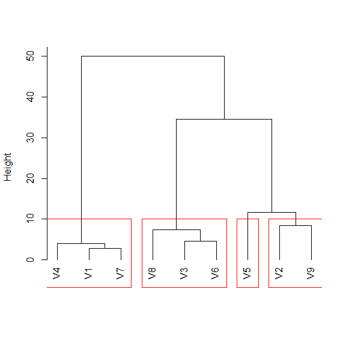
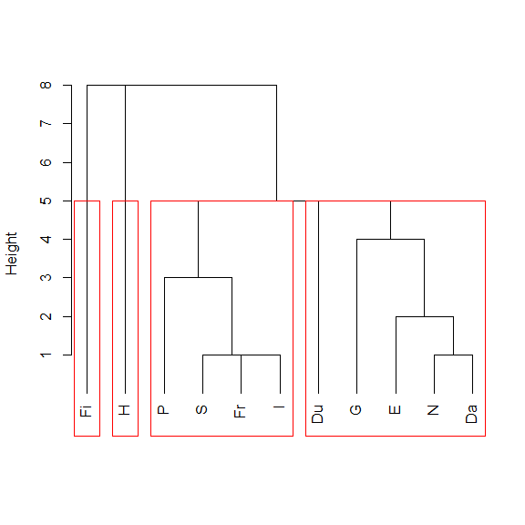
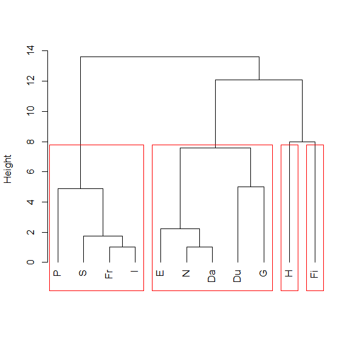
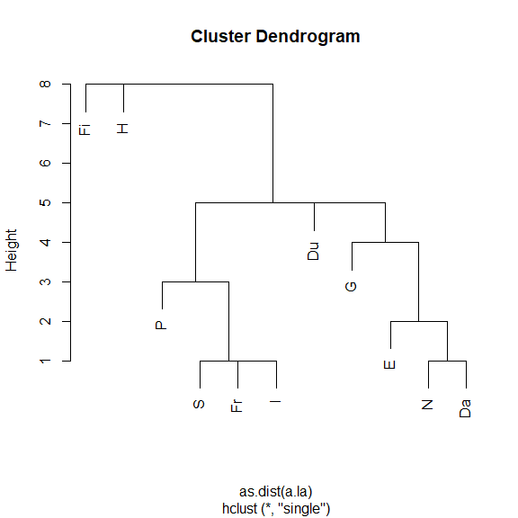
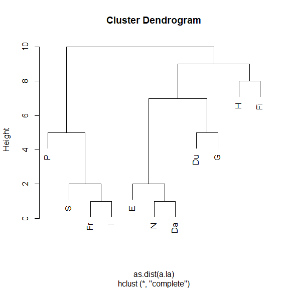
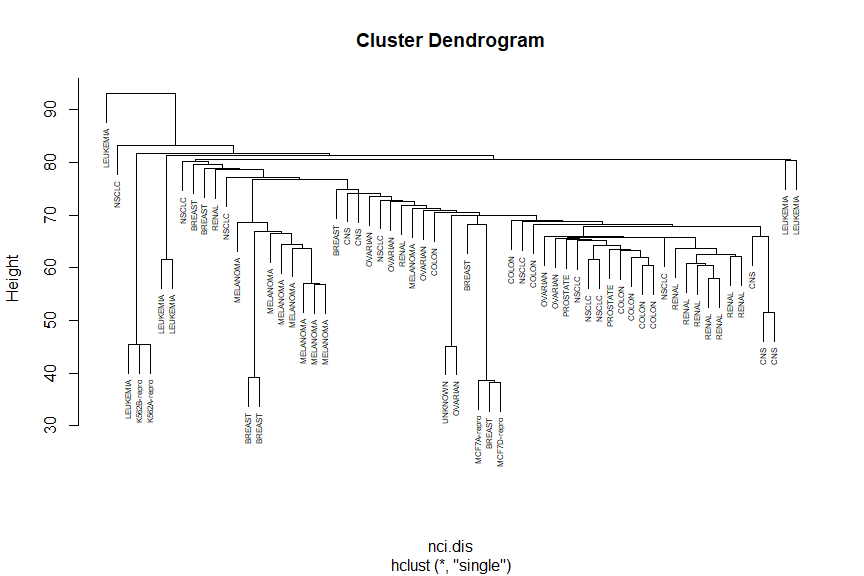
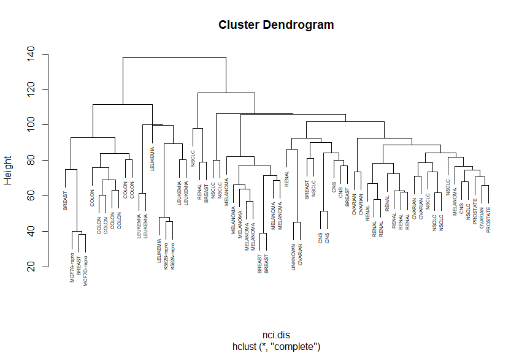
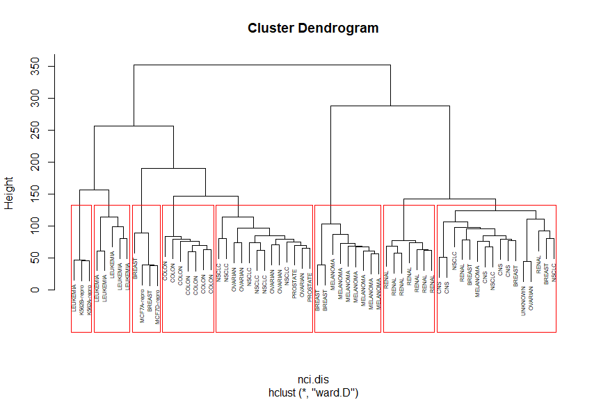
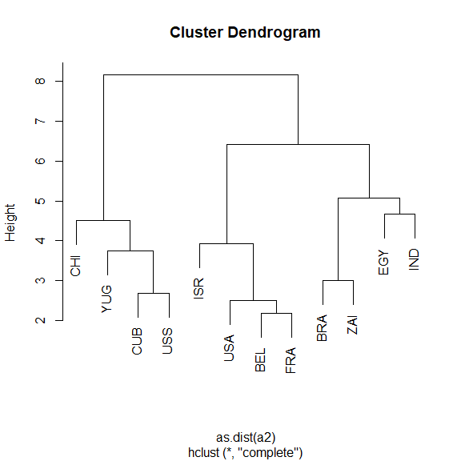
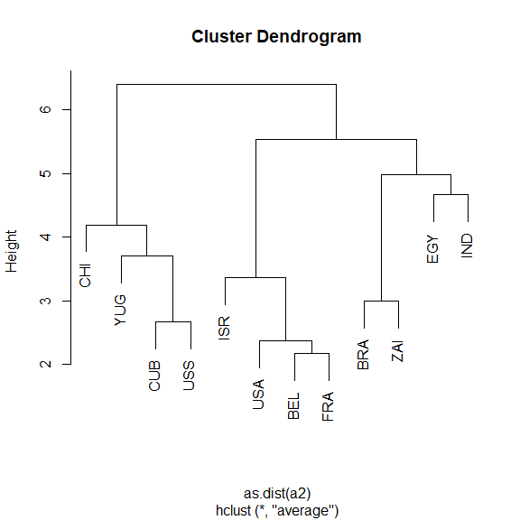

STAT406 - Lecture 23 notes
================
Matias Salibian-Barrera
2017-11-13

LICENSE
-------

These notes are released under the "Creative Commons Attribution-ShareAlike 4.0 International" license. See the **human-readable version** [here](https://creativecommons.org/licenses/by-sa/4.0/) and the **real thing** [here](https://creativecommons.org/licenses/by-sa/4.0/legalcode).

Lecture slides
--------------

The lecture slides are [here](STAT406-17-lecture-23-preliminary.pdf).

Hierarchical clustering.
------------------------

An agglomerative approach.

-   Distances / dissimilarities
-   Criteria for merging of clusters
-   Identifying clusters, dendograms

#### Breweries example

Beer drinkers were asked to rate 9 breweries on 26 attributes. The attributes were, e.g., Brewery has rich tradition; or Brewery makes very good Pils beer. Relative to each attribute, the informant had to assign each brewery a score on a 6-point scale ranging from 1=not true at all to 6=very true.

``` r
library(cluster)
x <- read.table("../Lecture20/breweries.dat", header = FALSE)
x <- t(x)
d <- dist(x, method = "manhattan")
# hierarchical
plot(cl <- hclust(d, method = "ward.D2"), main = "", xlab = "", sub = "", hang = -1)
rect.hclust(cl, k = 4, border = "red")
```



``` r
# read the data
a <- read.table("../Lecture20/breweries.dat", header = FALSE)
# data are transposed, we need to transpose it to make each row an
# observation
a <- t(a)
# compute pairwise distances among the 9 breweries use the L1 distance
br.dis <- dist(a, method = "manhattan")  # L1

# or
br.dis <- dist(a)  # L2


# compute hierarchical clustering using single linkage
br.hc <- hclust(br.dis, method = "single")

# show the dendogram
plot(br.hc)

# identify 3 clusters
br.hc.3 <- rect.hclust(br.hc, k = 3)
```


#### Languages example

``` r
dd <- read.table("languages.dat", header = FALSE)
names(dd) <- c("E", "N", "Da", "Du", "G", "Fr", "S", "I", "P", "H", "Fi")
dd <- (dd + t(dd)/2)
d <- as.dist(dd)

# hierarchical

plot(cl <- hclust(d, method = "single"), main = "", xlab = "", sub = "", hang = -1)
rect.hclust(cl, k = 4, border = "red")
```



``` r
plot(cl <- hclust(d, method = "complete"), main = "", xlab = "", sub = "", hang = -1)
rect.hclust(cl, k = 4, border = "red")
```


``` r
plot(cl <- hclust(d, method = "ward.D2"), main = "", xlab = "", sub = "", hang = -1)
rect.hclust(cl, k = 4, border = "red")
```



``` r
# read the pairwise dissimilarities (there's no data!)
a.la <- read.table("languages.dat", header = FALSE)

# since only the lower triangular matrix is available we need to copy it on
# the upper half
a.la <- a.la + t(a.la)

# create a vector of language names, to be used later
la.nms <- c("E", "N", "Da", "Du", "G", "Fr", "S", "I", "P", "H", "Fi")

# compute hierarchical clustering using single linkage
la.hc <- hclust(as.dist(a.la), method = "single")

# show the dendogram, use labels in object la.nms
plot(la.hc, labels = la.nms)
```



``` r
# compute hierarchical clustering using complete linkage
la.hc <- hclust(as.dist(a.la), method = "complete")

# show the dendogram, use labels in object la.nms
plot(la.hc, labels = la.nms)
```



#### Cancer example

``` r
data(nci, package = "ElemStatLearn")
ncit <- t(nci)
d <- dist(ncit)
plot(cl <- hclust(d, method = "ward.D2"), main = "", xlab = "", sub = "", hang = -1, 
    labels = rownames(nci))
rect.hclust(cl, k = 8, border = "red")
```


``` r
# compute pairwise distances
nci.dis <- dist(t(nci), method = "euclidean")

# compute hierarchical clustering using different linkage types
nci.hc.s <- hclust(nci.dis, method = "single")
nci.hc.c <- hclust(nci.dis, method = "complete")
nci.hc.a <- hclust(nci.dis, method = "average")
nci.hc.w <- hclust(nci.dis, method = "ward.D")

nci.nms <- rownames(nci)

# plot them
plot(nci.hc.s, labels = nci.nms, cex = 0.5)
```



``` r
plot(nci.hc.c, labels = nci.nms, cex = 0.5)
```



``` r
plot(nci.hc.a, labels = nci.nms, cex = 0.5)
```


``` r
plot(nci.hc.w, labels = nci.nms, cex = 0.5)

plot(nci.hc.w, labels = nci.nms, cex = 0.5)

# identify 8 clusters
rect.hclust(nci.hc.w, k = 8)
```



<!-- #### UN Votes -->
<!-- ```{r unvotes} -->
<!-- X <- read.table(file='../Lecture20/unvotes.csv', sep=',', row.names=1, header=TRUE) -->
<!-- ``` -->
#### Nations example

2 nations -- perceived "likeness" by Pol Sci students

``` r
# read the pairwise dissimilarities
a2 <- read.table("nations2.dat", header = FALSE)

# since only the lower triangular matrix is available we need to copy it on
# the upper half
a2 <- a2 + t(a2)

# create a vector of country names, to be used later
nams2 <- c("BEL", "BRA", "CHI", "CUB", "EGY", "FRA", "IND", "ISR", "USA", "USS", 
    "YUG", "ZAI")

# compute hierarchical clustering using complete linkage
na.hc <- hclust(as.dist(a2), method = "complete")
plot(na.hc, labels = nams2)
```



``` r
# compute hierarchical clustering using average linkage
na.hc <- hclust(as.dist(a2), method = "average")
plot(na.hc, labels = nams2)
```


