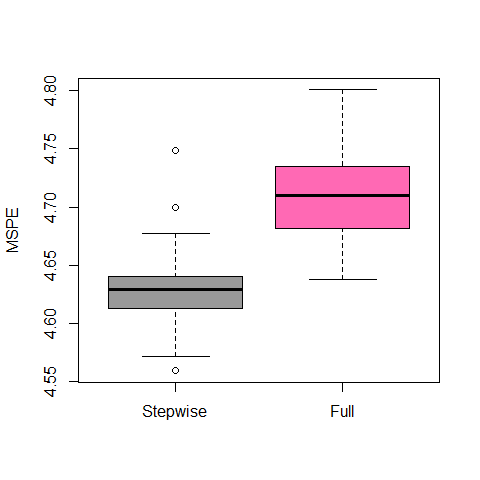
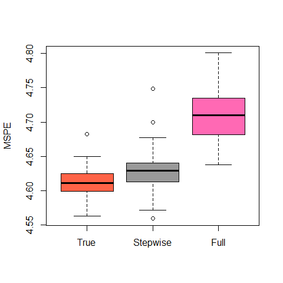
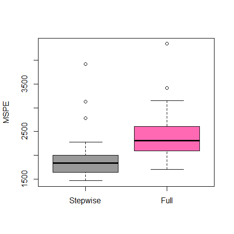
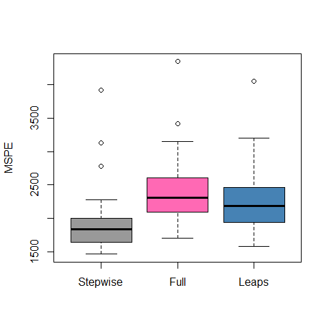
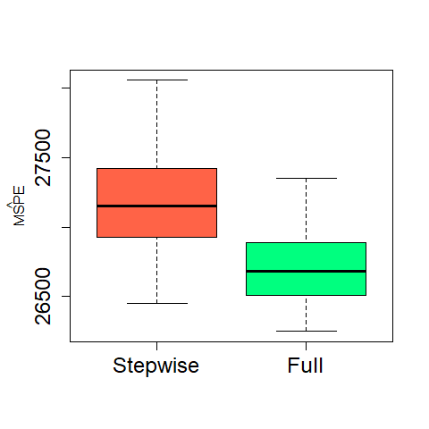

STAT406 - Lecture 4 notes
================
Matias Salibian-Barrera
2017-10-04

#### LICENSE

These notes are released under the "Creative Commons Attribution-ShareAlike 4.0 International" license. See the **human-readable version** [here](https://creativecommons.org/licenses/by-sa/4.0/) and the **real thing** [here](https://creativecommons.org/licenses/by-sa/4.0/legalcode).

Lecture slides
--------------

-   The lecture slides are [here](STAT406-17-lecture-4.pdf).
-   A reference paper for a formal derivation of AIC: Cavanaugh, J.E. (1997). Unifying the derivations for the Akaike and corrected Akaike information criteria. *Statistics & Probability Letters*, **33**(2), 201-208. [DOI: 10.1016/S0167-7152(96)00128-9](https://doi.org/10.1016/S0167-7152(96)00128-9)

Estimating MSPE with CV when the model was built using the data
---------------------------------------------------------------

Last week we learned that one needs to be careful when using cross-validation (in any of its flavours--leave one out, K-fold, etc.) Misuse of cross-validation is, unfortunately, not unusual. For [one example](https://doi.org/10.1073/pnas.102102699) see:

> Ambroise, C. and McLachlan, G.J. (2002). Selection bias in gene extraction on the basis of microarray gene-expression data, PNAS, 2002, 99 (10), 6562-6566. DOI: 10.1073/pnas.102102699

In particular, for every fold one needs to repeat **everything** that was done with the training set (selecting variables, looking at pairwise correlations, AIC values, etc.)

Correlated covariates
---------------------

Technological advances in recent decades have resulted in data being collected in a fundamentally different manner from the way it was done when most "classical" statistical methods were developed (early to mid 1900's). Specifically, it is now not at all uncommon to have data sets with an abundance of potentially useful explanatory variables (for example with more variables than observations). Sometimes the investigators are not sure which of the collected variables can be expected to be useful or meaningful.

A consequence of this "wide net" data collection strategy is that many of the explanatory variables may be correlated with each other. In what follows we will illustrate some of the problems that this can cause both when training and interpreting models, and also with the resulting predictions.

### Variables that were important may suddenly "dissappear"

Consider the air pollution data set we used earlier, and the **reduced** linear regression model discussed in class:

``` r
x <- read.table('../Lecture1/rutgers-lib-30861_CSV-1.csv', header=TRUE, sep=',')
reduced <- lm(MORT ~ POOR + HC + NOX + HOUS + NONW, data=x)
round( summary(reduced)$coef, 3)
```

    ##             Estimate Std. Error t value Pr(>|t|)
    ## (Intercept) 1172.831    143.241   8.188    0.000
    ## POOR          -4.065      2.238  -1.817    0.075
    ## HC            -1.480      0.333  -4.447    0.000
    ## NOX            2.846      0.652   4.369    0.000
    ## HOUS          -2.911      1.533  -1.899    0.063
    ## NONW           4.470      0.846   5.283    0.000

Note that all coefficients seem to be significant based on the individual tests of hypothesis (with `POOR` and `HOUS` maybe only marginally so). In this sense all 5 explanatory varibles in this model appear to be relevant.

Now, we fit the **full** model, that is, we include all available explanatory variables in the data set:

``` r
full <- lm(MORT ~ ., data=x)
round( summary(full)$coef, 3)
```

    ##             Estimate Std. Error t value Pr(>|t|)
    ## (Intercept) 1763.981    437.327   4.034    0.000
    ## PREC           1.905      0.924   2.063    0.045
    ## JANT          -1.938      1.108  -1.748    0.087
    ## JULT          -3.100      1.902  -1.630    0.110
    ## OVR65         -9.065      8.486  -1.068    0.291
    ## POPN        -106.826     69.780  -1.531    0.133
    ## EDUC         -17.157     11.860  -1.447    0.155
    ## HOUS          -0.651      1.768  -0.368    0.714
    ## DENS           0.004      0.004   0.894    0.376
    ## NONW           4.460      1.327   3.360    0.002
    ## WWDRK         -0.187      1.662  -0.113    0.911
    ## POOR          -0.168      3.227  -0.052    0.959
    ## HC            -0.672      0.491  -1.369    0.178
    ## NOX            1.340      1.006   1.333    0.190
    ## SO.            0.086      0.148   0.585    0.562
    ## HUMID          0.107      1.169   0.091    0.928

In the **full** model there are many more parameters that need to be estimated, and while two of them appear to be significantly different from zero (`NONW` and `PREC`), all the others appear to be redundant. In particular, note that the p-values for the individual test of hypotheses for 4 out of the 5 regression coefficients for the variables of the **reduced** model have now become not significant.

``` r
round( summary(full)$coef[ names(coef(reduced)), ], 3)
```

    ##             Estimate Std. Error t value Pr(>|t|)
    ## (Intercept) 1763.981    437.327   4.034    0.000
    ## POOR          -0.168      3.227  -0.052    0.959
    ## HC            -0.672      0.491  -1.369    0.178
    ## NOX            1.340      1.006   1.333    0.190
    ## HOUS          -0.651      1.768  -0.368    0.714
    ## NONW           4.460      1.327   3.360    0.002

In other words, the coeffficients of explanatory variables that appeared to be relevant in one model may turn to be "not significant" when other variables are included. This could pose some challenges for interpreting the estimated parameters of the models.

### Why does this happen?

Recall that the covariance matrix of the least squares estimator involves the inverse of (X'X), where X' denotes the transpose of the n x p matrix X (that contains each vector of explanatory variables as a row). It is easy to see that if two columns of X are linearly dependent, then X'X will be rank deficient. When two columns of X are "close" to being linearly dependent (e.g. their linear corrleation is high), then the matrix X'X will be ill-conditioned, and its inverse will have very large entries. This means that the estimated standard errors of the least squares estimator will be unduly large, resulting in non-significant test of hypotheses for each parameter separately, even if the global test for all of them simultaneously is highly significant.

### Why is this a problem if we are interested in prediction?

Although in many applications one is interested in interpreting the parameters of the model, even if one is only trying to fit / train a model to do predictions, highly variable parameter estimators will typically result in a noticeable loss of prediction accuracy. This can be easily seen from the bias / variance factorization of the mean squared prediction error (MSPE) mentioned in class. Hence, better predictions can be obtained if one uses less-variable parameter (or regression function) estimators.

### What can we do?

A commonly used strategy is to remove some explanatory variables from the model, leaving only non-redundant covariates. However, this is easier said than done. You will have seen some strategies in previous Statistics courses (e.g. stepwise variable selection). In coming weeks we will investigate other methods to deal with this problem.

Comparing models -- General strategy
------------------------------------

Suppose we have a set of competing models from which we want to choose the "best" one. In order to properly define our problem we need the following:

-   a list of models to be considered;
-   a numerical measure to compare any two models in our list;
-   a strategy (algorithm, criterion) to navigate the set of models; and
-   a criterion to stop the search.

For example, in stepwise methods the models under consideration in each step are those that differ from the current model only by one coefficient (variable). The numerical measure used to compare models could be AIC, or Mallow's Cp, etc. The strategy is to only consider submodels with one fewer variable than the current one, and we stop if either none of these "p-1" submodels is better than the current one, or we reach an empty model.

Comparing models -- What is AIC?
--------------------------------

One intuitively sensible quantity that can be used to compare models is a distance measuring how "close" the distributions implied by these models are from the actual stochastic process generating the data (here "stochastic process" refers to the random mechanism that generated the observations). In order to do this we need:

1.  a distance / metric (or at least a "quasimetric") between models; and
2.  a way of estimating this distance when the "true" model is unknown.

AIC provides an unbiased estimator of the Kullback-Leibler divergence between the estimated model and the "true" one. See the lecture slides for more details.

Using stepwise + AIC to select a model
--------------------------------------

We apply stepwise regression based on AIC to select a linear regression model for the airpollution data. In `R` we can use the function `stepAIC` in package `MASS` to perform a stepwise search, for the synthetic data set discussed in class:

``` r
set.seed(123)
x1 <- rnorm(506)
x2 <- rnorm(506, mean=2, sd=1)
x3 <- rexp(506, rate=1)
x4 <- x2 + rnorm(506, sd=.1)
x5 <- x1 + rnorm(506, sd=.1)
x6 <- x1 - x2 + rnorm(506, sd=.1)
x7 <- x1 + x3 + rnorm(506, sd=.1)
y <- x1*3 + x2/3 + rnorm(506, sd=2.2)

x <- data.frame(y=y, x1=x1, x2=x2,
                x3=x3, x4=x4, x5=x5, x6=x6, x7=x7)

library(MASS)
null <- lm(y ~ 1, data=x)
full <- lm(y ~ ., data=x)
st <- stepAIC(null, scope=list(lower=null, upper=full), trace=FALSE)
```

If you want to see the progression of the search step-by-step, set the argument `trace=TRUE` in the call to `stepAIC` above. The selected model is automatically fit and returned, so that in the code above `st` is an object of class `lm` containing the "best" linear regression fit.

``` r
st
```

    ## 
    ## Call:
    ## lm(formula = y ~ x1 + x6, data = x)
    ## 
    ## Coefficients:
    ## (Intercept)           x1           x6  
    ##   -0.000706     3.175239    -0.282906

We will now compare the mean squared prediction errors of the **full** model and that selected with **stepwise**. We use 50 runs of 5-fold CV, and obtain the following:



Note that since this is a synthetic data set, we can also estimate the MSPE of the **true** model (could we compute it analytically instead?) and compare it with that of the **full** and **stepwise** models. We obtain:



### Stepwise applied to the "air pollution" data

We now use stepwise on the air pollution data to select a model, and estimate its MSPE using 5-fold CV. We compare the predictions of this model with that of the full model.

``` r
library(MASS)
airp <- read.table('../lecture1/rutgers-lib-30861_CSV-1.csv', header=TRUE, sep=',')
null <- lm(MORT ~ 1, data=airp)
full <- lm(MORT ~ ., data=airp)
( tmp.st <- stepAIC(full, scope=list(lower=null), trace=FALSE) )
```

    ## 
    ## Call:
    ## lm(formula = MORT ~ PREC + JANT + JULT + OVR65 + POPN + EDUC + 
    ##     NONW + HC + NOX, data = airp)
    ## 
    ## Coefficients:
    ## (Intercept)         PREC         JANT         JULT        OVR65  
    ##   1934.0539       1.8565      -2.2620      -3.3200     -10.9205  
    ##        POPN         EDUC         NONW           HC          NOX  
    ##   -137.3831     -23.4211       4.6623      -0.9221       1.8710

``` r
k <- 5
n <- nrow(airp)
ii <- (1:n) %% k + 1
set.seed(123)
N <- 50
mspe.f <- mspe.st <- rep(0, N)
for(i in 1:N) {
  ii <- sample(ii)
  pr.f <- pr.st <- rep(0, n)
  for(j in 1:k) {
    x0 <- airp[ii != j, ]
    null0 <- lm(MORT ~ 1, data=x0)
    full0 <- lm(MORT ~ ., data=x0) # needed for stepwise
    step.lm0 <- stepAIC(null0, scope=list(lower=null0, upper=full0), trace=FALSE)
    pr.st[ ii == j ] <- predict(step.lm0, newdata=airp[ii==j,])
    pr.f[ ii == j ] <- predict(full0, newdata=airp[ii==j,])
  }
  mspe.st[i] <- mean( (airp$MORT - pr.st)^2 )
  mspe.f[i] <- mean( (airp$MORT - pr.f)^2 )
}
boxplot(mspe.st, mspe.f, names=c('Stepwise', 'Full'),
        col=c('gray60', 'hotpink'), ylab='MSPE')
```



We can also use the package `leaps` to run a more thorough search among all possible subsets. We do this with the air pollution data:

``` r
library(leaps)
a <- leaps(x=as.matrix(airp[, -16]), y=airp$MORT, int=TRUE, method='Cp', nbest=10)
```

In the call above we asked `leaps` to compute the 10 best models of each size, according to Mallow's Cp criterion. We can look at the returned object

``` r
str(a)
```

    ## List of 4
    ##  $ which: logi [1:141, 1:15] FALSE FALSE TRUE FALSE FALSE FALSE ...
    ##   ..- attr(*, "dimnames")=List of 2
    ##   .. ..$ : chr [1:141] "1" "1" "1" "1" ...
    ##   .. ..$ : chr [1:15] "1" "2" "3" "4" ...
    ##  $ label: chr [1:16] "(Intercept)" "1" "2" "3" ...
    ##  $ size : num [1:141] 2 2 2 2 2 2 2 2 2 2 ...
    ##  $ Cp   : num [1:141] 53.6 82.3 82.6 97 97.2 ...

We now find the best model (based on Mallow's Cp), and fit the corresponding model:

``` r
j0 <- which.min(a$Cp)
( m1 <- lm(MORT ~ ., data=airp[, c(a$which[j0,], TRUE)]) )
```

    ## 
    ## Call:
    ## lm(formula = MORT ~ ., data = airp[, c(a$which[j0, ], TRUE)])
    ## 
    ## Coefficients:
    ## (Intercept)         PREC         JANT         JULT         EDUC  
    ##   1180.3565       1.7970      -1.4836      -2.3553     -13.6190  
    ##        NONW          SO.  
    ##      4.5853       0.2596

We compare which variables are used in this model with those used in the model found with stepwise:

``` r
formula(m1)[[3]]
```

    ## PREC + JANT + JULT + EDUC + NONW + SO.

``` r
formula(tmp.st)[[3]]
```

    ## PREC + JANT + JULT + OVR65 + POPN + EDUC + NONW + HC + NOX

It is reasonable to ask whether the model found by `leaps` is much better than the one returned by `stepAIC`:

``` r
extractAIC(m1)
```

    ## [1]   7.0000 429.0017

``` r
extractAIC(tmp.st)
```

    ## [1]  10.000 429.634

Finally, what is the MSPE of the model found by `leaps`?

``` r
# proper way
k <- 5
n <- nrow(airp)
ii <- (1:n) %% k + 1
set.seed(123)
N <- 50
mspe.l <- rep(0, N)
for(i in 1:N) {
  ii <- sample(ii)
  pr.l <- rep(0, n)
  for(j in 1:k) {
    x0 <- airp[ii != j, ]
    tmp.leaps <- leaps(x=as.matrix(x0[, -16]), y=as.vector(x0[,16]), int=TRUE, method='Cp', nbest=10)
    j0 <- which.min(tmp.leaps$Cp)
    step.leaps <- lm(MORT ~ ., data=x0[, c(tmp.leaps$which[j0,], TRUE)])
    pr.l[ ii == j ] <- predict(step.leaps, newdata=airp[ii==j,])
  }
  mspe.l[i] <- mean( (airp$MORT - pr.l)^2 )
}
boxplot(mspe.st, mspe.f, mspe.l, names=c('Stepwise', 'Full', 'Leaps'),
        col=c('gray60', 'hotpink', 'steelblue'), ylab='MSPE')
```



Note that a "suboptimal" model (stepwise) seems to be better than the one found with a "proper" (exhaustive) search, as that returned by `leaps`. This is intriguing, but we will see the same phenomenon occur in different contexts later in the course.

An example where one may not need to select variables
-----------------------------------------------------

In some cases one may not need to select a subset of explanatory variables, and in fact, doing so may affect negatively the accuracy of the resulting predictions. In what follows we discuss such an example. Consider the credit card data set that contains information on credit card users. The interest is in predicting the balance carried by a client. We first load the data, and to simplify the presentation here we consider only the numerical explanatory variables:

``` r
x <- read.table('Credit.csv', sep=',', header=TRUE, row.names=1)
x <- x[, c(1:6, 11)]
```

There are 6 available covariates, and a stepwise search selects a model with 5 of them (discarding `Education`):

``` r
library(MASS)
null <- lm(Balance ~ 1, data=x)
full <- lm(Balance ~ ., data=x)
(tmp.st <- stepAIC(null, scope=list(lower=null, upper=full), trace=0))
```

    ## 
    ## Call:
    ## lm(formula = Balance ~ Rating + Income + Limit + Age + Cards, 
    ##     data = x)
    ## 
    ## Coefficients:
    ## (Intercept)       Rating       Income        Limit          Age  
    ##   -449.3610       2.0224      -7.5621       0.1286      -0.8883  
    ##       Cards  
    ##     11.5527

It is an easy exercise to check that the MSPE of this smaller model is in fact worse than the one for the **full** one:



<!-- ## Shrinkage methods / Ridge regression  -->
<!-- Stepwise methods are highly variable, and thus their predictions may not  -->
<!-- be very accurate (high MSPE).  -->
<!-- A different way to manage correlated explanatory variables (to "reduce" their -->
<!-- presence in the model without removing them) is... -->
<!-- ### Selecting the amount of shrinkage -->
