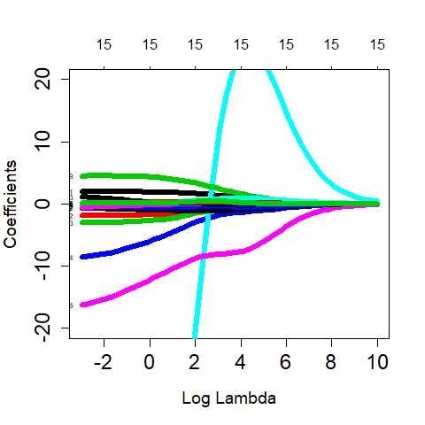
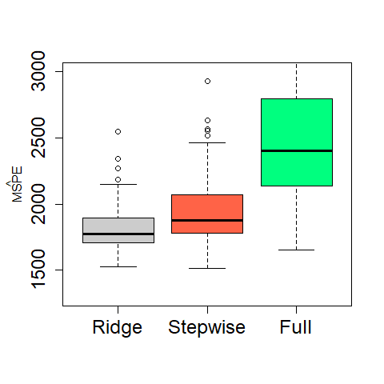
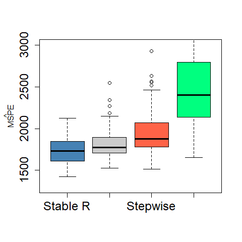
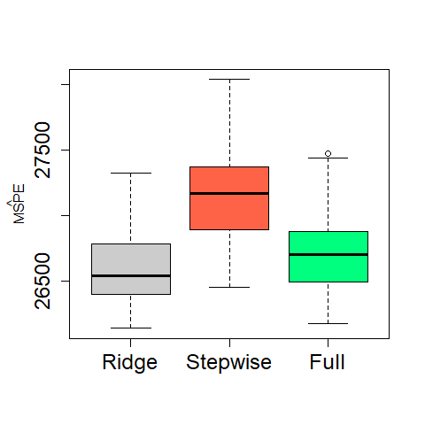

STAT406 - Lecture 5 notes
================
Matias Salibian-Barrera
2017-09-21

Lecture slides
--------------

The lecture slides are [here](STAT406-17-lecture-5.pdf).

Ridge regression
----------------

Variable selection methods like stepwise can be highly variable. To illustrate this issue consider the following simple experiment. As in the previous lecture, we apply stepwise on 5 randomly selected folds of the data, and look at the models selected in each of them.

``` r
airp <- read.table('../lecture1/rutgers-lib-30861_CSV-1.csv', header=TRUE, sep=',')
library(MASS)
k <- 5
n <- nrow(airp)
set.seed(123456)
ii <- sample( (1:n) %% k + 1 )
for(j in 1:k) {
  x0 <- airp[ii != j, ]
  null0 <- lm(MORT ~ 1, data=x0)
  full0 <- lm(MORT ~ ., data=x0) # needed for stepwise
  step.lm0 <- stepAIC(null0, scope=list(lower=null0, upper=full0), trace=FALSE)
  print(formula(step.lm0)[[3]])
}
```

    ## NONW + JANT + EDUC + SO. + PREC + JULT
    ## NONW + PREC + SO. + DENS + HOUS + WWDRK
    ## NONW + EDUC + SO. + PREC + JANT + JULT
    ## NONW + JANT + SO. + PREC + DENS + JULT
    ## NONW + EDUC + SO. + JANT + HUMID + POPN

Although many variables appear in more than one model, only `NONW` and `SO.` are in all of them, and `JANT` and `PREC` in 4 out of the 5. There are also several that appear in only one model (`HOUS`, `WWDRK` and `POPN`). <!-- `EDUC` 3 --> <!-- `JULT` in 3,  --> <!-- `DENS` in 2 --> <!-- and  --> This variability may in turn impact (negatively) the accuracy of the resulting predictions.

A different approach to dealing with potentially correlated explanatory variables (with the goal of obtaining less variable / more accurate predictions) is to "regularize" the parameter estimates. In other words we modify the optimization problem that defines the parameter estimators (in the case of linear regression fits we tweak the least squares problem) to limit their size (in fact restricting them to be in a bounded and possibly small subset of the parameter space).

The first proposal for a regularized / penalized estimator for linear regression models is Ridge Regression. We will use the function `glmnet` in package `glmnet` to compute the Ridge Regression estimator. Note that this function implements a larger family of regularized estimators, and in order to obtain a Ridge Regression estimator we need to set the argument `alpha = 0` of `glmnet()`. <!-- We use Ridge Regression with the air pollution data to obtain a --> <!-- more stable predictor. --> We also specify a range of possible values of the penalty coefficient (below we use a grid of 50 values between exp(-3) and exp(10)).

``` r
airp <- read.table('../lecture1/rutgers-lib-30861_CSV-1.csv', header=TRUE, sep=',')
library(glmnet)
# alpha = 0 - Ridge
# alpha = 1 - LASSO
y <- as.vector(airp$MORT)
xm <- as.matrix(airp[, -16])
lambdas <- exp( seq(-3, 10, length=50))
a <- glmnet(x=xm, y=y, lambda=rev(lambdas),
            family='gaussian', alpha=0)
```

The returned object contains the estimated regression coefficients for each possible value of the regularization parameter. We can look at them using the `plot` method for objects of class `glmnet` as follows:

``` r
plot(a, xvar='lambda', label=TRUE, lwd=6, cex.axis=1.5, cex.lab=1.2, ylim=c(-20, 20))
```



### Selecting the level of regularization

Different values of the penalization parameter will typically yield estimators with varying predictive accuracies. To select a good level of regularization we estimate the MSPE of the estimator resulting from each value of the penalization parameter. One way to do this is to run K-fold cross validation for each value of the penalty. The `glmnet` package provides a built-in function to do this, and a `plot` method to display the results:

``` r
# run 5-fold CV
set.seed(123)
tmp <- cv.glmnet(x=xm, y=y, lambda=lambdas, nfolds=5, alpha=0, family='gaussian')
plot(tmp, lwd=6, cex.axis=1.5, cex.lab=1.2)
```


In the above plot the red dots are the estimated MSPE's for each value of the penalty, and the vertical lines mark plus/minus one (estimated) standard deviations (for each of those estimated MSPE's). The `plot` method will also mark the optimal value of the regularization parameter, and also the largest one for which the estimated MSPE is within 1-SD of the optimal. The latter is meant to provide a more regularized estimator with estimated MSPE within the error-margin of our estimated minimum.

Note, however, that the above "analysis" is random (because of the intrinsic randomness of K-fold CV). If we run it again, we will most likely get different results. In many cases, however, the results will be qualitatively similar. If we run 5-fold CV again for this data get the following plot:


Note that both plots are similar, but not equal. It would be a good idea to repeat this a few times and explore how much variability is involved. If one were interested in selecting one value of the penalization parameter that was more stable than that obtained from a single 5-fold CV run, one could run it several times and take the average of the estimated optimal values. For example:

``` r
set.seed(123)
op.la <- 0
for(j in 1:20) {
  tmp <- cv.glmnet(x=xm, y=y, lambda=lambdas, nfolds=5, alpha=0, family='gaussian')
  op.la <- op.la + tmp$lambda.min # tmp$lambda.1se
}
(op.la <- op.la / 20)
```

    ## [1] 10.39156

``` r
log(op.la)
```

    ## [1] 2.340994

This value is reasonably close to the ones we saw in the plots above.

Comparing predictions
---------------------

We now run a cross-validation experiment to compare the MSPE of 3 models: the **full** model, the one selected by **stepwise** and the **ridge regression** one.

``` r
library(MASS)
n <- nrow(xm)
k <- 5
ii <- (1:n) %% k + 1
set.seed(123)
N <- 100
mspe.st <- mspe.ri <- mspe.f <- rep(0, N)
for(i in 1:N) {
  ii <- sample(ii)
  pr.f <- pr.ri <- pr.st <- rep(0, n)
  for(j in 1:k) {
    tmp.ri <- cv.glmnet(x=xm[ii != j, ], y=y[ii != j], lambda=lambdas,
                        nfolds=5, alpha=0, family='gaussian')
    null <- lm(MORT ~ 1, data=airp[ii != j, ])
    full <- lm(MORT ~ ., data=airp[ii != j, ])
    tmp.st <- stepAIC(null, scope=list(lower=null, upper=full), trace=0)
    pr.ri[ ii == j ] <- predict(tmp.ri, s='lambda.min', newx=xm[ii==j,])
    pr.st[ ii == j ] <- predict(tmp.st, newdata=airp[ii==j,])
    pr.f[ ii == j ] <- predict(full, newdata=airp[ii==j,])
  }
  mspe.ri[i] <- mean( (airp$MORT - pr.ri)^2 )
  mspe.st[i] <- mean( (airp$MORT - pr.st)^2 )
  mspe.f[i] <- mean( (airp$MORT - pr.f)^2 )
}
boxplot(mspe.ri, mspe.st, mspe.f, names=c('Ridge', 'Stepwise', 'Full'), 
        col=c('gray80', 'tomato', 'springgreen'), cex.axis=1.5, cex.lab=1.5, 
        cex.main=2, ylim=c(1300, 3000))
mtext(expression(hat(MSPE)), side=2, line=2.5)
```



#### A more stable Ridge Regression?

Here we try to obtain a ridge regression estimator with more stable predictions by using the average optimal penalty value using 20 runs. The improvement does not appear to be substantial.



### An example where one may not need to select variables

In some cases one may not need to select a subset of explanatory variables, and in fact, doing so may affect negatively the accuracy of the resulting predictions. In what follows we discuss such an example. Consider the credit card data set that contains information on credit card users. The interest is in predicting the balance carried by a client. We first load the data, and to simplify the presentation here we consider only the numerical explanatory variables:

``` r
x <- read.table('Credit.csv', sep=',', header=TRUE, row.names=1)
x <- x[, c(1:6, 11)]
```

There are 6 available covariates, and a stepwise search selects a model with 5 of them (discarding `Education`):

``` r
library(MASS)
null <- lm(Balance ~ 1, data=x)
full <- lm(Balance ~ ., data=x)
(tmp.st <- stepAIC(null, scope=list(lower=null, upper=full), trace=0))
```

    ## 
    ## Call:
    ## lm(formula = Balance ~ Rating + Income + Limit + Age + Cards, 
    ##     data = x)
    ## 
    ## Coefficients:
    ## (Intercept)       Rating       Income        Limit          Age  
    ##   -449.3610       2.0224      -7.5621       0.1286      -0.8883  
    ##       Cards  
    ##     11.5527

It is an easy exercise to check that the MSPE of this smaller model is in fact worse than the one for the **full** one:


Using ridge regression instead of stepwise to prevent the negative effect of possible correlations among the covariates yields a slight improvement (over the **full** model), but it is not clear the gain is worth the effort.



An important limitation of Ridge Regression
-------------------------------------------

Ridge Regression typically yields estimators with more accurate (less variable) predictions, specially when there is noticeable correlation among covariates. However, it is important to note that Ridge Regression does not select variables, and in that sense it does not "replace" methods like stepwise when the interest is in using a smaller number of explanatory variables. Furthermore, the interpretation of the Ridge Regression coefficient estimates is generally difficult. LASSO regression estimates were proposed to address these two issues (more stable predictions when correlated covariates are present **and** variable selection) simultaneously.
