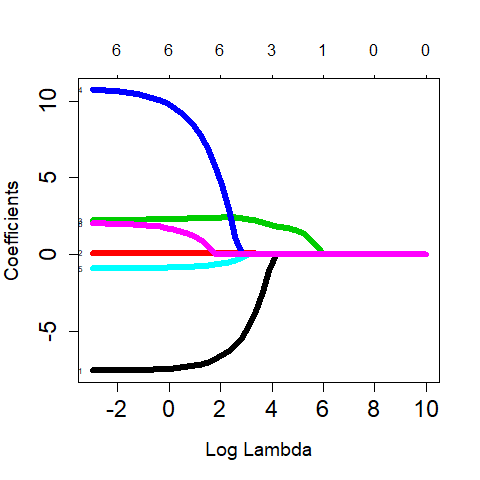
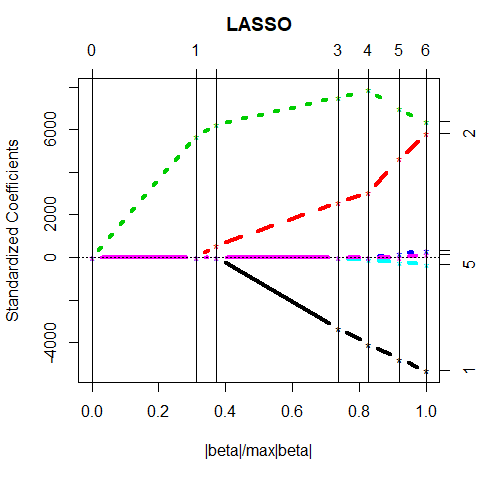
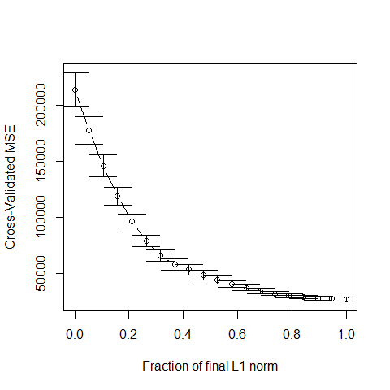
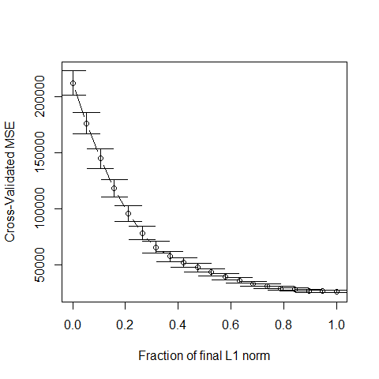
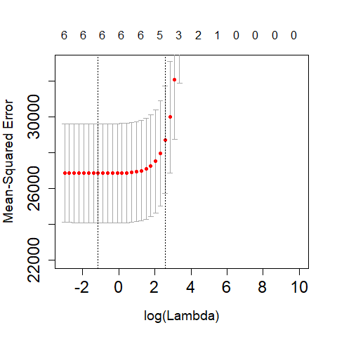
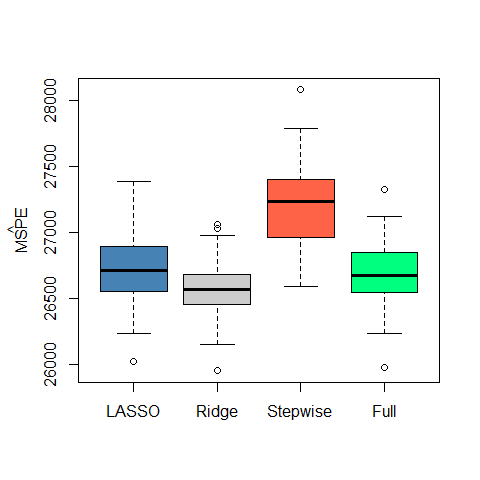

STAT406 - Lecture 6 notes
================
Matias Salibian-Barrera
2017-09-22

Lecture slides
--------------

The lecture slides are [here](STAT406-17-lecture-6-preliminary.pdf).

Effective degrees of freedom
----------------------------

Intuitively, if we interpret "degrees of freedom" as the number of "free" parameters that are available to us for tuning when we fit / train a model or predictor, then we would expect a Ridge Regression estimator to have less "degrees of freedom" than a regular least squares regression estimator, give that it is the solution of a constrained optimization problem. This is, of course, an informal argument, particularly since there is no proper definition of "degrees of freedom".

The more general definition discussed in class, called "effective degrees of freedom" (EDF), reduces to the trace of the "hat" matrix for any linear predictor (including, but not limited to, linear regression models), and is due to Efron:

> Efron, B. (1986). How biased is the apparent error rate of a prediction rule? *Journal of the American Statistical Association*, **81**(394):461-470. DOI: [10.1080/01621459.1986.10478291](https://doi.org/10.1080/01621459.1986.10478291)

You may also want to look at some of the more recent papers that cite the one above.

It is easy (but worth your time doing it) to see that for a Ridge Regression estimator computed with a penalty / regularization parameter equal to **b**, the corresponding EDF are the sum of the ratio of each eigenvalue of **X'X** with respect to itself plus **b** (see the formula on the lecture slides). We compute the EDF of the Ridge Regression fit to the air pollution data when the penalty parameter is considered to be fixed at the
average optimal value over 20 runs of 5-fold CV:

``` r
airp <- read.table('../Lecture1/rutgers-lib-30861_CSV-1.csv', header=TRUE, sep=',')
y <- as.vector(airp$MORT)
xm <- as.matrix(airp[, -16])
library(glmnet)
lambdas <- exp( seq(-3, 10, length=50))
set.seed(123)
op.la <- 0
for(j in 1:20) {
  tmp <- cv.glmnet(x=xm, y=y, lambda=lambdas, nfolds=5, alpha=0, family='gaussian')
  op.la <- op.la + tmp$lambda.min # tmp$lambda.1se
}
op.la <- op.la / 20
xm <- scale(as.matrix(airp[, -16]), scale=FALSE)
xm.svd <- svd(xm)
(est.edf <- sum( xm.svd$d^2 / ( xm.svd$d^2 + op.la ) ))
```

    ## [1] 13.05737

### Important caveat!

Note that in the above discussion of EDF we have assumed that the matrix defining the linear predictor does not depend on the values of the response variable (that it only depends on the matrix **X**), as it is the case in linear regression. This is fine for Ridge Regression estimators **as long as the penalty parameter was not chosen using the data**. This is typically not the case in practice. Although the general definition of EDF still holds, it is not longer true that Ridge Regression yields a linear predictor, and thus the corresponding EDF may not be equal to the trace of the corresponding matrix.

LASSO
-----

A different approach to perform *some kind* of variable selection that may be more stable than stepwise methods is to use an L1 regularization term (instead of the L2 one used in ridge regression). Notwidthstanding the geometric "interpretation" of the effect of using an L1 penalty, it can also be argued that the L1 norm is, in some cases, a convex relaxation (envelope) of the "L0" norm (the number of non-zero elements). As a result, estimators based on the LASSO (L1-regularized regression) will typically have some of their entries equal to zero.

Just as it was the case for Ridge Regression, as the value of the penalty parameter increases, the solutions to the L1 regularized problem change from the usual least squares estimator (when the regularization parameter equals to zero) to a vector of all zeroes (when the penalty constant is sufficiently large). One difference between using an L1 or an L2 penalty is that for an L1-regularized problem, there usually is a finite value of the penalty term that produces a solution of all zeroes, whereas for the L2 penalizations this is not generally true.

The sequence of solutions changing by value of the penalty parameter is often used as a way to rank (or "sequence"") the explanatory variables, listing them in the order in which they "enter" (their estimated coefficient changes from zero to a non-zero value). <!-- Varying the value of the penalty term we obtain a path of solutions (much like --> <!-- we did in ridge regression), where the vector of estimated regression --> <!-- coefficients becomes sparser as the penalty gets stronger.  --> We can also estimate the MSPE of each solution (on a finite grid of values of the penalty parameter) to select one with good prediction properties. If any of the estimated regression coefficients in the selected solution are exactly zero it is commonly said that those explanatory variables are not included in the chosen model.

There are two main implementation of the LASSO in `R`, one is via the `glmnet` function (in package `glmnet`), and the other is with the function `lars` in package `lars`. Both, of course, compute the same estimators, but they do so in different ways.

We first compute the path of LASSO solutions for the `credit` data used in previous lectures:

``` r
x <- read.table('../Lecture5/Credit.csv', sep=',', header=TRUE, row.names=1)
# use non-factor variables
x <- x[, c(1:6, 11)]
y <- as.vector(x$Balance)
xm <- as.matrix(x[, -7])
library(glmnet)
# alpha = 1 - LASSO
lambdas <- exp( seq(-3, 10, length=50))
a <- glmnet(x=xm, y=y, lambda=rev(lambdas),
            family='gaussian', alpha=1, intercept=TRUE)
```

The `plot` method can be used to show the path of solutions, just as we did for ridge regression:

``` r
plot(a, xvar='lambda', label=TRUE, lwd=6, cex.axis=1.5, cex.lab=1.2)
```



Using `lars::lars()` we obtain:

``` r
library(lars)
b <- lars(x=xm, y=y, type='lasso', intercept=TRUE)
plot(b, lwd=4)
```



With `lars` the returned object is a matrix of regression estimators, one for each value of the penalty constant where a new coefficient "enters" the model:

``` r
# see the variables
coef(b)
```

    ##         Income      Limit   Rating     Cards        Age Education
    ## [1,]  0.000000 0.00000000 0.000000  0.000000  0.0000000  0.000000
    ## [2,]  0.000000 0.00000000 1.835963  0.000000  0.0000000  0.000000
    ## [3,]  0.000000 0.01226464 2.018929  0.000000  0.0000000  0.000000
    ## [4,] -4.703898 0.05638653 2.433088  0.000000  0.0000000  0.000000
    ## [5,] -5.802948 0.06600083 2.545810  0.000000 -0.3234748  0.000000
    ## [6,] -6.772905 0.10049065 2.257218  6.369873 -0.6349138  0.000000
    ## [7,] -7.558037 0.12585115 2.063101 11.591558 -0.8923978  1.998283

``` r
b
```

    ## 
    ## Call:
    ## lars(x = xm, y = y, type = "lasso", intercept = TRUE)
    ## R-squared: 0.878 
    ## Sequence of LASSO moves:
    ##      Rating Limit Income Age Cards Education
    ## Var       3     2      1   5     4         6
    ## Step      1     2      3   4     5         6

The presentation below exploits the fact that the LASSO regression estimators are piecewise linear between values of the regularization parameter where a variable enters or drops the model.

In order to select one LASSO estimator (among the infinitely many that are possible) we can use K-fold CV to estimate the MSPE of a few of them (for a grid of values of the penalty parameter, for example), and choose the one with smallest estimated MSPE:

``` r
# select one solution
set.seed(123)
tmp.la <- cv.lars(x=xm, y=y, intercept=TRUE, type='lasso', K=5,
                  index=seq(0, 1, length=20))
```



Given their random nature, it is always a good idea to run K-fold CV experiments more than once:

``` r
set.seed(23)
tmp.la <- cv.lars(x=xm, y=y, intercept=TRUE, type='lasso', K=5,
                  index=seq(0, 1, length=20))
```



We now repeat the same steps as above but using the implementation in `glmnet`:

``` r
# run 5-fold CV with glmnet()
set.seed(123)
tmp <- cv.glmnet(x=xm, y=y, lambda=lambdas, nfolds=5, alpha=1, 
                 family='gaussian', intercept=TRUE)
plot(tmp, lwd=6, cex.axis=1.5, cex.lab=1.2)
```


We ran CV again:

``` r
set.seed(23)
tmp <- cv.glmnet(x=xm, y=y, lambda=lambdas, nfolds=5, alpha=1, 
                 family='gaussian', intercept=TRUE)
plot(tmp, lwd=6, cex.axis=1.5, cex.lab=1.2)
```


Zoom in the CV plot to check the 1-SE rule:

``` r
plot(tmp, lwd=6, cex.axis=1.5, cex.lab=1.2, ylim=c(22000, 33000))
```



The returned object includes the "optimal" value of the penalization parameter, which can be used to find the corresponding estimates for the regression coefficients:

``` r
# optimal lambda
tmp$lambda.min
```

    ## [1] 0.3189066

``` r
# coefficients for the optimal lambda
coef(tmp, s=tmp$lambda.min)
```

    ## 7 x 1 sparse Matrix of class "dgCMatrix"
    ##                        1
    ## (Intercept) -480.5654477
    ## Income        -7.5153030
    ## Limit          0.1117195
    ## Rating         2.2638772
    ## Cards         10.4021961
    ## Age           -0.8801089
    ## Education      1.9363219

``` r
# coefficients for other values of lambda
coef(tmp, s=exp(4))
```

    ## 7 x 1 sparse Matrix of class "dgCMatrix"
    ##                         1
    ## (Intercept) -262.35053476
    ## Income        -0.63094341
    ## Limit          0.02749778
    ## Rating         1.91772580
    ## Cards          .         
    ## Age            .         
    ## Education      .

``` r
coef(tmp, s=exp(4.5)) # note no. of zeroes...
```

    ## 7 x 1 sparse Matrix of class "dgCMatrix"
    ##                         1
    ## (Intercept) -175.98151842
    ## Income         .         
    ## Limit          0.01492881
    ## Rating         1.76170516
    ## Cards          .         
    ## Age            .         
    ## Education      .

Compare MSPEs of Ridge & LASSO on the credit data
-------------------------------------------------

We now compare the MSPEs of the different estimators / predictors:

``` r
library(MASS)
n <- nrow(xm)
k <- 5
ii <- (1:n)%%k + 1
set.seed(123)
N <- 50
mspe.la <- mspe.st <- mspe.ri <- mspe.f <- rep(0, N)
for (i in 1:N) {
    ii <- sample(ii)
    pr.la <- pr.f <- pr.ri <- pr.st <- rep(0, n)
    for (j in 1:k) {
        tmp.ri <- cv.glmnet(x = xm[ii != j, ], y = y[ii != j], lambda = lambdas, 
            nfolds = 5, alpha = 0, family = "gaussian")
        tmp.la <- cv.glmnet(x = xm[ii != j, ], y = y[ii != j], lambda = lambdas, 
            nfolds = 5, alpha = 1, family = "gaussian")
        null <- lm(Balance ~ 1, data = x[ii != j, ])
        full <- lm(Balance ~ ., data = x[ii != j, ])
        tmp.st <- stepAIC(null, scope = list(lower = null, upper = full), trace = 0)
        pr.ri[ii == j] <- predict(tmp.ri, s = "lambda.min", newx = xm[ii == 
            j, ])
        pr.la[ii == j] <- predict(tmp.la, s = "lambda.min", newx = xm[ii == 
            j, ])
        pr.st[ii == j] <- predict(tmp.st, newdata = x[ii == j, ])
        pr.f[ii == j] <- predict(full, newdata = x[ii == j, ])
    }
    mspe.ri[i] <- mean((x$Balance - pr.ri)^2)
    mspe.la[i] <- mean((x$Balance - pr.la)^2)
    mspe.st[i] <- mean((x$Balance - pr.st)^2)
    mspe.f[i] <- mean((x$Balance - pr.f)^2)
}
boxplot(mspe.la, mspe.ri, mspe.st, mspe.f, names = c("LASSO", "Ridge", "Stepwise", 
    "Full"), col = c("steelblue", "gray80", "tomato", "springgreen"), cex.axis = 1, 
    cex.lab = 1, cex.main = 2)
mtext(expression(hat(MSPE)), side = 2, line = 2.5)
```



Compare MSPEs of Ridge & LASSO on the air pollution data
--------------------------------------------------------

On the air pollution data example there are groups of correlated variables and the different behaviour of LASSO and Ridge Regression is interesting to note. Elastic Net estimators were introduced to find an informative compromise.

Less desirable properties of LASSO
----------------------------------

-   Not "variable selection"-consistent
-   Not oracle
-   Tends to only pick one variable (randomly) from groups of correlated ones
