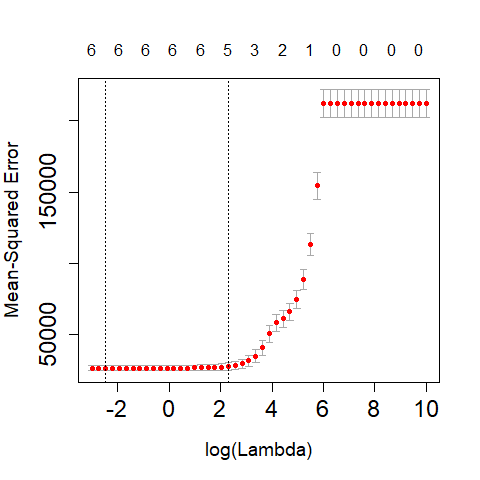
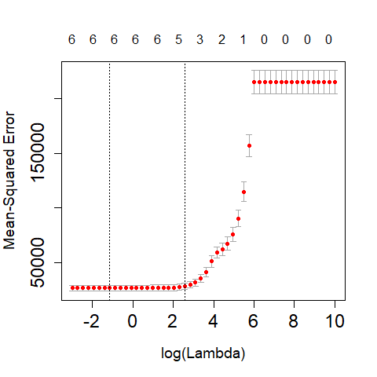

STAT406 - Lecture 6 notes
================
Matias Salibian-Barrera
2017-09-19

Lecture slides
--------------

The lecture slides are [here](STAT406-17-lecture-6-preliminary.pdf).

LASSO
-----

``` r
x <- read.table('../Lecture5/Credit.csv', sep=',', header=TRUE, row.names=1)
# use non-factor variables
x <- x[, c(1:6, 11)]
y <- as.vector(x$Balance)
xm <- as.matrix(x[, -7])
```

``` r
library(glmnet)
# alpha = 1 - LASSO

lambdas <- exp( seq(-3, 10, length=50))
a <- glmnet(x=xm, y=y, lambda=rev(lambdas),
            family='gaussian', alpha=1, intercept=TRUE)
```

Now plot

``` r
# plot trajectories
plot(a, xvar='lambda', label=TRUE, lwd=6, cex.axis=1.5, cex.lab=1.2)
```


Another way of doing it

``` r
# Another display
library(lars)
b <- lars(x=xm, y=y, type='lasso', intercept=TRUE)
plot(b, lwd=4)
```


Look at the returned object

``` r
# see the variables
coef(b)
```

    ##         Income      Limit   Rating     Cards        Age Education
    ## [1,]  0.000000 0.00000000 0.000000  0.000000  0.0000000  0.000000
    ## [2,]  0.000000 0.00000000 1.835963  0.000000  0.0000000  0.000000
    ## [3,]  0.000000 0.01226464 2.018929  0.000000  0.0000000  0.000000
    ## [4,] -4.703898 0.05638653 2.433088  0.000000  0.0000000  0.000000
    ## [5,] -5.802948 0.06600083 2.545810  0.000000 -0.3234748  0.000000
    ## [6,] -6.772905 0.10049065 2.257218  6.369873 -0.6349138  0.000000
    ## [7,] -7.558037 0.12585115 2.063101 11.591558 -0.8923978  1.998283

``` r
b
```

    ## 
    ## Call:
    ## lars(x = xm, y = y, type = "lasso", intercept = TRUE)
    ## R-squared: 0.878 
    ## Sequence of LASSO moves:
    ##      Rating Limit Income Age Cards Education
    ## Var       3     2      1   5     4         6
    ## Step      1     2      3   4     5         6

Pick one solution from the path

``` r
# select one solution
set.seed(123)
tmp.la <- cv.lars(x=xm, y=y, intercept=TRUE, type='lasso', K=5,
                  index=seq(0, 1, length=20))
```


Another run

``` r
set.seed(23)
tmp.la <- cv.lars(x=xm, y=y, intercept=TRUE, type='lasso', K=5,
                  index=seq(0, 1, length=20))
```


And now with `glmnet`:

``` r
# run 5-fold CV with glmnet()
set.seed(123)
tmp <- cv.glmnet(x=xm, y=y, lambda=lambdas, nfolds=5, alpha=1, 
                 family='gaussian', intercept=TRUE)
plot(tmp, lwd=6, cex.axis=1.5, cex.lab=1.2)
```



And again:

``` r
set.seed(23)
tmp <- cv.glmnet(x=xm, y=y, lambda=lambdas, nfolds=5, alpha=1, 
                 family='gaussian', intercept=TRUE)
plot(tmp, lwd=6, cex.axis=1.5, cex.lab=1.2)
```



The "optimal" fit:

``` r
# optimal lambda
tmp$lambda.min
```

    ## [1] 0.3189066

``` r
# coefficients for the optimal lambda
coef(tmp, s=tmp$lambda.min)
```

    ## 7 x 1 sparse Matrix of class "dgCMatrix"
    ##                        1
    ## (Intercept) -480.5654477
    ## Income        -7.5153030
    ## Limit          0.1117195
    ## Rating         2.2638772
    ## Cards         10.4021961
    ## Age           -0.8801089
    ## Education      1.9363219

``` r
# coefficients for other values of lambda
coef(tmp, s=exp(4))
```

    ## 7 x 1 sparse Matrix of class "dgCMatrix"
    ##                         1
    ## (Intercept) -262.35053476
    ## Income        -0.63094341
    ## Limit          0.02749778
    ## Rating         1.91772580
    ## Cards          .         
    ## Age            .         
    ## Education      .

``` r
coef(tmp, s=exp(4.5)) # note no. of zeroes...
```

    ## 7 x 1 sparse Matrix of class "dgCMatrix"
    ##                         1
    ## (Intercept) -175.98151842
    ## Income         .         
    ## Limit          0.01492881
    ## Rating         1.76170516
    ## Cards          .         
    ## Age            .         
    ## Education      .

Zoom in the CV plot

``` r
# zoom-in in CV plot
plot(tmp, lwd=6, cex.axis=1.5, cex.lab=1.2, ylim=c(22000, 33000))
```


``` r
# check "1-SE rule"
```
