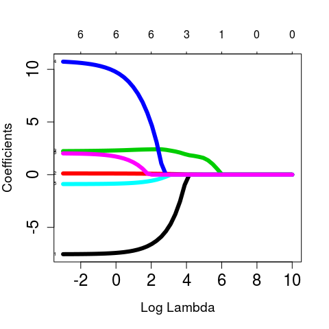
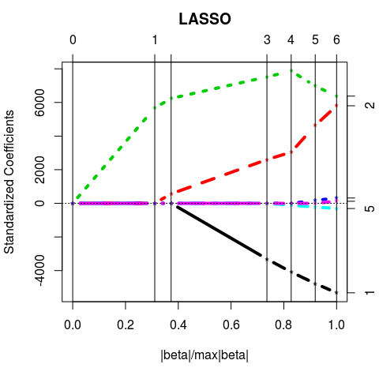
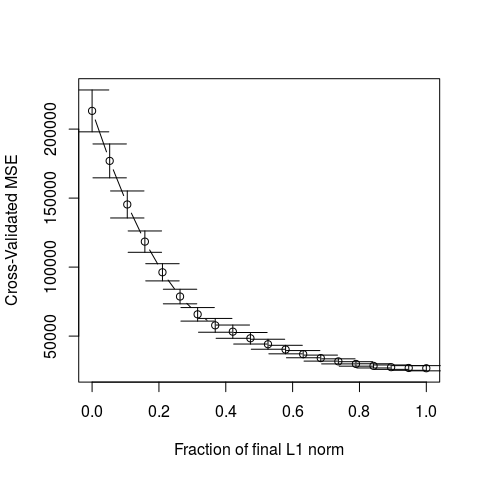
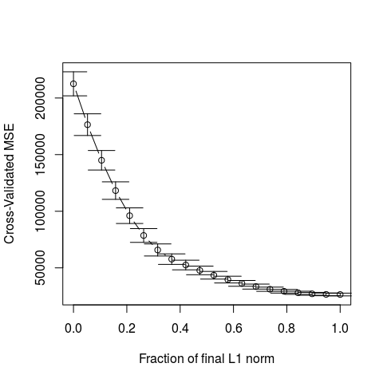
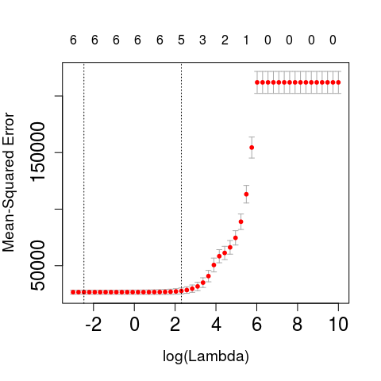
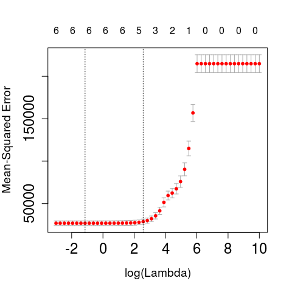
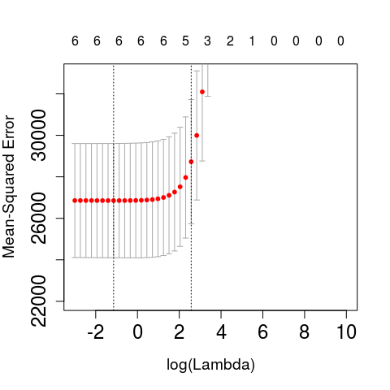

STAT406 - Lecture 6 notes
================
Matias Salibian-Barrera
2017-09-20

Lecture slides
--------------

The lecture slides are [here](STAT406-17-lecture-6-preliminary.pdf).

LASSO
-----

A different approach to perform some type of variable selection that can be more stable than stepwise methods is to use an L1 regularization term (instead of the L2 one used in ridge regression). Notwidthstanding the geometric "interpretation" of the effect of using an L1 penalty, it can also be argued that the L1 norm is, in some cases, a convex relaxation (envelope) of the "L0" norm (the number of non-zero elements). As a result, estimators based on the LASSO (L1-regularized regression) will typically have some of their entries equal to zero.

As the value of the penalty parameter increases the solutions change from the usual least squares estimator (when the regularization parameter equals to zero) to a vector of all zeroes (when the penalty constant is sufficiently large). This sequence of solutions is generally used as a way to rank (or sequence) the explanatory variables, listing them in the order in which they "enter" (their estimated coefficient changes from zero to a non-zero value). <!-- Varying the value of the penalty term we obtain a path of solutions (much like --> <!-- we did in ridge regression), where the vector of estimated regression --> <!-- coefficients becomes sparser as the penalty gets stronger.  --> We can also estimate the MSPE of each solution (on a finite grid of values of the penalty parameter) to select one with good prediction properties. If any of the estimated regression coefficients in the selected solution are exactly zero it is commonly said that those explanatory variables are not included in the chosen model.

There are two main implementation of the LASSO in `R`, one is via the `glmnet` function (in package `glmnet`), and the other is with the function `lars` in package `lars`. Both, of course, compute the same estimators, but they do so in different ways.

We first compute the path of LASSO solutions for the `credit` data used in previous lectures:

``` r
x <- read.table('../Lecture5/Credit.csv', sep=',', header=TRUE, row.names=1)
# use non-factor variables
x <- x[, c(1:6, 11)]
y <- as.vector(x$Balance)
xm <- as.matrix(x[, -7])
library(glmnet)
# alpha = 1 - LASSO
lambdas <- exp( seq(-3, 10, length=50))
a <- glmnet(x=xm, y=y, lambda=rev(lambdas),
            family='gaussian', alpha=1, intercept=TRUE)
```

The `plot` method can be used to show the path of solutions, just as we did for ridge regression:

``` r
plot(a, xvar='lambda', label=TRUE, lwd=6, cex.axis=1.5, cex.lab=1.2)
```



Using `lars::lars()` we obtain:

``` r
library(lars)
b <- lars(x=xm, y=y, type='lasso', intercept=TRUE)
plot(b, lwd=4)
```



With `lars` the returned object is a matrix of regression estimators, one for each value of the penalty constant where a new coefficient "enters" the model:

``` r
# see the variables
coef(b)
```

    ##         Income      Limit   Rating     Cards        Age Education
    ## [1,]  0.000000 0.00000000 0.000000  0.000000  0.0000000  0.000000
    ## [2,]  0.000000 0.00000000 1.835963  0.000000  0.0000000  0.000000
    ## [3,]  0.000000 0.01226464 2.018929  0.000000  0.0000000  0.000000
    ## [4,] -4.703898 0.05638653 2.433088  0.000000  0.0000000  0.000000
    ## [5,] -5.802948 0.06600083 2.545810  0.000000 -0.3234748  0.000000
    ## [6,] -6.772905 0.10049065 2.257218  6.369873 -0.6349138  0.000000
    ## [7,] -7.558037 0.12585115 2.063101 11.591558 -0.8923978  1.998283

``` r
b
```

    ## 
    ## Call:
    ## lars(x = xm, y = y, type = "lasso", intercept = TRUE)
    ## R-squared: 0.878 
    ## Sequence of LASSO moves:
    ##      Rating Limit Income Age Cards Education
    ## Var       3     2      1   5     4         6
    ## Step      1     2      3   4     5         6

The presentation below exploits the fact that the LASSO regression estimators are piecewise linear between values of the regularization parameter where a variable enters or drops the model.

In order to select one LASSO estimator (among the infinitely many that are possible) we can use K-fold CV to estimate the MSPE of a few of them (for a grid of values of the penalty parameter, for example), and choose the one with smallest estimated MSPE:

``` r
# select one solution
set.seed(123)
tmp.la <- cv.lars(x=xm, y=y, intercept=TRUE, type='lasso', K=5,
                  index=seq(0, 1, length=20))
```



Given their random nature, it is always a good idea to run K-fold CV experiments more than once:

``` r
set.seed(23)
tmp.la <- cv.lars(x=xm, y=y, intercept=TRUE, type='lasso', K=5,
                  index=seq(0, 1, length=20))
```



We now repeat the same steps as above but using the implementation in `glmnet`:

``` r
# run 5-fold CV with glmnet()
set.seed(123)
tmp <- cv.glmnet(x=xm, y=y, lambda=lambdas, nfolds=5, alpha=1, 
                 family='gaussian', intercept=TRUE)
plot(tmp, lwd=6, cex.axis=1.5, cex.lab=1.2)
```



We ran CV again:

``` r
set.seed(23)
tmp <- cv.glmnet(x=xm, y=y, lambda=lambdas, nfolds=5, alpha=1, 
                 family='gaussian', intercept=TRUE)
plot(tmp, lwd=6, cex.axis=1.5, cex.lab=1.2)
```



Zoom in the CV plot to check the 1-SE rule:

``` r
plot(tmp, lwd=6, cex.axis=1.5, cex.lab=1.2, ylim=c(22000, 33000))
```



The returned object includes the "optimal" value of the penalization parameter, which can be used to find the corresponding estimates for the regression coefficients:

``` r
# optimal lambda
tmp$lambda.min
```

    ## [1] 0.3189066

``` r
# coefficients for the optimal lambda
coef(tmp, s=tmp$lambda.min)
```

    ## 7 x 1 sparse Matrix of class "dgCMatrix"
    ##                        1
    ## (Intercept) -480.5654477
    ## Income        -7.5153030
    ## Limit          0.1117195
    ## Rating         2.2638772
    ## Cards         10.4021961
    ## Age           -0.8801089
    ## Education      1.9363219

``` r
# coefficients for other values of lambda
coef(tmp, s=exp(4))
```

    ## 7 x 1 sparse Matrix of class "dgCMatrix"
    ##                         1
    ## (Intercept) -262.35053476
    ## Income        -0.63094341
    ## Limit          0.02749778
    ## Rating         1.91772580
    ## Cards          .         
    ## Age            .         
    ## Education      .

``` r
coef(tmp, s=exp(4.5)) # note no. of zeroes...
```

    ## 7 x 1 sparse Matrix of class "dgCMatrix"
    ##                         1
    ## (Intercept) -175.98151842
    ## Income         .         
    ## Limit          0.01492881
    ## Rating         1.76170516
    ## Cards          .         
    ## Age            .         
    ## Education      .
