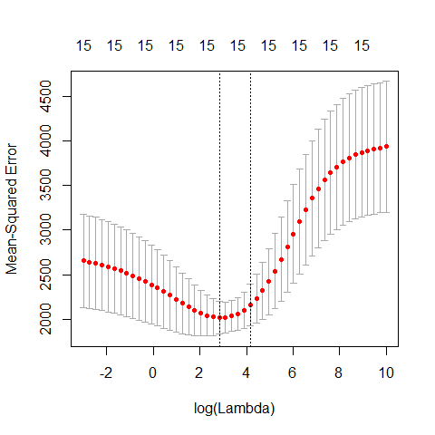
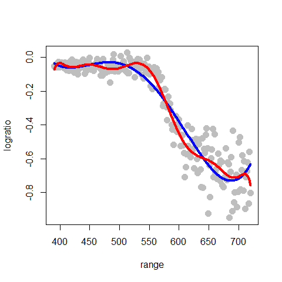

STAT406 - Lecture 7 notes
================
Matias Salibian-Barrera
2017-09-23

Lecture slides
--------------

The lecture slides are [here](STAT406-17-lecture-7-preliminary.pdf).

Compare MSPEs of Ridge & LASSO on the air pollution data
--------------------------------------------------------

On the air pollution data example there are groups of correlated variables and the different behaviour of LASSO and Ridge Regression is interesting to note.

``` r
airp <- read.table('../Lecture1/rutgers-lib-30861_CSV-1.csv', header=TRUE, sep=',')
y <- as.vector(airp$MORT)
xm <- as.matrix(airp[, names(airp) != 'MORT'])

library(glmnet)

lambdas <- exp( seq(-3, 10, length=50))

# Ridge 
set.seed(123)
air.l2 <- cv.glmnet(x=xm, y=y, lambda=lambdas, nfolds=5, alpha=0, 
                 family='gaussian', intercept=TRUE)
# LASSO
set.seed(23)
air.l1 <- cv.glmnet(x=xm, y=y, lambda=lambdas, nfolds=5, alpha=1, 
                 family='gaussian', intercept=TRUE)

a <- data.frame(ridge=round(as.vector(coef(air.l2, s='lambda.min')), 2),
lasso=round(as.vector(coef(air.l1, s='lambda.min')), 2))

cbind(round(coef(air.l2, s='lambda.min'), 3),
round(coef(air.l1, s='lambda.min'), 3))
```

    ## 16 x 2 sparse Matrix of class "dgCMatrix"
    ##                    1        1
    ## (Intercept) 1179.335 1100.355
    ## PREC           1.570    1.503
    ## JANT          -1.109   -1.189
    ## JULT          -1.276   -1.247
    ## OVR65         -2.571    .    
    ## POPN         -10.135    .    
    ## EDUC          -8.479  -10.510
    ## HOUS          -1.164   -0.503
    ## DENS           0.005    0.004
    ## NONW           3.126    3.979
    ## WWDRK         -0.476   -0.002
    ## POOR           0.576    .    
    ## HC            -0.035    .    
    ## NOX            0.064    .    
    ## SO.            0.240    0.228
    ## HUMID          0.372    .

``` r
library(ggcorrplot)
# Reordering the correlation matrix
# using hierarchical clustering
ggcorrplot(cor(xm), hc.order = TRUE, outline.col = "white")
```



<!-- # # https://briatte.github.io/ggcorr/ -->
<!-- # source('https://raw.githubusercontent.com/briatte/ggcorr/master/ggcorr.R') -->
<!-- # library(ggplot2) -->
<!-- #  -->
<!-- # ggcorr(xm) -->
<!-- # ggcorr(xm, nbreaks=3) -->
<!-- #  -->
<!-- # ggcorr(xm, geom = "blank", label = TRUE, hjust = 0.75) + -->
<!-- #   geom_point(size = 10, aes(color = coefficient > 0, alpha = abs(coefficient) > 0.5)) + -->
<!-- #   scale_alpha_manual(values = c("TRUE" = 0.25, "FALSE" = 0)) + -->
<!-- #   guides(color = FALSE, alpha = FALSE) -->
Less desirable properties of LASSO
----------------------------------

-   Not "variable selection"-consistent
-   Not oracle
-   Tends to only pick one variable (randomly) from groups of correlated ones

Elastic net
-----------

Elastic Net estimators were introduced to find an informative compromise between LASSO and Ridge Regression.

### Run EN on airpollution data, compare fits

### Compare MSPE's of Full, LASSO, Ridge, EN and stepwise

Non-parametric regression
-------------------------

Polynomial regression
=====================

``` r
# help(lidar, package='SemiPar')

data(lidar, package='SemiPar')
plot(logratio~range, data=lidar, pch=19, col='gray', cex=1.5)

# Degree 4 polynomials
pm <- lm(logratio ~ poly(range, 4), data=lidar)
plot(logratio~range, data=lidar, pch=19, col='gray', cex=1.5)
lines(predict(pm)[order(range)] ~ sort(range), data=lidar, lwd=4, col='blue')

# Degree 10 polynomials
pm2 <- lm(logratio ~ poly(range, 10), data=lidar)
lines(predict(pm2)[order(range)]~sort(range), data=lidar, lwd=4, col='red')
```



``` r
# A more flexible basis: splines

# linear splines ``by hand''
# select the knots at 5 quantiles
kn <- as.numeric( quantile(lidar$range, (1:5)/6) )

# prepare the matrix of covariates / explanatory variables
x <- matrix(0, dim(lidar)[1], length(kn)+1)
for(j in 1:length(kn)) {
  x[,j] <- pmax(lidar$range-kn[j], 0)
}
x[, length(kn)+1] <- lidar$range

# Fit the regression model
ppm <- lm(lidar$logratio ~ x)
plot(logratio~range, data=lidar, pch=19, col='gray', cex=1.5)
lines(predict(ppm)[order(range)]~sort(range), data=lidar, lwd=4, col='green')

# a better way to obtain the same fit
library(splines)
ppm2 <- lm(logratio ~ bs(range, degree=1, knots=kn), data=lidar)
lines(predict(ppm)[order(range)]~sort(range), data=lidar, lwd=2, col='blue')
```


``` r
# quadratic splines?
plot(logratio~range, data=lidar, pch=19, col='gray', cex=1.5)
ppmq <- lm(logratio ~ bs(range, degree=2, knots=kn), data=lidar)
lines(predict(ppmq)[order(range)]~sort(range), data=lidar, lwd=4, col='steelblue')
```


``` r
# cubic splines
plot(logratio~range, data=lidar, pch=19, col='gray', cex=1.5)
ppmc <- lm(logratio ~ bs(range, degree=3, knots=kn), data=lidar)
lines(predict(ppmc)[order(range)]~sort(range), data=lidar, lwd=4, col='tomato3')
```


