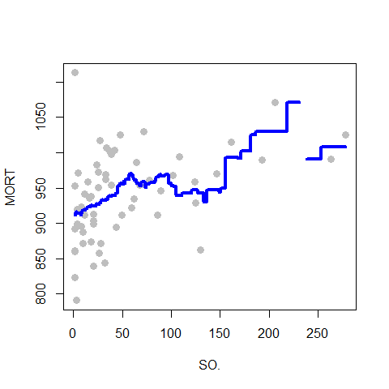
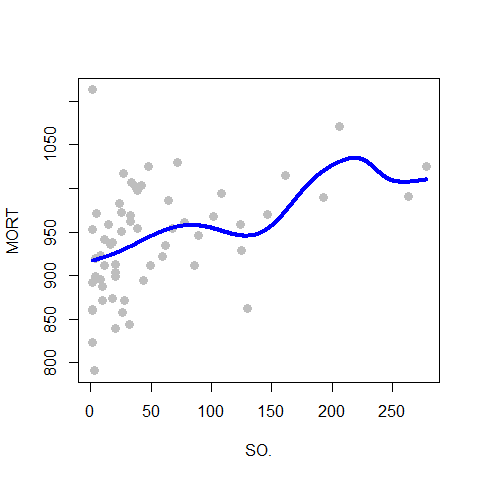
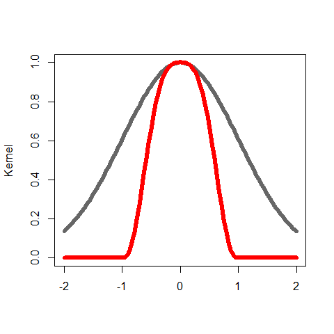
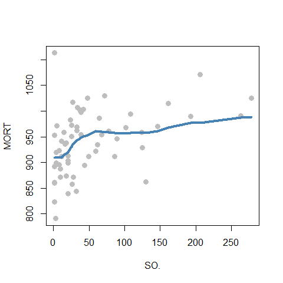
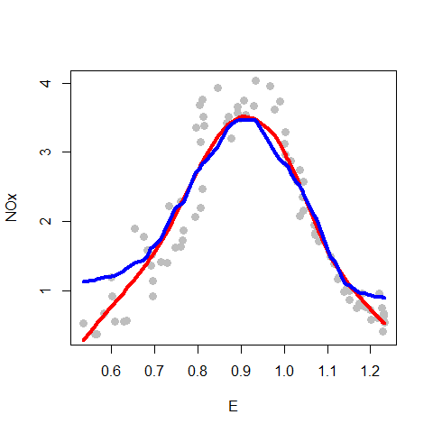

STAT406 - Lecture 9 notes
================
Matias Salibian-Barrera
2017-10-01

Lecture slides
--------------

The lecture slides are [here](STAT406-17-lecture-9-preliminary.pdf).

Kernel regression / local regression
------------------------------------

A different approach to estimate a regression function is based on recalling that the true regression function is *f(a) = E(Y | X = a)*, the mean of the response variable *Y* **conditional** to the event that the explanatory variable(s) **X** equal(s) **a**. If we had lots of data, we could, in principle, think of the following intuitively simple regression estimator: given **c**, consider all observations (Y, **X**) in your training set that have **X = c**, and take our estimated *f(c)* as the average of the corresponding observed values of the response variable Y. This would be a resonable estimator for E(Y | **X** = **c** ) (if we had sufficient cases in our training data pairs for which **X** = **c**).

Although the simple approach above does not usually work in practice (because we do not have enough training points with **X** = **c** for many values of **c**), the idea can still be used to construct a regression estimator that works **locally**, i.e. that given **c** uses the points in the training set that have **X close to c** (you can think of this as *working in a neighbourhood* of **c**). This family of regression estimators is called *local regression*, or *kernel regression*. The latter name is based on the fact that we will use a specific family of functions (called kernels) to define which points are *neighbours* and how they will be used to estimate the regression function. Note that these *kernel functions* are different from those used in Support Vector Machines and other reproducible kernel Hilbert spaces methods.

Probably the simplest kernel regression estimator is to simply take the average of the responses of the training points where the explanatory variables are within *h* of the point of interest. This "window width" *h* is called the *bandwidth*. We can use the function `ksmooth` in package `KernSmooth` in `R` to do this (**but it would be a great exercise to write your own `R` function to do it**). The code below considers one specific explanatory variable for the air pollution data (just for illustration purposes) and fits a local averages regression estimator, with bandwidth equal to 50:

``` r
dat <- read.table('../Lecture1/rutgers-lib-30861_CSV-1.csv', header=TRUE, sep=',')
library(KernSmooth)
x <- dat$SO.
y <- dat$MORT
h <- 50
a <- ksmooth(x=x, y=y, kernel='box', bandwidth=h, n.points=1000)
plot(y ~ x, pch=19, col='gray', cex=1.3, xlab='SO.', ylab='MORT')
lines(a$x, a$y, lwd=4, col='blue')
```



Note the gap in the estimated regression function. Why do you think this happened?

If we increase the bandwidth from 50 to 60 we obtain the following estimated regression function:

``` r
h <- 60
a <- ksmooth(x=x, y=y, kernel='box', bandwidth=h, n.points=1000)
plot(y ~ x, pch=19, col='gray', cex=1.3, xlab='SO.', ylab='MORT')
lines(a$x, a$y, lwd=4, col='blue')
```


This fit is still rather unsatisfactory. For example, note how it looks like a *staircase*. The estimated regression curve is fairly jagged, which is usually not how we expect the true regression function to be. Can you explain why the above regression estimator looks like this?

As discussed in class, using a smoother kernel function results in a smoother estimated regression function. The plot below uses the same bandwidth as before, but the kernel function is the standard gaussian density:

``` r
h <- 60
a <- ksmooth(x=x, y=y, kernel='normal', bandwidth=h, n.points=1000)
plot(y ~ x, pch=19, col='gray', cex=1.3, xlab='SO.', ylab='MORT')
lines(a$x, a$y, lwd=4, col='blue')
```



Better properties for the estimated regression function are obtained when one uses a smooth kernel with *compact support* (the support of the gaussian density function is the whole real line and thus not compact). The reasons for this (better kernel regression estimators when the kernel has compact support) are rather technical and will not be discussed here.

In what follows we will use the `R` function `loess` that implements this approach with a tri-cubic kernel given by *k(a) = ( 1 - (|a|)^3 )^3* if *|a| &lt; 1*, and 0 otherwise. The following plot compares this kernel with the gaussian one. Since the important characteristics of a kernel are its shape and support set, below I standardized both of them to reach the same maximum value (1):

``` r
tt <- seq(-2, 2, length=100)
tmp <- dnorm(tt)
plot(tt, tmp/max(tmp), ylab='Kernel', xlab='', lwd=6, type='l', col='gray40', ylim=c(0,1))
tmp <- (1-abs(tt)^3)^3
tmp[abs(tt) > 1] <- 0
lines(tt, tmp/max(tmp), lwd=6, col='red')
```



### Fixed versus variable bandwidths

As we discussed in class, fixed bandwidths may present problems in practice when the density of the observed explanatory variables is not uniform (i.e. there are *dense* regions where we have more observations and *sparse* regions where there are fewer observations). A solution to this is to use *variable bandwidths*, where at each point *c* we take a bandwidth large enough to contain a pre-specified proportion *alpha* of the data. The function `loess` implements this approach, the desired proportion of observations in each neighbourhood is given by the argument `span`.

When we apply this method (with `span = 0.5`, and `degree = 0` to indicate we are using *local averages*) to the example above, we get the following fit:

``` r
a <- loess(MORT ~ SO., data=dat, span=0.5, degree=0, family='gaussian')
plot(MORT ~ SO., data=dat, pch=19, col='gray', cex=1.3, xlab='SO.', ylab='MORT')
tmp <- order(a$x)
lines(a$x[tmp], a$fitted[tmp], lwd=4, col='steelblue')
```



Note, in particular, how the upper end of the estimated regression function looks better than the approach discussed before using fixed bandwidths.

Although we have not yet discussed how to choose a bandwidth (either fixed or variable) among the infinitely many possible ones, I expect the reader to already know how this may be done.

### Local regression versus local means

As discussed in more detail in class, a better way to exploit the approximating properties of a Taylor expansion, is to use it locally. In particular, using kernels as above, we can estimate the regression function using a linear function *locally* (corresponding to a Taylor expansion of order 1), or a quadratic function (expansion of order 2), etc. We will illustrate these points on the `ethanol` data in package `SemiPar`. As usual, information about the data can be found on its help page.

Below we load the data and compute a *local constant* (`degree = 0`) *regression estimator*, where the response variable is `NOx` and the explanatory variable is `E`. The span was arbitrarily set to 0.40 (but this will discussed in more detail below).

``` r
data(ethanol, package='SemiPar')
# local constant
span <- .4
b0 <- loess(NOx ~ E, data=ethanol, span=span, degree=0, family='gaussian')
plot(NOx ~ E, data=ethanol, pch=19, col='gray', cex=1.3, xlab='E', ylab='NOx')
tmp <- order(b0$x)
lines(b0$x[tmp], b0$fitted[tmp], lwd=4, col='blue')
```


Note how this regression estimator tends to not fit well the *tails* of the data (i.e. the smallest and largest observed values of `E`). A better fit is obtained with a *locally linear* estimator (`degree = 1`), shown below in red, over the *locally constant* one (in blue):

``` r
# local linear
span <- .4
b1 <- loess(NOx ~ E, data=ethanol, span=span, degree=1, family='gaussian')
plot(NOx ~ E, data=ethanol, pch=19, col='gray', cex=1.3, xlab='E', ylab='NOx')
tmp <- order(b1$x)
lines(b1$x[tmp], b1$fitted[tmp], lwd=4, col='red')
lines(b0$x[tmp], b0$fitted[tmp], lwd=4, col='blue')
```



This fit is an improvement from the previous one, but it does not capture well the *peak* of the data (around `E` = 0.90). It is easy to see that a quadratic local fit might be able to do this, without affecting the quality of the fit elsewhere. Below we compare the locally linear (red) and locally quadratic (dark green) fits:

``` r
# local quad
span <- .4
b2 <- loess(NOx ~ E, data=ethanol, span=span, degree=2, family='gaussian')
plot(NOx ~ E, data=ethanol, pch=19, col='gray', cex=1.3, xlab='E', ylab='NOx')
tmp <- order(b2$x)
lines(b1$x[tmp], b1$fitted[tmp], lwd=4, col='red')
lines(b2$x[tmp], b2$fitted[tmp], lwd=4, col='darkgreen')
```


### Choosing the bandwidth

Effect of span. Local quadratic, small span (0.05):

``` r
tmp <- loess(NOx ~ E, data=ethanol, span = .05, degree=2, family='gaussian')
plot(NOx ~ E, data=ethanol, pch=19, col='gray', cex=1.5)
# artificial grid of values to show predictions for the plot
prs <- with(ethanol, seq(min(E), max(E), length=1000))
lines(predict(tmp, newdata=prs) ~ prs, data=ethanol, lwd=4, col='steelblue')
```


Better spans (0.25, and 0.50):

``` r
tmp <- loess(NOx ~ E, data=ethanol, span = .25, degree=2, family='gaussian')
plot(NOx ~ E, data=ethanol, pch=19, col='gray', cex=1.5)
lines(predict(tmp, newdata=prs) ~ prs, data=ethanol, lwd=4, col='hotpink')
tmp <- loess(NOx ~ E, data=ethanol, span = .5, degree=2, family='gaussian')
lines(predict(tmp, newdata=prs) ~ prs, data=ethanol, lwd=4, col='darkgreen')
legend('topleft', legend=c('span: 0.25', 'span: 0.50'), col=c('hotpink', 'darkgreen'), lwd=4)
```


<!-- Effect of the degree, now quadratic: -->
<!-- ```{r kernel3, fig.width=5, fig.height=5, message=FALSE, warning=FALSE} -->
<!-- tmp <- loess(NOx ~ E, data=ethanol, span = .5, degree=2, family='gaussian') -->
<!-- plot(NOx ~ E, data=ethanol, pch=19, col='gray', cex=1.5) -->
<!-- lines(predict(tmp, newdata=prs) ~ prs, data=ethanol, lwd=4, col='blue') -->
<!-- ``` -->
<!-- Now quadratic, span = 0.20 -->
<!-- ```{r kernel4, fig.width=5, fig.height=5, message=FALSE, warning=FALSE} -->
<!-- tmp <- loess(NOx ~ E, data=ethanol, span = .2, degree=2, family='gaussian') -->
<!-- plot(NOx ~ E, data=ethanol, pch=19, col='gray', cex=1.5) -->
<!-- lines(predict(tmp)[order(E)] ~ sort(E), data=ethanol, lwd=4, col='steelblue') -->
<!-- lines(predict(tmp, newdata=prs) ~ prs, data=ethanol, lwd=2, col='red2') -->
<!-- ``` -->
<!-- Kinks are artifact of sparsity of data -->
