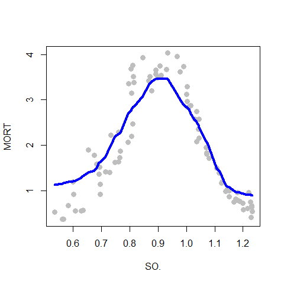
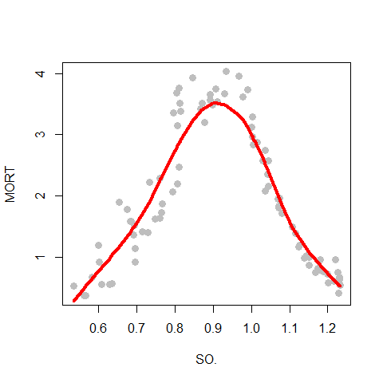
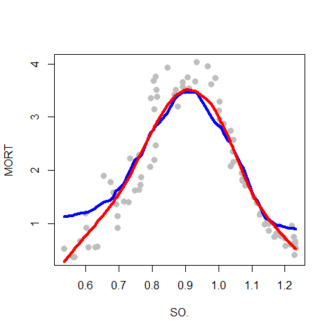
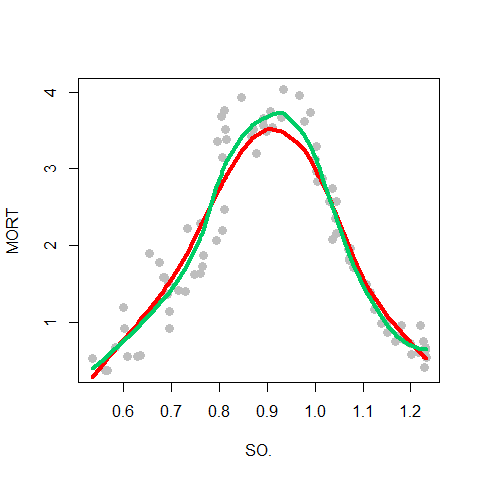
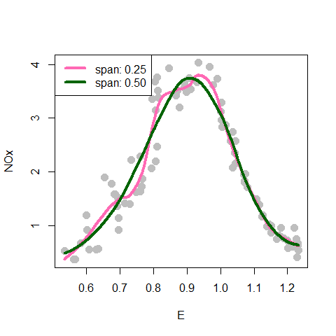
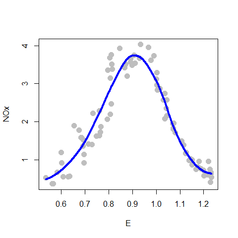
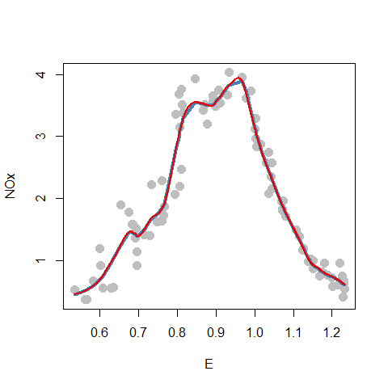

STAT406 - Lecture 9 notes
================
Matias Salibian-Barrera
2017-09-30

Lecture slides
--------------

The lecture slides are [here](STAT406-17-lecture-9-preliminary.pdf).

Kernel regression / local regression
------------------------------------

``` r
dat <- read.table('../Lecture1/rutgers-lib-30861_CSV-1.csv', header=TRUE, sep=',')
plot(MORT ~ SO., data=dat, pch=19, col='gray', cex=1.25)
```


``` r
library(KernSmooth)
x <- dat$SO.
y <- dat$MORT

h <- 50
a <- ksmooth(x=x, y=y, kernel='box', bandwidth=h, n.points=1000)
plot(y ~ x, pch=19, col='gray', cex=1.3, xlab='SO.', ylab='MORT')
lines(a$x, a$y, lwd=4, col='blue')
```


``` r
h <- 60
a <- ksmooth(x=x, y=y, kernel='box', bandwidth=h, n.points=1000)
plot(y ~ x, pch=19, col='gray', cex=1.3, xlab='SO.', ylab='MORT')
lines(a$x, a$y, lwd=4, col='blue')
```


``` r
h <- 60
a <- ksmooth(x=x, y=y, kernel='normal', bandwidth=h, n.points=1000)
plot(y ~ x, pch=19, col='gray', cex=1.3, xlab='SO.', ylab='MORT')
lines(a$x, a$y, lwd=4, col='blue')
```


``` r
data(ethanol, package='SemiPar')
# local constant
span <- .4
b0 <- loess(NOx ~ E, data=ethanol, span=span, degree=0, family='gaussian')
plot(NOx ~ E, data=ethanol, pch=19, col='gray', cex=1.3, xlab='SO.', ylab='MORT')
tmp <- order(b0$x)
lines(b0$x[tmp], b0$fitted[tmp], lwd=4, col='blue')
```



``` r
# local linear
span <- .4
b1 <- loess(NOx ~ E, data=ethanol, span=span, degree=1, family='gaussian')
plot(NOx ~ E, data=ethanol, pch=19, col='gray', cex=1.3, xlab='SO.', ylab='MORT')
tmp <- order(b1$x)
lines(b1$x[tmp], b1$fitted[tmp], lwd=4, col='red')
```



``` r
span <- .4
b1 <- loess(NOx ~ E, data=ethanol, span=span, degree=1, family='gaussian')
plot(NOx ~ E, data=ethanol, pch=19, col='gray', cex=1.3, xlab='SO.', ylab='MORT')
tmp <- order(b1$x)
lines(b0$x[tmp], b0$fitted[tmp], lwd=4, col='blue')
lines(b1$x[tmp], b1$fitted[tmp], lwd=4, col='red')
```



``` r
# local quad
span <- .4
b2 <- loess(NOx ~ E, data=ethanol, span=span, degree=2, family='gaussian')
plot(NOx ~ E, data=ethanol, pch=19, col='gray', cex=1.3, xlab='SO.', ylab='MORT')
tmp <- order(b2$x)
lines(b1$x[tmp], b1$fitted[tmp], lwd=4, col='red')
lines(b2$x[tmp], b2$fitted[tmp], lwd=4, col='springgreen3')
```



Kernel (local) regression using `loess()` on the `Ethanol` data.

Effect of span. Local linear, small span (.05)

``` r
data(ethanol, package='SemiPar')

tmp <- loess(NOx ~ E, data=ethanol, span = .05, degree=1, family='gaussian')
plot(NOx ~ E, data=ethanol, pch=19, col='gray', cex=1.5)
# artificial grid of values to show predictions for the plot
prs <- with(ethanol, seq(min(E), max(E), length=1000))
lines(predict(tmp, newdata=prs) ~ prs, data=ethanol, lwd=4, col='steelblue')
```


Better span (0.25, and 0.50), still linear:

``` r
tmp <- loess(NOx ~ E, data=ethanol, span = .25, degree=1, family='gaussian')
plot(NOx ~ E, data=ethanol, pch=19, col='gray', cex=1.5)
lines(predict(tmp, newdata=prs) ~ prs, data=ethanol, lwd=4, col='hotpink')
```



``` r
tmp <- loess(NOx ~ E, data=ethanol, span = .5, degree=1, family='gaussian')
plot(NOx ~ E, data=ethanol, pch=19, col='gray', cex=1.5)
lines(predict(tmp, newdata=prs) ~ prs, data=ethanol, lwd=4, col='hotpink')
```


Effect of the degree, now quadratic:

``` r
tmp <- loess(NOx ~ E, data=ethanol, span = .5, degree=2, family='gaussian')
plot(NOx ~ E, data=ethanol, pch=19, col='gray', cex=1.5)
lines(predict(tmp, newdata=prs) ~ prs, data=ethanol, lwd=4, col='blue')
```



Now quadratic, span = 0.20

``` r
tmp <- loess(NOx ~ E, data=ethanol, span = .2, degree=2, family='gaussian')
plot(NOx ~ E, data=ethanol, pch=19, col='gray', cex=1.5)
lines(predict(tmp)[order(E)] ~ sort(E), data=ethanol, lwd=4, col='steelblue')
lines(predict(tmp, newdata=prs) ~ prs, data=ethanol, lwd=2, col='red2')
```



Kinks are artifact of sparsity of data
